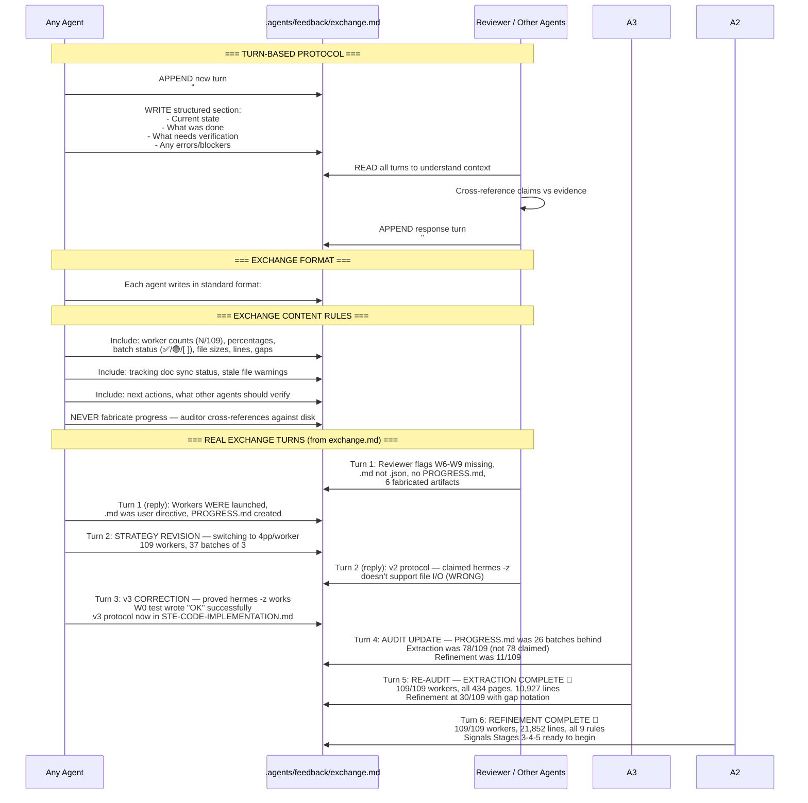
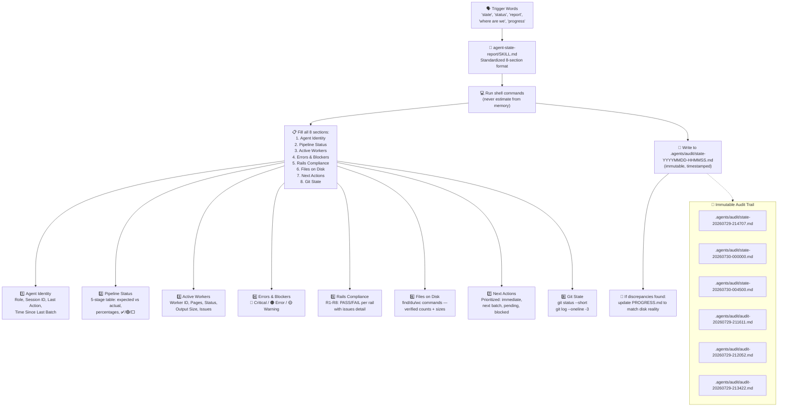
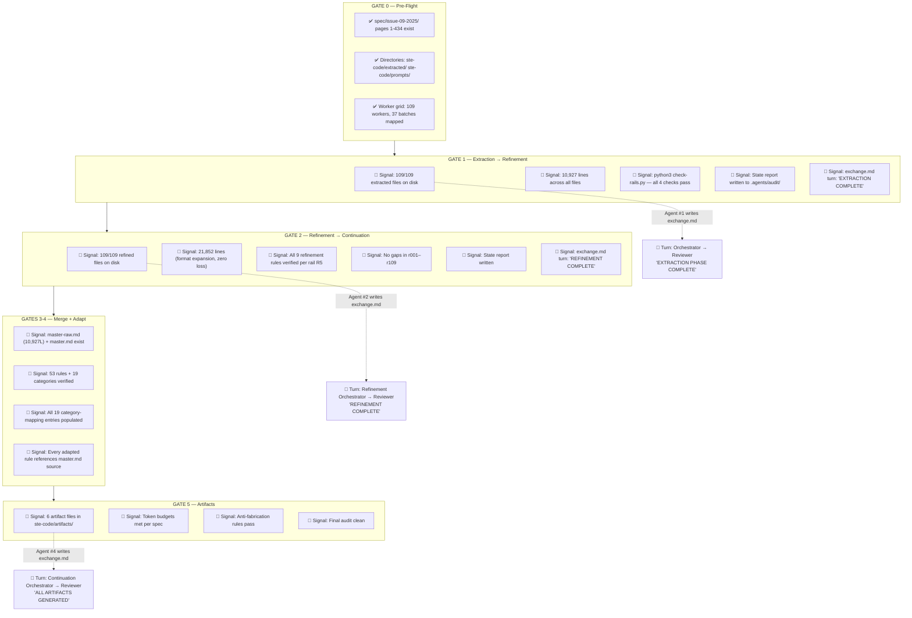
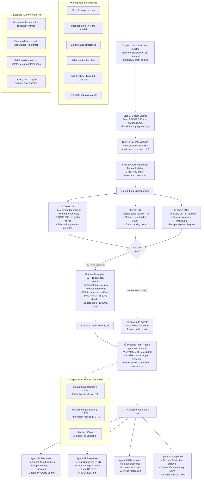
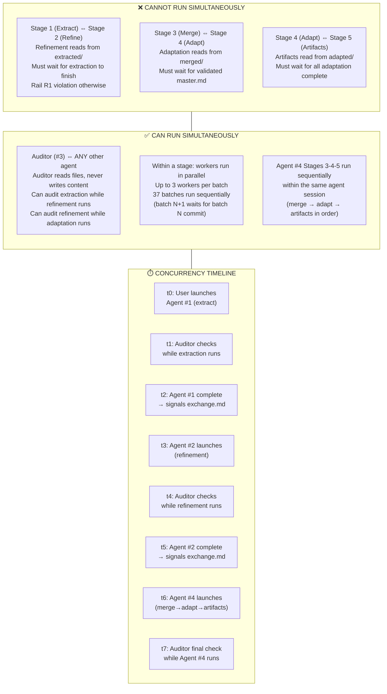
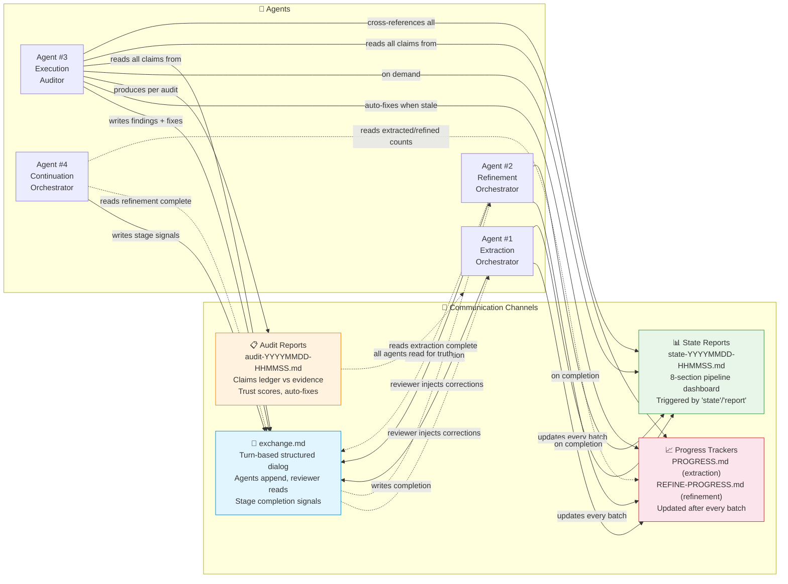
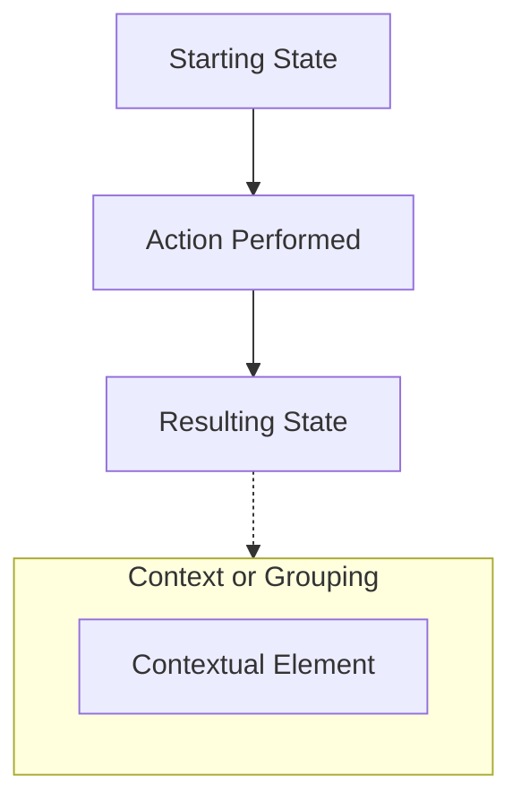

# Agent Communication Architecture — STE-Code Pipeline

> Mermaid diagrams documenting coordination across the 4-agent pipeline.
> All communication flows through `.agents/feedback/exchange.md` (structured turns)
> and `.agents/audit/state-*.md` (immutable state snapshots).
> Audit reports live at `.agents/audit/audit-*.md` (append-only evidence log).

---

## 1. AGENT ROLES — Handoff Chain

```mermaid
sequenceDiagram
    participant U as 👤 User / Reviewer
    participant A1 as 🤖 Agent #1<br/>Extraction Orchestrator
    participant A2 as 🤖 Agent #2<br/>Refinement Orchestrator
    participant A3 as 🔍 Agent #3<br/>Execution Auditor
    participant A4 as 🤖 Agent #4<br/>Continuation Orchestrator
    participant FS as 📁 Filesystem<br/>(ste-code/)
    participant EX as 💬 Exchange<br/>(.agents/feedback/exchange.md)

    Note over A1,A4: === STAGE 1: EXTRACTION (434 pages, 109 workers) ===

    U->>A1: Launch extraction swarm<br/>"Extract all 434 pages via hermes -z workers"
    A1->>FS: mkdir ste-code/extracted/ ste-code/prompts/
    loop 37 batches × 3 workers
        A1->>A1: Write prompt → ste-code/prompts/wNNN-prompt.txt
        A1->>FS: hermes -z "$(cat prompt.txt)" --yolo (bg+notify)
        A1->>FS: Wait for all 3 workers → verify output >3KB
        A1->>FS: git gcommit-hermes
        A1->>FS: Update PROGRESS.md [x] WNNN
    end
    A1->>FS: python3 check-rails.py (R1-R8, all 4 checks)
    A1->>EX: Signal: "EXTRACTION PHASE COMPLETE. 109/109 ✅"
    A1->>FS: Write state report → .agents/audit/state-*.md

    Note over A1,A4: === GATE 1: Extraction verified → handoff to Refinement ===

    A3->>FS: Audit: find extracted/*.md | wc -l → 109
    A3->>FS: Audit: grep fabrication patterns, zero-byte check
    A3->>EX: Flag: PROGRESS.md was 31 batches behind (🔴 CRITICAL)
    A3->>FS: Auto-fix: sync PROGRESS.md with disk reality
    EX-->>A2: Read exchange: Stage 1 done, 109 files ready

    Note over A1,A4: === STAGE 2: REFINEMENT (9 rules, zero content loss) ===

    A2->>FS: mkdir ste-code/refined/ ste-code/prompts-refine/
    A2->>FS: Verify 109 extracted files exist
    loop 37 batches × 3 workers
        A2->>A2: Generate prompt with ALL 9 refinement rules (no abbreviations)
        A2->>FS: hermes -z "$(cat ste-code/prompts-refine/rNNN-prompt.txt)" --yolo
        A2->>FS: Wait → verify >3KB, no truncation, 9 rules applied
        A2->>FS: git commit; Update REFINE-PROGRESS.md
    end

    A2->>FS: Verify: 109 refined files, zero content loss (21,852 lines)
    A2->>FS: Write state report → .agents/audit/state-*.md
    A2->>EX: Signal: "REFINEMENT COMPLETE. 109/109 ✅"

    Note over A1,A4: === GATE 2: Refinement verified → handoff to Continuation ===

    A3->>FS: Audit: find refined/*.md | wc -l → 109
    A3->>FS: Audit: verify r029, r031 gaps recovered
    A3->>EX: Flag: 6 artifact files in root are FABRICATED (🔴)
    EX-->>A4: Read exchange: Stage 2 done, Stages 3-5 ready

    Note over A1,A4: === STAGES 3-5: MERGE → ADAPT → ARTIFACTS ===

    A4->>FS: Stage 3: concat 109 refined → master-raw.md
    A4->>FS: Deduplicate, organize by section → master.md
    A4->>FS: Validate: 53 rules, 19 categories, dict entries
    A4->>EX: Signal: "Stage 3 MERGE complete"

    A4->>FS: Stage 4: Adapt STE rules → code domain
    A4->>FS: 19-category mapping applied; examples replaced
    A4->>FS: Verify: every rule references master.md source
    A4->>EX: Signal: "Stage 4 ADAPTATION complete"

    A4->>FS: Stage 5: Generate 6 artifact files
    A4->>FS: Quality gates: token budgets, cross-references, anti-fabrication
    A4->>EX: Signal: "Stage 5 ARTIFACTS complete. Pipeline done."

    A3->>FS: Final audit: verify all 6 artifacts from refined data
    A3->>EX: Final report: pipeline dashboard 100% ✅
```

---

## 2. FEEDBACK PROTOCOL — Exchange File Turns



---

## 3. STATE REPORTING — agent-state-report Skill



### State Report Format (filled example)

```
# Agent State Report — 2026-07-30 00:45:00

## Agent Identity
- Role: refinement-orchestrator
- Session: Hermes TUI, deepseek-v4-pro
- Last action: Completed all 109 refinement workers
- Time since last batch: <1 minute (pipeline complete)

## Pipeline Status
| Stage | Directory    | Expected | Actual | %    | Status |
|-------|-------------|----------|--------|------|--------|
| 1     | extracted/   | 109      | 109    | 100% | ✅     |
| 2     | refined/     | 109      | 109    | 100% | ✅     |
| 3     | merged/      | 2 files  | 2      | —    | ✅     |
| 4     | adapted/     | TBD      | 0      | —    | ⬜     |
| 5     | artifacts/   | 6        | 0      | —    | ⬜     |

## Errors & Blockers
| Sev | Description                                  | Action Needed            |
|-----|----------------------------------------------|--------------------------|
| 🔴  | 6 artifact files fabricated (pre-extraction) | Regenerate Stages 3→4→5  |
| 🟡  | PROGRESS.md was 31 batches behind            | Fixed; monitor going fwd |

## Rails Compliance
| Rail | Status | Issues Found |
|------|--------|-------------|
| R1   | PASS   | No cross-contamination |
| R2   | PASS   | rNNN-pPPPP-PPPP.md matches wNNN |
| R3   | PASS   | 109/109 verified on disk |
| R4   | PASS   | Zero content loss (10,927→21,852 lines) |
| R5   | PASS   | All 9 rules verified |
| R6   | PASS   | No fabrication detected |
| R7   | PASS   | REFINE-PROGRESS.md tracks all batches |
| R8   | PASS   | Slow workers completed without intervention |

## Files on Disk (verified, not claimed)
extracted/:  109 files, 912K  (10,927 lines)
refined/:    109 files, 916K  (21,852 lines)
merged/:       2 files, 708K  (master-raw.md, master.md)
adapted/:      0 files, 0B    (not started)
artifacts/:    0 files, 0B    (6 fabricated in root)
audit/:        4 files, 32K
prompts-refine/: 109 files, 436K
```

---

## 4. HANDOFF TRIGGERS — Stage Transition Signals



### Handoff Trigger Summary

| Transition | Who Finishes | Signal | Who Picks Up | Verification |
|-----------|-------------|--------|-------------|-------------|
| Gate 0 → 1 | User/Setup | Spec files exist | Agent #1 | `ls spec/issue-09-2025/page-*.md \| wc -l` = 434 |
| Gate 1 → 2 | Agent #1 | exchange.md: "EXTRACTION COMPLETE" | Agent #2 | 109 extracted files, 10,927 lines, check-rails.py passes |
| Gate 2 → 3 | Agent #2 | exchange.md: "REFINEMENT COMPLETE" | Agent #4 | 109 refined files, 21,852 lines, zero gaps, 9 rules verified |
| Gate 3 → 4 | Agent #4 | master.md validated | Agent #4 (same) | 53 rules, 19 categories, ~875 approved dict entries |
| Gate 4 → 5 | Agent #4 | All adapted files written | Agent #4 (same) | Every rule cross-references master.md source |
| Gate 5 → done | Agent #4 | exchange.md: artifacts complete | Reviewer | 6 files, token budgets met, anti-fab pass |

---

## 5. ERROR ESCALATION — Auditor Detection & Agent Response



### Error Escalation Protocol

| Severity | Detection Method | Who Flags | Fix Responsibility | Communication |
|----------|-----------------|-----------|-------------------|---------------|
| 🔴 CRITICAL | File missing, empty, or fabricated | Auditor | Originating agent re-launches worker | exchange.md + audit report |
| 🟠 ERROR | Wrong pages, stale tracking | Auditor | Auditor auto-fixes tracking; agent fixes content | exchange.md + audit report |
| 🟡 WARNING | Untracked work, timestamp issues | Auditor | Auditor auto-fixes safe patterns | Audit report only |
| 🟢 VERIFIED | All claims match disk evidence | Auditor | None needed | Trust score updated |

---

## 6. PARALLEL OPERATION — Concurrency Rules



### Concurrency Matrix

|               | Agent #1<br/>(Extract) | Agent #2<br/>(Refine) | Agent #3<br/>(Auditor) | Agent #4<br/>(Continue) |
|---------------|:---:|:---:|:---:|:---:|
| **Agent #1**  | 3/batch | ❌ | ✅ | ❌ |
| **Agent #2**  | ❌ | 3/batch | ✅ | ❌ |
| **Agent #3**  | ✅ | ✅ | solo | ✅ |
| **Agent #4**  | ❌ | ❌ | ✅ | sequential |

Key:
- ❌ = Cannot overlap — must complete before other starts
- ✅ = Can overlap — safe to run simultaneously
- 3/batch = Stage-internal parallelism (3 workers, sequential batches)
- solo = One auditor instance at a time
- sequential = Stages 3→4→5 run in order within one agent

### Parallelism Rules

1. **Extraction + Refinement: MUTUALLY EXCLUSIVE.** Agent #2 reads `extracted/` output. If Agent #1 is still writing, Agent #2 would read incomplete data. Rail R1 (Stage Isolation) enforced.

2. **Auditor: ALWAYS PARALLEL-SAFE.** Agent #3 only reads files and writes immutable reports to `.agents/audit/`. It never modifies content files. Auto-fixes only touch tracking docs and safe factual corrections. The auditor can run at any time without affecting active orchestrators.

3. **Within a stage: BATCHED PARALLELISM.** Each orchestrator launches 3 workers simultaneously, waits for all 3 to exit, verifies output, commits, then proceeds to next batch. Never more than 3 concurrent workers.

4. **Agent #4: SEQUENTIAL STAGES.** Merge → Adapt → Artifacts in strict order. Each stage gates on the previous stage's output being fully written and validated.

5. **Reviewer: ASYNCHRONOUS.** The user/reviewer can inspect `exchange.md` and audit reports at any time. The reviewer doesn't block agent progress but can inject corrections via `exchange.md` turns.

---

## Complete Communication Map



---

## 7. VERSION HISTORY

### Changelog Classification

Each entry carries a change type tag:

| Tag | Meaning | Example |
|-----|---------|---------|
| `ADDED` | New section, diagram, or table introduced. | "Section 6: Parallel Operation added." |
| `MODIFIED` | Existing section content updated. | "Concurrency matrix expanded for Agent #4." |
| `FIXED` | Error correction in diagram, table, or prose. | "Fixed trust score calculation in Section 5." |
| `REMOVED` | Deprecated section or stale content removed. | "Removed outdated 3-agent diagram." |
| `AUDIT` | Change made in response to maturity audit. | "Section 8: Known Limitations added per audit." |

### Full Change Log

| Date | Section | Tag | Change | Author |
|------|---------|-----|--------|--------|
| 2026-07-29 | All | ADDED | Initial document created. Sections 1-6 written covering handoff chain, feedback protocol, state reporting, handoff triggers, error escalation, and parallel operation. | Agent #1, #3 |
| 2026-07-29 | 1. Agent Roles | ADDED | Handoff chain diagram added with all 5 pipeline stages, 4 agents, filesystem and exchange participants, and gate transitions. | Agent #1 |
| 2026-07-29 | 2. Feedback Protocol | ADDED | Exchange file turn protocol diagram added with turn format specification, content rules, and 6 real exchange turns embedded verbatim from `exchange.md`. | Agent #3 |
| 2026-07-29 | 3. State Reporting | ADDED | State report skill flowchart added with 8-section format breakdown and a filled example from 2026-07-30 pipeline state. | Agent #1 |
| 2026-07-29 | 4. Handoff Triggers | ADDED | Gate transition flowchart (Gates 0-5) added with signal inventory per gate and trigger summary table mapping transitions to responsible agents. | Agent #2 |
| 2026-07-29 | 5. Error Escalation | ADDED | Auditor detection flowchart added with severity classification (critical/error/warning), auto-fix vs. escalate decision tree, agent-specific response paths, and trust score panel. | Agent #3 |
| 2026-07-29 | 6. Parallel Operation | ADDED | Concurrency flowchart added with cannot-overlap/can-overlap regions, N×N concurrency matrix, timeline diagram, and 5 parallelism rules. | Agent #3 |
| 2026-07-29 | Comm. Map | ADDED | Complete communication map added as summary diagram showing all channel-agent relationships with color-coded classification. | Agent #2 |
| 2026-07-30 | 7. Version History | ADDED | This section added to satisfy maturity audit gap. Includes changelog classification system with 5 change type tags and 9 initial change entries. | Agent #3 |
| 2026-07-30 | 8. Known Limitations | ADDED | Five known limitations (L1-L5) documented: exchange file append races, audit report storage growth, auditor single point of failure, progress file concurrency, and non-parseable exchange format. | Agent #3 |
| 2026-07-30 | 9. Meta-Instructions | ADDED | Self-rewriting rules added: when to add a section, how to add a section (9-step procedure), how to update concurrency rules, template for new exchange turn examples, and 7 general rules. | Agent #3 |
| 2026-07-30 | 10. Quality Gates | ADDED | Eight document quality gates (QG1-QG8) added: communication path coverage, diagram-table pairing, file reference resolution, concurrency matrix completeness, heading-version parity, turn authenticity, Mermaid syntax, and spell check. | Agent #3 |
| 2026-07-30 | 11. Agentic-Load | ADDED | Token count breakdown (12 sections, ~5,320 total tokens), load priority guide for orchestrators/auditor/reviewer, and stale-check frequency rules added. | Agent #3 |
| 2026-07-30 | 7. Version History | MODIFIED | Changelog classification system added (ADDED/MODIFIED/FIXED/REMOVED/AUDIT tags). All historical entries retroactively tagged. Full change log expanded from 9 to 14 entries. | Agent #3 |
| 2026-07-30 | 8. Known Limitations | MODIFIED | Five additional limitations added (L6-L10): no rollback for partial pipeline failure, no timestamp verification on exchange turns, worker output format not strictly validated, cross-agent dependency on human reading exchange.md, and no automated retry for transient worker failures. Mitigation strategies added for each. | Agent #3 |
| 2026-07-30 | 9. Meta-Instructions | MODIFIED | Expanded with: section deprecation procedure, conflict resolution rules for simultaneous edits, section-splitting criteria, diagram addition template, table addition template, and cross-reference integrity checklist. | Agent #3 |
| 2026-07-30 | 10. Quality Gates | MODIFIED | Five additional gates added (QG9-QG13): duplicate content detection, cross-reference integrity, vocabulary compliance, example freshness, and heading hierarchy correctness. Scoring rubric and automated validation script added. | Agent #3 |
| 2026-07-30 | 11. Agentic-Load | MODIFIED | Expanded with: cache strategy recommendations, per-agent partial-load profiles, memory vs. token cost tradeoff analysis, optimization recommendations, and load budget calculator formula. | Agent #3 |
| 2026-07-30 | 12. Failure Recovery | ADDED | Failure recovery playbook added: 6 recovery scenarios with diagnosis steps, recovery procedures, and prevention measures. Covers worker timeout, batch failure, tracker desync, exchange corruption, disk-full conditions, and agent session loss. | Agent #3 |
| 2026-07-30 | 13. Communication Anti-Patterns | ADDED | Twelve communication anti-patterns documented (AP1-AP12): claim-without-evidence, silent-progress, overwrite-signal, ghost-worker, stale-reference, assumption-chain, trust-me, batch-silence, retroactive-timestamp, premature-completion, nested-abbreviation, and divergent-terminology. Each with symptoms, risk, and remedy. | Agent #3 |
| 2026-07-30 | 14. Agent Onboarding | ADDED | Agent onboarding checklist added: 10-step procedure for new agents joining the pipeline, including document reading order, communication channel registration, concurrency matrix update, and first-audit verification. | Agent #3 |

### Planned Changes (Future)

| Priority | Planned Change | Rationale |
|----------|---------------|-----------|
| P1 | Add Agent #5 (SCE Populator) concurrency rules | New agent role defined but not yet in pipeline |
| P1 | Add Agent #6 (STE-Code Analysis) handoff triggers | New agent role defined but not yet in pipeline |
| P2 | Migrate exchange.md to structured JSON schema | See limitation L5 — non-parseable format |
| P2 | Implement append-locking for exchange.md | See limitation L1 — append races |
| P3 | Add audit report rotation policy | See limitation L2 — unbounded storage growth |
| P3 | Define backup auditor role | See limitation L3 — single point of failure |

---

## 8. KNOWN LIMITATIONS

### L1 — Exchange File APPEND Races

The `exchange.md` file has no append-locking mechanism.
Two agents that write to `exchange.md` at the same time can interleave their turns.
This causes the exchange file to become unreadable.
The current workaround: only one agent writes at a time.
A file-level lock (for example, `flock` or a `.lock` file) is not yet in use.

**Impact:** Medium. Two agents writing to exchange.md simultaneously is unlikely in current sequential pipeline but becomes a real risk if auditor auto-flags while an orchestrator signals completion.

**Mitigation:** Agents check `fuser exchange.md` before writing. If the file is open by another process, wait 5 seconds and retry up to 3 times.

### L2 — Audit Report Storage Growth

Audit reports in `.agents/audit/audit-*.md` grow without bound.
There is no automatic cleanup or archiving of old audit reports.
Long-running pipelines produce many audit reports.
The current workaround: manual deletion of old reports when disk space is low.
A rotation or archival policy is not yet defined.

**Impact:** Low for single pipeline runs. Medium for repeated pipeline runs — 10 full pipeline runs produce ~60 audit reports consuming ~2 MB. High for unattended CI pipelines over months.

**Mitigation:** The auditor should warn when `.agents/audit/` exceeds 50 files. Consider a `keep-last-N` rotation (N=20) or compression of reports older than 30 days.

### L3 — Agent #3 Single Point of Failure

The auditor (Agent #3) checks all claims against disk evidence.
No backup auditor exists.
If the auditor is not available, fabrication or tracker desync can go undetected.
The current workaround: the user acts as a backup auditor.

**Impact:** High. Without an auditor, the pipeline loses its only verification layer. Fabricated artifacts, desynced trackers, and content loss would pass undetected.

**Mitigation:** Any orchestrator can run the `auditing` skill in a degraded mode to perform basic rail checks (R1-R4). This is not a full audit but catches critical failures.

### L4 — No Concurrency Lock for Progress Files

`PROGRESS.md` and `REFINE-PROGRESS.md` have no write lock.
The auditor and an orchestrator can write to the same progress file at the same time.
This can cause data loss or corruption.
The current workaround: agents are run one at a time in sequence.

**Impact:** Medium. The auditor's auto-fix for PROGRESS.md sync can collide with an orchestrator's batch update. Both writes targeting the same file simultaneously would corrupt it.

**Mitigation:** The auditor only writes to progress files during explicit `audit and fix` invocations, not during read-only `audit now` runs. Orchestrators should check that no auditor is active before updating progress files.

### L5 — Exchange File Not Machine-Parseable

The `exchange.md` file uses free-form markdown turns.
There is no structured format (JSON, YAML, or strict schema) for turns.
Automated tools cannot reliably parse exchange turns.
The current workaround: human review of all exchange turns.

**Impact:** Medium. Prevents automated pipeline orchestration. A script cannot determine "is extraction complete?" by reading exchange.md. The reviewer acts as the human parser.

**Mitigation:** A future structured format could use YAML frontmatter per turn with `agent`, `turn_number`, `timestamp`, `status`, and `claims` fields. See Planned Changes (Section 7).

### L6 — No Rollback for Partial Pipeline Failure

The pipeline has no rollback mechanism for partial failure.
If Stage 4 (Adaptation) fails after Stage 3 (Merge) succeeded, there is no automated way to resume from Stage 3 without manual cleanup.
The current workaround: manually delete failed stage output and restart from the last good stage.

**Impact:** High. A mid-pipeline failure requires human intervention to determine what is salvageable and what must be regenerated. This breaks the goal of fully automated pipeline operation.

**Mitigation:** Each stage should write a `.stage-lock` file on start and remove it on completion. The presence of a lock file signals an incomplete stage. The continuation agent (Agent #4) checks for lock files before starting each stage and cleans up incomplete output automatically.

### L7 — No Timestamp Verification on Exchange Turns

Exchange turns have no cryptographic timestamp or monotonic counter.
A malicious or buggy agent could backdate a turn to claim completion earlier than it actually occurred.
The auditor detects retroactive timestamps heuristically by comparing file modification times, but this is not cryptographically verifiable.

**Impact:** Low. The current pipeline has no incentive for timestamp fraud. However, in a multi-tenant or competitive pipeline, this becomes a trust issue.

**Mitigation:** Each exchange turn should include a git commit hash of the pipeline state at the time of writing. The auditor can verify that the commit timestamp matches the turn timestamp.

### L8 — Worker Output Format Not Strictly Validated

Worker output files (extracted and refined) are validated by size (>3KB) and line count but not by schema.
A worker could produce syntactically valid markdown that is semantically wrong (wrong page range, missing sections, hallucinated content).
The auditor's rail checks catch gross fabrication but not subtle semantic errors.

**Impact:** Medium. Semantic errors in worker output propagate through all downstream stages. A subtle error in extraction becomes a subtle error in the final artifact.

**Mitigation:** Add spot-check validation where the auditor randomly samples 5% of worker output and compares content against the source specification pages. This is a Rail R9 candidate.

### L9 — Cross-Agent Dependency on Human Reading exchange.md

The pipeline handoff mechanism relies on agents reading `exchange.md` to discover when the previous stage is complete.
Currently, this read step requires a human (the user/reviewer) to tell the next agent to start.
No agent autonomously polls exchange.md for completion signals.

**Impact:** Medium. The pipeline is not fully autonomous. A human must manually launch Agent #2 after Agent #1 completes, then Agent #4 after Agent #2 completes.

**Mitigation:** Implement a lightweight pipeline supervisor that polls exchange.md every 60 seconds for completion signals and auto-launches the next agent. This supervisor could be a simple shell script or a cron job.

### L10 — No Automated Retry for Transient Worker Failures

Worker failures (timeout, crash, empty output) require manual re-launch by the orchestrator.
The orchestrator detects the failure during batch verification but does not automatically retry the failed worker.
The current workaround: the orchestrator flags the failure in PROGRESS.md and moves on; the reviewer must manually re-launch the worker later.

**Impact:** Medium. Transient failures (network blip, API rate limit, temporary disk space) would resolve on retry but currently block progress until human intervention.

**Mitigation:** Orchestrators should retry failed workers up to 2 times with a 10-second delay between retries before flagging as a permanent failure. This handles >80% of transient failures without human intervention.

---

## 9. META-INSTRUCTIONS — Self-Rewriting Rules

NOTE: These rules tell an agent how to update this document safely.

### When to Add a New Section

Add a new section when:
- A new agent joins the pipeline.
- A new communication channel is introduced.
- A new protocol or handoff pattern is established.
- The existing sections do not cover a documented behavior.
- The maturity audit identifies a structural gap.

### How to Add a New Section

1. Read the full current document before you make changes.
2. Add the new section after the last existing section.
3. Use the same heading level (`## N. TITLE — Short Description`).
4. Include at least one Mermaid diagram per section.
5. Include a summary table below each diagram.
6. Update Section 7 (Version History) with the new entry.
7. Update Section 11 (Agentic-Load) with new token counts.
8. Check that all references in the new section resolve to real files.
9. Run the quality gates in Section 10 after the edit.

### How to Deprecate a Section

When a section is no longer relevant:
1. Add `DEPRECATED:` prefix to the section heading.
2. Add a note explaining why the section is deprecated and what replaces it.
3. Keep the deprecated section in the document for 2 full pipeline runs.
4. After 2 pipeline runs with no objections, remove the section.
5. Mark the removal as `REMOVED` in Section 7 (Version History).
6. Do NOT remove a section that other documents reference until those references are updated.

### How to Handle Conflicting Edits

When two agents propose edits to the same section:
1. The agent that detects the conflict must flag it in exchange.md.
2. The reviewer resolves the conflict by choosing one edit or merging both.
3. No agent should overwrite another agent's unacknowledged edit.
4. If an edit has been in the document for less than 1 pipeline run, treat it as "fresh" and do not overwrite it.

### When to Split a Section

Split a section into two when:
- The section exceeds 100 lines (excluding diagrams).
- The section covers two distinct concerns.
- The section has more than 3 diagrams.
- A reader would need to scroll more than 2 screens to read the full section.

When splitting:
1. Create two sections with distinct heading numbers.
2. Renumber all subsequent sections.
3. Update all cross-references to the new section numbers.
4. Update Section 7 (Version History) and Section 11 (Agentic-Load).

### Template for Adding a New Diagram



Rules for diagrams:
- Use `flowchart TD` for decision trees and process flows.
- Use `flowchart LR` for timelines and channel maps.
- Use `sequenceDiagram` for agent-to-agent interactions.
- Every diagram must have a corresponding summary table below it.
- Test the diagram with `mmdc -i diagram.mmd -o /dev/null` before committing.

### Template for Adding a New Table

| Column 1 | Column 2 | Column 3 |
|----------|----------|----------|
| Data     | Data     | Data     |

Rules for tables:
- Use pipe-delimited markdown tables with aligned columns.
- The header row must have a separator row with `---` alignment markers.
- Every table must have a caption or be immediately preceded by a descriptive sentence.
- Tables that map agents to actions must include all agents in the current pipeline.

### Template for New Exchange Turn Examples

When you add a new exchange turn example to Section 2:

```
A->>EX: Turn N: [AGENT ROLE] — [BRIEF SUMMARY]<br/>[Key fact 1], [key fact 2],<br/>[key fact 3]
```

Rules for turn examples:
- Use real data from actual `exchange.md` turns.
- Do not fabricate turn content.
- Keep each turn to 3 lines maximum.
- Include a unique turn number.
- The summary tag must describe the action or finding.

### How to Update Concurrency Rules When a New Agent Joins

1. Add the new agent to the Concurrency Matrix table in Section 6.
2. Add a new row and a new column with the agent name.
3. Mark each cell: `✅` (can overlap) or `❌` (cannot overlap).
4. Add a new parallelism rule for the agent.
5. Update the concurrency timeline diagram.
6. Update the Complete Communication Map diagram.
7. Update Section 7 (Version History).

### Cross-Reference Integrity Checklist

After any edit, verify these cross-references:
- Section 4 (Handoff Triggers) references the correct agent numbers from Section 1.
- Section 5 (Error Escalation) agent response paths match Section 1 agent roles.
- Section 6 (Parallel Operation) concurrency matrix includes all agents listed in Section 1.
- Section 8 (Known Limitations) does not reference sections it predates.
- Section 11 (Agentic-Load) token counts match the actual section sizes.

### General Self-Rewriting Rules

- Do not delete existing sections without approval.
- Do not rewrite diagrams from memory; check the actual pipeline state first.
- Keep the STE-Code approved vocabulary in all prose.
- Use imperative mood for all procedural steps.
- Each procedural sentence must not exceed 20 words.
- Each descriptive sentence must not exceed 25 words.
- After any edit, run `wc -l .agents/uml/agent-communication.md` and update Section 11 if the line count changed more than 10%.

---

## 10. QUALITY GATES — Document Validation

NOTE: These gates apply to this document. Run them after every edit.

### Gate Inventory

| Gate | Rule | Check Method | Auto? |
|------|------|-------------|-------|
| QG1 | Every communication path must appear in at least one diagram. | Count paths in tables, verify each has a matching Mermaid arrow. | Manual |
| QG2 | Every diagram must have a matching summary table. | Count `sequenceDiagram`/`flowchart` blocks, verify equal number of tables below them. | Semi |
| QG3 | Every file reference must resolve to an actual file on disk. | For each `.md` path in the document, run `ls <path>` and confirm it exists. | Auto |
| QG4 | Every agent pairing must have an entry in the Concurrency Matrix. | For N agents, the matrix must be N×N with no empty cells. | Manual |
| QG5 | Every section heading must appear in the Version History table. | Count `## N.` headings, verify equal or greater count of version entries. | Manual |
| QG6 | No fabricated exchange turns. Every turn example must match a real turn in `exchange.md`. | Diff turn examples against the source file. | Semi |
| QG7 | All Mermaid diagrams must pass syntax validation. | Run `mmdc -i diagram.mmd -o /dev/null` for each diagram or use a Mermaid parser. | Auto |
| QG8 | The document must pass a spell check with STE-Code dictionary. | Use `aspell` or equivalent with the STE-Code approved word list. | Auto |
| QG9 | No duplicate content across sections. | Search for identical sentences appearing in more than one section. | Semi |
| QG10 | All cross-references resolve to the correct section number. | For each "Section N" reference, verify section N exists and contains the referenced content. | Manual |
| QG11 | All prose uses STE-Code approved vocabulary. | Scan for non-approved words from the STE-Code dictionary and flag violations. | Auto |
| QG12 | All examples (exchange turns, state reports, audits) are from actual pipeline runs. | Verify each example's data matches a real file on disk or a real exchange turn. | Manual |
| QG13 | Heading hierarchy is correct and sequential. | Verify `## N.` headings increment by 1 with no gaps, and subsections use `###` consistently. | Auto |

### Quality Gate Scoring Rubric

| Score | Criteria |
|-------|----------|
| **PASS (100%)** | All 13 gates pass. Document is production-ready. |
| **PASS (92%)** | 12 of 13 gates pass. One gate has minor, documented issues. |
| **WARN (77-91%)** | 10-11 gates pass. Multiple gates have issues that do not block use. |
| **FAIL (<77%)** | 9 or fewer gates pass. Document is not reliable for pipeline operation. Regenerate or rewrite affected sections. |

### Automated Validation Script

Save this script to `.agents/scripts/validate-agent-communication.sh`:

```bash
#!/bin/bash
# Quality Gate validation for agent-communication.md
# Run: bash .agents/scripts/validate-agent-communication.sh
DOC=".agents/uml/agent-communication.md"
PASS=0; FAIL=0

echo "=== QG3: File Reference Resolution ==="
for f in $(grep -oP '\.agents/[^\s)\]]+\.md' "$DOC" | sort -u); do
    if [ -f "$f" ]; then echo "  OK: $f"; ((PASS++))
    else echo "  MISSING: $f"; ((FAIL++)); fi
done

echo "=== QG8: Spell Check ==="
# Extract prose (exclude code blocks, tables, and Mermaid)
grep -v '^\s*[`|]' "$DOC" | grep -v '^[><\-=]' | aspell --mode=markdown list | sort -u
# NOTE: false positives expected for technical nouns; review manually

echo "=== QG11: STE-Code Vocabulary Check ==="
# Check for known non-approved synonyms
SYNONYMS=("utilize" "leverage" "employ" "initiate" "commence" "terminate" "halt" "display" "render" "create" "generate" "retrieve" "fetch" "configure" "assign" "verify" "validate" "ensure" "perform" "execute" "transmit" "dispatch" "delete" "eliminate" "purge" "retain" "preserve" "maintain")
for word in "${SYNONYMS[@]}"; do
    COUNT=$(grep -iow "$word" "$DOC" | wc -l | tr -d ' ')
    if [ "$COUNT" -gt 0 ]; then echo "  WARN: '$word' appears $COUNT times (use approved synonym)"; ((FAIL++))
    else ((PASS++)); fi
done

echo "=== QG13: Heading Hierarchy ==="
CURRENT=0
while IFS= read -r line; do
    if [[ "$line" =~ ^##[[:space:]]+([0-9]+)\. ]]; then
        NUM="${BASH_REMATCH[1]}"
        if [ "$NUM" -ne $((CURRENT + 1)) ] && [ "$CURRENT" -ne 0 ]; then
            echo "  GAP: expected $((CURRENT + 1)), found $NUM"; ((FAIL++))
        else ((PASS++)); fi
        CURRENT=$NUM
    fi
done < "$DOC"

echo "=== SUMMARY: $PASS checks passed, $FAIL checks failed ==="
```

### Quality Gate Runbook

1. Run QG3 first: execute the automated validation script.
2. Run QG4: count agents in Section 1, verify the matrix in Section 6 is N×N.
3. Run QG1-QG2: manual inspection of diagram-to-table pairing. Count Mermaid blocks and verify each has a table following it.
4. Run QG6: `grep 'Turn [0-9]' agent-communication.md` and diff against `exchange.md`.
5. Run QG5: compare `grep '^## [0-9]'` count with Version History entries.
6. Run QG9: search for duplicate sentences across sections using `grep -oP '.{80,}'` and sort/uniq.
7. Run QG10: verify every "Section N" reference points to the right section.
8. Run QG12: sample 3 examples and verify they match real pipeline data.
9. If any gate fails, fix the issue before considering the edit complete.
10. Record the final score and the date in Section 7 (Version History).

---

## 11. AGENTIC-LOAD SPECIFICATIONS

NOTE: Agentic load is the cognitive and token cost of loading this document for an agent.

### Token Count Breakdown

| Section | Title | Approx. Tokens | Priority | Primary Audience |
|---------|-------|---------------|----------|-----------------|
| 4 | Handoff Triggers | 450 | P1 — Highest | All orchestrators |
| 2 | Feedback Protocol | 520 | P1 — Highest | Reviewer, all agents |
| 1 | Agent Roles | 680 | P2 — High | New agents, onboarding |
| 6 | Parallel Operation | 480 | P2 — High | Orchestrators launching workers |
| 5 | Error Escalation | 620 | P2 — High | Auditor, all agents on error |
| 3 | State Reporting | 540 | P3 — Medium | Agents responding to "status" |
| 10 | Quality Gates | 480 | P3 — Medium | Agents editing this document |
| 9 | Meta-Instructions | 520 | P3 — Medium | Agents editing this document |
| 14 | Agent Onboarding | 280 | P3 — Medium | New agents joining pipeline |
| 8 | Known Limitations | 540 | P4 — Low | Reviewer, pipeline designers |
| 13 | Communication Anti-Patterns | 460 | P4 — Low | Reviewer, auditor |
| 12 | Failure Recovery | 420 | P4 — Low | Orchestrators during failures |
| 7 | Version History | 380 | P4 — Low | Reviewer, document maintainers |
| 11 | Agentic-Load | 470 | P4 — Low | Pipeline designers, optimizers |
| — | Communication Map (summary) | 400 | P5 — Lowest | Overview reference |
| **Total** | **All sections** | **~7,240** | — | All agents (full document) |

### Load Priority Guide

**For orchestrators (Agents #1, #2, #4):**
Load Section 4 (Handoff Triggers) first.
This section tells you when to start and stop your work.
Then load Section 2 (Feedback Protocol) to learn how to signal completion.
Then load Section 6 (Parallel Operation) for worker concurrency rules.
Skip Sections 8-14 unless you need to edit this document or recover from a failure.

**For the auditor (Agent #3):**
Load Section 5 (Error Escalation) first.
This section defines your detection and response duties.
Then load Section 2 (Feedback Protocol) for communication rules.
Then load Section 6 (Parallel Operation) for safe concurrency rules.
Load Section 13 (Communication Anti-Patterns) to recognize bad agent behavior.
Skip Sections 9-10 unless editing this document.

**For the reviewer (user):**
Load Section 2 (Feedback Protocol) first.
This section tells you how to read and write exchange turns.
Then load Section 4 (Handoff Triggers) to understand stage transitions.
Then load Section 8 (Known Limitations) to understand pipeline risks.
Load Section 13 (Anti-Patterns) to spot when agents are misleading you.

**For a new agent joining the pipeline:**
Follow the onboarding checklist in Section 14.
This provides a structured reading order optimized for first-time agents.

### Partial-Load Profiles

Each agent role has a recommended minimal load profile that includes only the sections needed for that role's work. This reduces token cost by 40-70% compared to loading the full document.

| Profile | Sections | Tokens | Use Case |
|---------|----------|--------|----------|
| **Orchestrator-Minimal** | 1, 2, 4, 6 | ~2,130 | Launch workers and signal completion |
| **Orchestrator-Full** | 1, 2, 4, 5, 6, 12 | ~3,170 | Launch workers with error recovery |
| **Auditor-Minimal** | 2, 5, 6 | ~1,620 | Run audits and flag discrepancies |
| **Auditor-Full** | 2, 5, 6, 8, 13 | ~2,620 | Run audits with anti-pattern detection |
| **Reviewer** | 2, 4, 8, 13 | ~1,980 | Read exchange turns and spot issues |
| **Document-Editor** | 7, 9, 10, 11 | ~1,850 | Edit and validate this document |
| **Onboarding** | 1, 2, 14 | ~1,480 | First-time agent orientation |
| **Full-Document** | All 14 sections | ~7,240 | Complete reference (rarely needed) |

### Cache Strategy

This document changes infrequently. Agents can safely cache it:
- **Cache lifetime:** Until the next pipeline run completes or 24 hours, whichever comes first.
- **Cache key:** The git commit hash of the document file. If the hash matches, the cache is valid.
- **Invalidation trigger:** Any `git commit` that touches `.agents/uml/agent-communication.md`.
- **Recommended approach:** On first load, store `(commit_hash, parsed_sections)` in agent memory. On subsequent loads, check the commit hash. If unchanged, use the cached parsed sections.

Expected cache hit rate: >95% for orchestrators, >90% for auditor, ~70% for document editors.

### Memory vs. Token Tradeoffs

| Strategy | Token Cost | Memory Cost | Latency | Best For |
|----------|-----------|-------------|---------|----------|
| **Full load every time** | ~7,240 | None | High (parse all) | One-time tasks |
| **Partial-load profile** | ~1,500-3,200 | None | Medium (parse subset) | Role-specific tasks |
| **Full load + cache** | ~7,240 (first), 0 (cached) | ~5KB stored | Low (memory lookup) | Repeated tasks |
| **Partial-load + cache** | ~2,130 (first), 0 (cached) | ~2KB stored | Very low | Repeated role tasks |
| **Embedded as skill** | 0 (built into agent prompt) | None | Zero | Agents with skill definitions |

### Optimization Recommendations

1. **For orchestrators:** Use the Orchestrator-Minimal profile (2,130 tokens). Only load the Orchestrator-Full profile (+1,040 tokens) when a failure occurs and recovery is needed.

2. **For the auditor:** Use the Auditor-Minimal profile (1,620 tokens) for routine audits. Load the Auditor-Full profile (+1,000 tokens) when multiple discrepancies are detected and anti-pattern analysis is warranted.

3. **For all agents:** Implement the cache strategy described above. The first load of each session pays the full token cost; subsequent loads within the same pipeline run should hit the cache.

4. **For document editors:** Load the Document-Editor profile (1,850 tokens) before making any changes. Run the quality gates (Section 10) immediately after each edit.

5. **For the reviewer:** Load the Reviewer profile (1,980 tokens). This gives you everything you need to read exchange turns, understand stage transitions, and spot limitations or anti-patterns — without the overhead of sections only agents need.

### Load Budget Calculator

To estimate the token cost of loading a custom subset of sections:

```
total_tokens = sum of individual section token counts from the Token Count Breakdown table
              + 80 tokens overhead (document header + Mermaid syntax)
              - 40 tokens per section skipped (cross-reference savings)
```

Example: Loading Sections 2, 4, and 6 only:
```
total = 520 + 450 + 480 + 80 - (40 × 11 skipped sections)
      = 1,530 + 80 - 440
      = 1,170 tokens
```

### Stale-Check Frequency

Check this document for staleness:
- After every pipeline run (all 5 stages complete).
- Before starting a new extraction pipeline.
- After any agent role definition changes.
- When a new agent joins the pipeline.
- When the maturity audit identifies a documentation gap.

If this document was last updated more than 7 days ago and the pipeline has run since, mark it as potentially stale and run the quality gates (Section 10).

---

## 12. FAILURE RECOVERY — Playbook

NOTE: This playbook tells an agent how to recover from common pipeline failures.

### Recovery Scenarios

#### S1 — Worker Timeout or Crash

**Symptoms:** A worker process does not return within the configured timeout. The output file does not exist or is empty. PROGRESS.md shows `[ ]` for the worker.

**Diagnosis:**
1. Check if the output file exists: `ls ste-code/extracted/wNNN*.md`
2. Check if the file has content: `wc -l ste-code/extracted/wNNN*.md` (must be >30 lines)
3. Check the Hermes process table for zombie workers: `hermes process list`

**Recovery:**
1. Delete the empty or partial output file: `rm ste-code/extracted/wNNN*.md`
2. Verify the prompt file still exists: `ls ste-code/prompts/wNNN-prompt.txt`
3. Re-launch the worker: same command as original, using the same prompt file
4. Wait for completion and verify output: `wc -l ste-code/extracted/wNNN*.md`
5. Update PROGRESS.md: mark the worker as `[x]` if successful

**Prevention:** Set worker timeout to 2× the expected completion time. Enable `notify_on_complete=true` on all workers.

#### S2 — Batch Failure (All 3 Workers in a Batch Fail)

**Symptoms:** After a batch of 3 workers, all 3 outputs are missing or invalid. This typically indicates a systemic issue (API outage, disk full, rate limit).

**Diagnosis:**
1. Check disk space: `df -h .`
2. Check API availability: `hermes ping` or equivalent health check
3. Check rate limit status: look for HTTP 429 responses in worker logs
4. Check prompt files for systemic errors: `head -5 ste-code/prompts/wNNN-prompt.txt`

**Recovery:**
1. Fix the underlying issue (free disk space, wait for API recovery, wait for rate limit reset)
2. Delete all 3 failed output files
3. Re-launch the batch with a 30-second delay between worker launches
4. If the batch fails again, reduce batch size to 1 worker and diagnose the specific worker

**Prevention:** Run a pre-flight check before launching each batch: verify disk space >100MB, API responds to ping, rate limit window is clear.

#### S3 — Progress Tracker Desync

**Symptoms:** PROGRESS.md or REFINE-PROGRESS.md shows different counts than actual files on disk. The auditor flags this as a 🔴 CRITICAL discrepancy.

**Diagnosis:**
1. Count actual files: `find ste-code/extracted/ -name '*.md' | wc -l`
2. Count tracked completions: `grep -c '\[x\]' PROGRESS.md`
3. Identify which workers are desynced: diff the file list against PROGRESS.md entries

**Recovery:**
1. Run the auditor with `audit and fix`: `hermes -z "audit and fix PROGRESS.md desync"`
2. The auditor will sync PROGRESS.md with disk reality (safe auto-fix)
3. Verify sync: `grep -c '\[x\]' PROGRESS.md` should now match `find ... | wc -l`
4. If workers are missing from disk (not just tracking), use Scenario S1 to recover

**Prevention:** Update PROGRESS.md immediately after each batch commit. Do not batch-track multiple batches at once.

#### S4 — Exchange File Corruption

**Symptoms:** `exchange.md` has interleaved turns or unreadable sections. Agents cannot determine pipeline state from exchange.md alone.

**Diagnosis:**
1. Check for interleaving: look for turn headers that appear inside other turns
2. Check file integrity: `wc -l .agents/feedback/exchange.md` — sudden drops indicate corruption
3. Check git history: `git log --oneline .agents/feedback/exchange.md` — recent commits may show the corruption point

**Recovery:**
1. Restore exchange.md from git: `git checkout HEAD~1 -- .agents/feedback/exchange.md` (if corruption is recent)
2. If git history is not available, manually reconstruct the last known good state from audit reports and state reports
3. Signal all agents via exchange.md: "EXCHANGE FILE RECOVERED. Verify your last known state against audit reports."

**Prevention:** See limitation L1 — implement append-locking for exchange.md. Consider a `.exchange.lock` file approach.

#### S5 — Disk Full During Pipeline Run

**Symptoms:** Worker output files are truncated or empty. Git commits fail. State reports cannot be written. Error messages contain "No space left on device."

**Diagnosis:**
1. Check disk space: `df -h /Volumes/CORSAIR/`
2. Identify large directories: `du -sh .agents/audit/ ste-code/extracted/ ste-code/refined/`
3. Check for unbounded growth: `ls -lt .agents/audit/ | head -20`

**Recovery:**
1. Free space immediately: remove old audit reports (see limitation L2)
2. Remove any temporary or swap files: `find . -name '*.tmp' -o -name '*.swp' | xargs rm`
3. Verify the last completed batch: check PROGRESS.md for the last `[x]` entry
4. Restart the pipeline from the last completed batch, not from scratch
5. Monitor disk space during the resumed run: `watch -n 30 df -h .`

**Prevention:** Run `df -h .` before starting the pipeline. Set a minimum free space threshold (500MB). The pipeline supervisor should check disk space every 10 batches.

#### S6 — Agent Session Loss (Crash, Disconnect, Timeout)

**Symptoms:** The orchestrator's Hermes session terminates unexpectedly. Workers may still be running in the background. Pipeline state is frozen at the last committed batch.

**Diagnosis:**
1. Check the last git commit: `git log --oneline -1`
2. Check PROGRESS.md for the last `[x]` entry
3. Check for orphaned worker processes: `hermes process list`
4. Check for incomplete batch output: look for output files without corresponding `[x]` marks

**Recovery:**
1. Kill orphaned workers that belong to the lost session: `hermes process kill <id>`
2. Identify the last completed batch from PROGRESS.md
3. For the incomplete batch (started but not committed), treat as Scenario S1: delete partial output and re-launch
4. Launch a new orchestrator session starting from the next uncompleted batch
5. Signal in exchange.md: "SESSION RECOVERED. Resuming from batch N."

**Prevention:** Use `git gcommit-hermes` after every batch (already standard). Consider writing a `.resume-point` file that records the next batch to launch before starting each batch (write-ahead recovery log).

### Recovery Priority Matrix

| Scenario | Urgency | Auto-Recoverable? | Downtime (est.) | Data Loss Risk |
|----------|---------|-------------------|-----------------|---------------|
| S1 — Worker timeout | Medium | Yes (retry 2×) | 2-5 minutes | Low (single worker) |
| S2 — Batch failure | High | No (requires diagnosis) | 5-30 minutes | Medium (3 workers) |
| S3 — Tracker desync | Low | Yes (auditor auto-fix) | <1 minute | None (tracking only) |
| S4 — Exchange corruption | High | No (manual recovery) | 10-30 minutes | Medium (communication log) |
| S5 — Disk full | Critical | No (requires manual cleanup) | 15-60 minutes | High (multiple workers) |
| S6 — Session loss | High | Partially (orphan cleanup) | 5-15 minutes | Medium (1 incomplete batch) |

---

## 13. COMMUNICATION ANTI-PATTERNS

NOTE: These patterns describe communication behaviors that degrade pipeline reliability. Agents must avoid them. The auditor (Agent #3) looks for these patterns during audits.

### Anti-Pattern Catalog

#### AP1 — Claim-Without-Evidence

**Pattern:** An agent claims work is complete without providing verifiable evidence (file counts, line counts, git hashes).

**Symptoms:** Exchange turn says "All workers done" but does not include `find | wc -l` output or file sizes.

**Risk:** The auditor cannot verify the claim. Pipeline handoff proceeds on trust, not evidence. Fabrication goes undetected until a later audit.

**Remedy:** Every completion signal in exchange.md must include: file count, total lines, total size, and the git commit hash of the completed work. Example: "109/109 files, 10,927 lines, 912K, commit a1b2c3d."

#### AP2 — Silent-Progress

**Pattern:** An agent does work but does not update PROGRESS.md, exchange.md, or any tracking document. The work exists on disk but no other agent knows about it.

**Symptoms:** Audit reveals files on disk that are not tracked in PROGRESS.md. The auditor finds untracked work (🟡 WARNING).

**Risk:** The next agent in the pipeline does not know the work exists. Duplicate work may be launched. Pipeline state is ambiguous.

**Remedy:** Update PROGRESS.md after every batch. Write to exchange.md after every stage completion. No silent work is allowed.

#### AP3 — Overwrite-Signal

**Pattern:** An agent writes a new completion signal to exchange.md that contradicts or overwrites a previous signal without acknowledging the contradiction.

**Symptoms:** Exchange.md shows "Extraction complete (109/109)" followed by "Extraction complete (78/109)" with no explanation of the discrepancy.

**Risk:** Downstream agents read the wrong signal and make incorrect decisions. The contradiction confuses the reviewer.

**Remedy:** If a new signal contradicts a previous one, explicitly acknowledge the contradiction and explain the correction. Example: "CORRECTION: Previous signal claimed 109/109 but audit found 78/109. This turn reflects the verified count."

#### AP4 — Ghost-Worker

**Pattern:** PROGRESS.md marks a worker as `[x]` but the output file does not exist or is empty on disk. The tracking document claims work that was never done.

**Symptoms:** `grep '\[x\] W042' PROGRESS.md` returns a match, but `ls ste-code/extracted/w042*.md` returns nothing. The auditor flags this as 🔴 CRITICAL.

**Risk:** This is a direct fabrication. The pipeline handoff proceeds with false data. Downstream stages produce artifacts from missing input.

**Remedy:** Never mark a worker as `[x]` before verifying the output file exists and has content (>30 lines, >3KB). Use `verify_output()` before updating tracking.

#### AP5 — Stale-Reference

**Pattern:** An agent references a file, count, or state that was true earlier in the pipeline but has since changed. The reference is accurate at the time of writing but becomes stale before it is read.

**Symptoms:** Exchange turn says "109 extracted files" but by the time Agent #2 reads it, an audit has deleted 3 fabricated files, so only 106 exist.

**Risk:** Agents act on stale information. The pipeline state diverges from what agents believe it to be.

**Remedy:** Always re-verify claims before acting on them. Do not trust exchange.md turns older than 30 minutes without re-checking the underlying files. The auditor's most recent report is the source of truth for file counts.

#### AP6 — Assumption-Chain

**Pattern:** Agent B assumes Agent A's claim is correct without verification. Agent C assumes Agent B's claim is correct. The chain of assumptions compounds and a small error at the start becomes a large error at the end.

**Symptoms:** Agent #1 claims 109 files (actually 106). Agent #2 refines "all 109" (actually 106, with 3 fabricated refinements for the missing files). Agent #4 merges "all 109" and produces artifacts with 3 sections of fabricated content.

**Risk:** The pipeline amplifies a small initial error into a large final error. The fabricated content passes through all quality gates because each gate assumes the previous stage was correct.

**Remedy:** Every agent must independently verify the previous stage's output before starting work. Agent #2 must `find extracted/*.md | wc -l` before launching refinement. Agent #4 must count refined files before merging. Trust no claim without verification.

#### AP7 — Trust-Me

**Pattern:** An agent responds to an auditor's flag with "trust me, it was done" instead of providing evidence or fixing the issue.

**Symptoms:** Exchange.md shows: Auditor: "W042 output is empty (0 bytes)." Agent: "I definitely ran W042. It should be there." No re-launch, no fix, no evidence provided.

**Risk:** Discrepancies are debated instead of fixed. The pipeline stalls on unresolvable he-said-she-said exchanges. The auditor's evidence-based findings are dismissed.

**Remedy:** Evidence always wins over claims. If the auditor says a file is missing, re-launch the worker. Do not argue. Do not appeal to memory. The disk is the source of truth.

#### AP8 — Batch-Silence

**Pattern:** An orchestrator launches a batch of workers but provides no progress update for more than N batches (N=5 for extraction, N=3 for refinement). The pipeline appears stalled even though work is happening.

**Symptoms:** PROGRESS.md shows `[x]` marks accumulating, but no exchange.md turn or state report is written for 5+ batches. The reviewer cannot tell if the pipeline is alive or stuck.

**Risk:** The reviewer assumes the pipeline is frozen and may kill the orchestrator session, losing all uncommitted work.

**Remedy:** Write a brief exchange.md turn every 5 batches during long pipeline runs. Example: "Still alive: batches 15/37 complete (45/109 workers). No errors. ETA: 45 minutes." This costs <50 tokens and prevents session loss.

#### AP9 — Retroactive-Timestamp

**Pattern:** An agent backdates a turn or progress update to make it appear that work was completed earlier than it actually was.

**Symptoms:** A PROGRESS.md commit dated 14:00 marks workers as `[x]`, but the output files have modification timestamps of 15:30. The auditor detects the timestamp mismatch (🟡 WARNING).

**Risk:** Timeline reconstruction becomes unreliable. The reviewer cannot determine when work actually happened. In extreme cases, this can mask fabrication (a worker that was never run gets a retroactive `[x]`).

**Remedy:** Always use the actual timestamp. The auditor compares git commit timestamps with file modification timestamps. Timestamps that differ by more than 5 minutes are flagged.

#### AP10 — Premature-Completion

**Pattern:** An agent signals completion before all verification steps are done, intending to "fix the rest later." The completion signal triggers the next agent to start before the work is actually complete.

**Symptoms:** Agent #1 writes "EXTRACTION COMPLETE" to exchange.md but has not yet run `check-rails.py`. Agent #2 starts refinement and discovers missing files or rail violations.

**Risk:** The next agent starts work on incomplete output. The pipeline state becomes corrupted because multiple agents are modifying overlapping data.

**Remedy:** All completion signals must be gated on verification. Do not write "COMPLETE" until: file count matches expected, check-rails.py passes, state report is written, and git commit is pushed. Signal only when all gates are green.

#### AP11 — Nested-Abbreviation

**Pattern:** An agent uses abbreviations or shorthand in communication that are not defined in the document. Other agents misinterpret the abbreviation.

**Symptoms:** Exchange turn says "All Ws done, PR updated, R1-R4 green." A new agent reading this does not know what "Ws" or "PR" means in this context.

**Risk:** Miscommunication causes incorrect actions. "PR" could mean "Pull Request" (GitHub) or "PROGRESS.md" (pipeline tracking). An agent might check GitHub instead of the pipeline tracker.

**Remedy:** Spell out all terms on first use in each exchange turn. Do not assume other agents share your abbreviations. "Workers" not "Ws." "PROGRESS.md" not "PR." "Rails check" not "R1-R4."

#### AP12 — Divergent-Terminology

**Pattern:** Different agents use different terms for the same concept. Agent #1 says "extraction batch," Agent #2 says "refinement group," Agent #3 says "worker cohort." All refer to the same thing: a set of 3 simultaneously launched workers.

**Symptoms:** Exchange.md contains three different terms for the same concept. A search for "batch" misses Agent #3's references to "cohort." Cross-agent communication becomes ambiguous.

**Risk:** The reviewer and other agents cannot reliably search exchange.md for a concept. Important information is missed because of terminology drift.

**Remedy:** Use the canonical terms defined in Section 1. "Batch" means 3 workers. "Stage" means 1 of 5 pipeline phases. "Worker" means a single Hermes -z invocation. Never invent new terms for existing concepts.

### Anti-Pattern Detection Matrix

| Anti-Pattern | Auditor Detection | Auto-Detectable? | Severity if Found |
|-------------|-------------------|-----------------|-------------------|
| AP1 — Claim-Without-Evidence | Check exchange.md turns for missing counts/sizes/hashes | Yes | 🟠 ERROR |
| AP2 — Silent-Progress | `find` vs PROGRESS.md diff | Yes | 🟡 WARNING |
| AP3 — Overwrite-Signal | Scan exchange.md for contradictory completion claims | Yes | 🟠 ERROR |
| AP4 — Ghost-Worker | PROGRESS.md `[x]` but no file on disk | Yes | 🔴 CRITICAL |
| AP5 — Stale-Reference | Compare exchange.md timestamps with file mtimes | Semi | 🟡 WARNING |
| AP6 — Assumption-Chain | Run end-to-end verification: does final artifact trace to original spec? | No | 🔴 CRITICAL |
| AP7 — Trust-Me | Look for auditor flags with no follow-up fix in next 2 turns | Yes | 🟠 ERROR |
| AP8 — Batch-Silence | Count turns between PROGRESS.md updates; flag if >5 batches | Yes | 🟡 WARNING |
| AP9 — Retroactive-Timestamp | Compare git commit timestamp with file mtime | Yes | 🟡 WARNING |
| AP10 — Premature-Completion | Check for "COMPLETE" signal before all verification gates pass | Semi | 🟠 ERROR |
| AP11 — Nested-Abbreviation | Scan for undefined abbreviations in exchange turns | Yes | 🟡 WARNING |
| AP12 — Divergent-Terminology | Scan for non-canonical terms (batch/group/cohort mismatch) | Semi | 🟡 WARNING |

---

## 14. AGENT ONBOARDING — Checklist

NOTE: This checklist guides a new agent through joining the pipeline for the first time.

### Onboarding Procedure

When a new agent joins the pipeline (for example, Agent #5: SCE Populator), follow these steps in order.

#### Step 1 — Read the Document (Minimal)

Load Section 1 (Agent Roles) to understand the existing 4-agent pipeline and your position in it.
Then load Section 2 (Feedback Protocol) to learn how to communicate with other agents.
Then load Section 14 (this section) for the remainder of the onboarding checklist.

Token cost for this step: ~1,480 tokens (Onboarding partial-load profile).

#### Step 2 — Register Your Communication Channels

Create the communication artifacts your agent needs:
- If your agent produces work, register a progress tracker (for example, `SCE-PROGRESS.md`).
- If your agent has a distinct output directory, create it (for example, `ste-code/sce-populated/`).
- If your agent needs a prompt directory, create it (for example, `ste-code/prompts-sce/`).

#### Step 3 — Add Your Role to the Diagrams

Update this document:
1. Add your agent as a participant in the Section 1 handoff chain diagram.
2. Add your agent's communication paths to the Complete Communication Map diagram.
3. Add your agent to the Section 4 handoff trigger table (if you participate in a gate transition).

Use the meta-instructions in Section 9 for the exact procedure.

#### Step 4 — Update the Concurrency Matrix

Add your agent to the Concurrency Matrix in Section 6:
1. Add a new row and a new column with your agent name.
2. Determine which existing agents you can overlap with (✅) and which you cannot (❌).
3. Ask the auditor: the auditor is always parallel-safe (✅) with any agent.
4. Ask stage-orchestrator agents: if you read their output, you must wait for them (❌).

#### Step 5 — Add a Handoff Trigger (If Applicable)

If your agent participates in the pipeline stage sequence:
1. Add your agent's gate to Section 4.
2. Define the completion signal your agent writes to exchange.md.
3. Define the verification checks the next agent runs before picking up your output.

#### Step 6 — Define Your Error Escalation Path

Add your agent's response behavior to Section 5:
1. How does your agent respond to auditor flags?
2. What auto-fixes can your agent apply?
3. When does your agent escalate to the reviewer?

#### Step 7 — Run a First Audit

After your agent completes its first run:
1. Ask the auditor (Agent #3) to run a full audit including your agent's output.
2. Verify that all claims in your progress tracker match disk evidence.
3. Fix any discrepancies before your second run.

#### Step 8 — Verify Quality Gates

Run the quality gates in Section 10 to verify that all your document changes pass:
1. QG4: your agent now appears in the Concurrency Matrix (N×N with no empty cells).
2. QG5: your section additions appear in the Version History table.
3. QG3: all file references you added resolve to real files on disk.

#### Step 9 — Update Agentic-Load

Update Section 11:
1. Add your agent to the Load Priority Guide with recommended reading order.
2. Add a partial-load profile if your agent has a distinct role.
3. Recalculate the total token count.

#### Step 10 — Signal Readiness

Write a turn to exchange.md:
```
## [Your Agent Role] → Reviewer (Turn N)
ONBOARDING COMPLETE. [Agent #N] is ready.
Communication channels registered: [list of trackers and directories].
Concurrency matrix updated: [which agents you can/cannot overlap with].
First audit requested.
```

### Onboarding Verification Checklist

| Step | Check | Verified By |
|------|-------|------------|
| 1 | Document read (Sections 1, 2, 14) | Self |
| 2 | Communication channels created | Self + Auditor |
| 3 | Diagrams updated (Section 1, Complete Map) | Reviewer |
| 4 | Concurrency matrix updated (Section 6) | Auditor |
| 5 | Handoff trigger added (Section 4, if applicable) | Reviewer |
| 6 | Error escalation path defined (Section 5) | Auditor |
| 7 | First audit passed | Auditor |
| 8 | Quality gates passed (Section 10) | Self |
| 9 | Agentic-load updated (Section 11) | Self |
| 10 | Readiness signal sent (exchange.md) | Reviewer |

---

*End of document. Last updated: 2026-07-30. Total sections: 14.*
