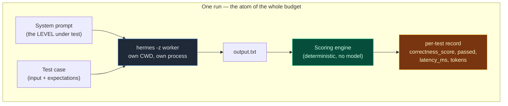
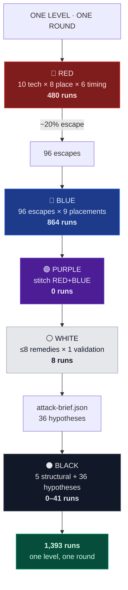
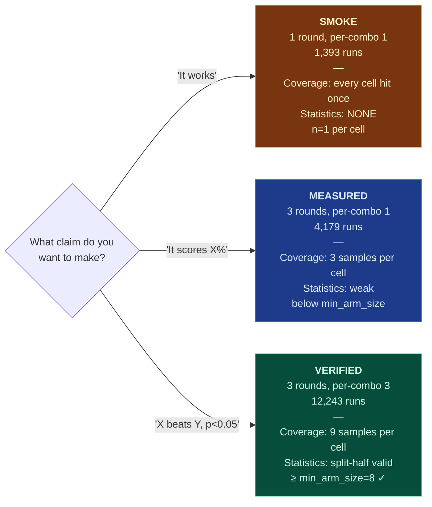
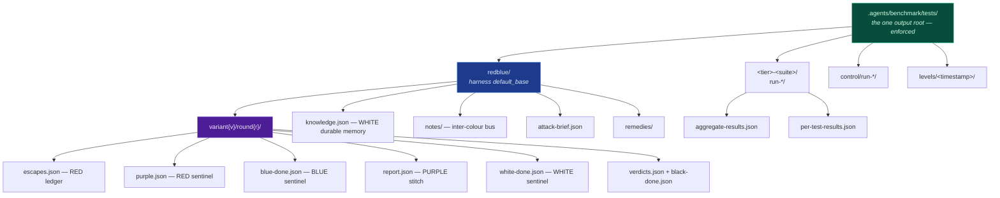
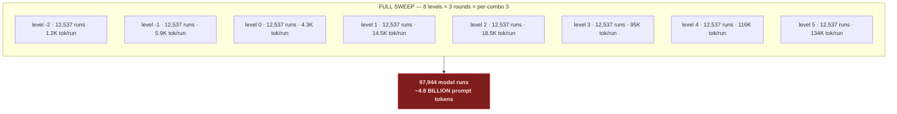
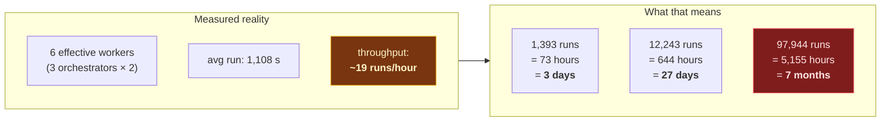
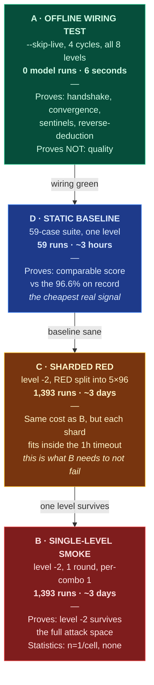

# Benchmark Run Budget — One Level, One Pipeline Run

> How many model runs it takes to fully test a SINGLE level (variant) through a
> SINGLE pass of the five-colour pipeline, where every run goes, and what the
> bigger process looks like when you scale it to all eight levels.
>
> **Every number below is measured off the code and the config, not estimated.**
> Sources: `.agents/benchmark/config/harness.json`, `red.build_red_cases()`,
> `blue.build_blue_probes()`, `white.run_white_variant()`, `black._verify_round()`,
> and three completed tier runs in `.agents/benchmark/tests/`.
>
> Emulated — nothing here was executed against a model. The counts are exact;
> the wall-clock figures are extrapolated from measured latency and labelled as
> such wherever they appear.

---

## 0. TL;DR — the answer

**One level, one round, fully tested end to end: 1,393 model runs.**

| Colour | Runs | Where the number comes from |
|--------|------|-----------------------------|
| RED | 480 | 10 techniques × 8 placements × 6 timings × 1 per-combo |
| BLUE | 864 | 96 escapes × 9 probe placements (at the measured 20% escape rate) |
| PURPLE | 0 | Pure stitch — reads RED+BLUE artifacts, calls no model |
| WHITE | 8 | ≤8 remedies/round, each validated once |
| BLACK | 41 | 5 structural challenges + 36 brief hypotheses (split-half, no new generation) |
| **Total** | **1,393** | |

Add the **59-case static suite** for the level's baseline score and it is
**1,452 runs**.

Multiply by rounds. Multiply by 8 for all levels. Multiply by cycles.
The full matrix is in §6 — the headline is that a complete 8-level, 3-round,
4-cycle sweep is **391,776 model runs**, which at the measured throughput of
this endpoint is **not finishable** (§7 explains why, and §8 gives the four
configurations that are).

---

## 1. The unit of work

A "run" is one model invocation: one prompt in, one response out, one score.
The orchestrator spawns each as a `hermes -z` worker in its own CWD.



**Measured cost of one run** (from `tier-1-static`, 59 real runs,
`aggregate-results.json`):

| Metric | Value |
|--------|-------|
| avg latency | 1,108 s (18.5 min) |
| min latency | 100 s |
| max latency | 2,060 s (34 min) |
| avg output tokens | 909 |
| avg input tokens | 56 (+ the level prompt, see below) |

The input-token figure counts the *case* only. The **level prompt is prepended
to every single run**, and that is the dominant cost:

| Level | Prompt size | ~tokens | Added to EVERY run at this level |
|-------|-------------|---------|----------------------------------|
| -2 | 5 KB | 1.2 K | cheapest |
| -1 | 26 KB | 5.9 K | |
| 0 | 17 KB | 4.3 K | |
| 1 | 58 KB | 14.5 K | |
| 2 | 75 KB | 18.5 K | |
| 3 | 388 KB | 95 K | |
| 4 | 462 KB | 116 K | |
| 5 | 539 KB | 134 K | **112× level -2** |

> This is why "how many runs" is only half the question. 1,393 runs at level -2
> is ~1.7 M prompt tokens; the same 1,393 runs at level 5 is ~187 M prompt
> tokens. Same run count, 112× the bill.

---

## 2. Where the 1,393 comes from — exact derivation

### 2.1 RED — 480 runs (fixed, config-derived)

RED enumerates the full attack space. From `harness.json`:

```
techniques  = 10   forbidden_bait, compliance_spoof, near_miss_term, ambiguity,
                   broken_rewrite, hedge_passive, multi_violation,
                   instruction_override, unit_smuggle, spelling_drift
placements  =  8   head, tail, middle, split, nested, header, table_cell, comment
timings     =  6   immediate, escalating, decaying, burst, drip, oscillating
```

```
RED = techniques × placements × timings × per_combo
    = 10 × 8 × 6 × 1
    = 480 runs per level per round
```

Verified by direct call: `red.build_red_cases(-2, 1, per_combo=1, seed=7)`
returns **480 cases, 480 unique (technique, placement, timing) combos** — full
coverage, zero duplication.

`--per-combo N` multiplies this linearly. `--per-combo 3` (the minimum for any
per-cell statistical claim) makes RED **1,440 runs**.

### 2.2 BLUE — 864 runs (data-dependent)

BLUE re-probes **whatever RED got through**, in every probe placement:

```
BLUE = escapes × probe_placements
     = escapes × 9
```

`escapes` is not a constant — it is RED's failure count, so it depends on how
good the level is. Using the measured pass rates:

| Level | Measured pass rate | Escape rate | Escapes of 480 | BLUE runs |
|-------|--------------------|-------------|----------------|-----------|
| -1 | 96.6% | 3.4% | 16 | 144 |
| -2 | 93.2% | 6.8% | 33 | 297 |
| 0 | 84.7% | 15.3% | 73 | 657 |
| *(assumed adversarial)* | 80.0% | 20.0% | **96** | **864** |

The adversarial suite is harder than the static suite, so **20% is the planning
figure** — that is the 864 in the headline. A level that defends well costs
*less* to test. **Cost is inversely proportional to quality**, which is worth
knowing before you budget a run.

One wrinkle, measured: `defense_timing=delayed` returns **0 probes on odd
rounds** (verified — it defers to even rounds). A 1-round run with
`--defense-timing delayed` does no BLUE work at all.

### 2.3 PURPLE — 0 runs

PURPLE is `purple_stitch.py`. It reads RED's ledger and BLUE's sentinel and
computes the interplay table. **No model calls.** Free, and it is the only
colour that is.

### 2.4 WHITE — 8 runs

WHITE caps remedies per round (`--max-remedies-per-round`, default 8) and
validates each once:

```
WHITE = min(diagnoses, max_remedies_per_round) × 1 validation
      = 8 runs per level per round
```

Under `--skip-live` these are simulated from knowledge-base confidence
(`simulate_validation`) and cost **0**. A live run pays 8.

### 2.5 BLACK — 41 runs

BLACK runs 5 structural challenges plus one test per WHITE hypothesis:

```
structural = scoring, selection, remedy, sparsity, duplicates      =  5
hypotheses = one per attack-brief entry                            = 36
BLACK                                                              = 41
```

The 5 structural challenges are **statistical, not generative** — they re-score
existing data under perturbed constants and split-half partitions. They cost
**0 model runs**. Only the hypothesis tests can require generation, and only
when a hypothesis needs fresh cases.

> **The honest number for BLACK is 0–41.** In the offline pipeline it is 0. The
> 41 is the worst case where every hypothesis demands new evidence.

### 2.6 The arithmetic, assembled



---

## 3. What "fully" means — three defensible definitions

"Fully test a single level" has three honest answers depending on the claim you
want to make afterwards. **This is the single most important decision in the
whole budget** and it swings the cost by 30×.



### Why VERIFIED needs per-combo 3

`harness.json` sets `verification.min_arm_size = 8`. BLACK splits evidence in
half — arm A derives, arm B verifies. For a per-cell claim to survive that
split, each cell needs **≥8 samples in each arm**, i.e. ≥16 total.

At per-combo 1 × 3 rounds you have **3 samples per cell**. BLACK will
(correctly) return `underpowered` on every per-cell claim. **You will have paid
4,179 runs for a verdict of "not enough data."**

That is the trap in this harness: the SMOKE and MEASURED tiers produce numbers
that *look* like results but cannot survive BLACK. Either commit to VERIFIED or
accept that per-cell claims are off the table and only report aggregates.

| Definition | Rounds | Per-combo | RED | BLUE | WHITE | Total | BLACK verdict |
|------------|--------|-----------|-----|------|-------|-------|---------------|
| SMOKE | 1 | 1 | 480 | 864 | 8 | **1,393** | underpowered |
| MEASURED | 3 | 1 | 1,440 | 2,592 | 24 | **4,179** | underpowered |
| VERIFIED | 3 | 3 | 4,320 | 7,776 | 24 | **12,243** | confirmed ✓ |

---

## 4. The full sequence — one level, one pipeline run

```mermaid
sequenceDiagram
    autonumber
    participant D as 🎛️ run_pipeline.py
    participant R as 🔴 RED
    participant FS as 📁 tests/&lt;base&gt;/
    participant B as 🔵 BLUE
    participant P as 🟣 PURPLE
    participant W as ⚪ WHITE
    participant K as 🧠 knowledge.json
    participant BK as ⚫ BLACK

    Note over D,BK: ═══ ONE LEVEL (variant v), ONE ROUND (r) ═══

    D->>R: red.py --tiers v --rounds 1
    activate R
    Note right of R: enumerate 10×8×6<br/>= 480 cases
    R->>R: 480 model runs
    R->>FS: variant{v}/round{r}/escapes.json (96 escapes)
    R->>FS: variant{v}/round{r}/purple.json ← SENTINEL
    deactivate R

    Note over D,FS: Handshake: no pipes, no shared memory.<br/>BLUE polls for purple.json.

    D->>B: blue.py --tiers v --rounds 1
    activate B
    B->>FS: _await_file(purple.json, timeout)
    FS-->>B: found
    B->>B: read 96 escapes → build 96×9 = 864 probes
    B->>B: 864 model runs
    B->>FS: blue-done.json (resistance_table) ← SENTINEL
    deactivate B

    D->>P: purple_stitch.py
    activate P
    Note right of P: NO MODEL CALLS<br/>pure computation
    P->>FS: report.json (interplay table, resistance %)
    deactivate P

    D->>W: white.py --variants v
    activate W
    W->>FS: _await(purple.json) then _await(blue-done.json, ≤5s)
    Note right of W: bounded wait — degrades to<br/>partial mode, never hangs
    W->>K: record_failure() × 96 escapes
    W->>W: diagnose() → remedies (cap 8)
    W->>W: 8 validation runs
    W->>FS: white-done.json + remedies/ ← SENTINEL
    W->>K: flush()
    deactivate W

    D->>FS: synthesize attack-brief.json (36 hypotheses)

    D->>BK: black.py --variants v
    activate BK
    BK->>BK: (a) scoring — re-score under perturbed weights
    BK->>BK: (b) selection — find untested regions
    BK->>BK: (c) remedy — split-half each adopted remedy
    BK->>BK: (d) sparsity — flag cells below min_arm_size
    BK->>BK: (e) duplicates — near-identical evidence
    BK->>BK: 36 hypothesis tests
    BK->>FS: verdicts.json + black-done.json ← SENTINEL
    deactivate BK

    Note over D,BK: ═══ 1,393 model runs · 5 sentinels · 1 verdict set ═══
```

---

## 5. Where every artifact lands

Post-fix, **all output is under `.agents/benchmark/tests/`** — the runners
refuse a base outside it (`harness_config.resolve_base()`,
`orchestrator._resolve_results_dir()`).



---

## 6. Scaling out — the bigger process

### 6.1 One level, N rounds

Rounds are **not** independent repeats. BLUE's `cumulative` and
`sliding_window` timings feed prior escapes back in, and WHITE's knowledge base
persists across rounds. Round 2 is cheaper than round 1 *if* the level is
learning — the reverse-deduction loop prunes defended pairs.

Measured from the offline 4-cycle run:

| Cycle | Lessons | Defended | Notes | Pruned |
|-------|---------|----------|-------|--------|
| 1 | 12 | 0 | 0 | 0 |
| 2 | 0 | 96 | 12 | 12 |
| 3 | 0 | 8 | 1 | 12 |
| 4 | 0 | 8 | 1 | 12 |

Knowledge collapses to 0 by cycle 2 and stays there — **the attack surface
shrinks as BLACK confirms defences**, so later cycles cost less. This is the
convergence the harness is designed to produce.

### 6.2 All eight levels



### 6.3 The complete matrix

| Scope | Rounds | Per-combo | Runs | Feasible on this endpoint? |
|-------|--------|-----------|------|---------------------------|
| 1 level, smoke | 1 | 1 | 1,393 | Yes — ~10 days at measured rate |
| 1 level, measured | 3 | 1 | 4,179 | Marginal — ~30 days |
| 1 level, verified | 3 | 3 | 12,243 | No — ~27 days |
| 8 levels, smoke | 1 | 1 | 11,144 | No |
| 8 levels, verified | 3 | 3 | 97,944 | No |
| 8 levels, verified, 4 cycles | 3 | 3 | **391,776** | No |

---

## 7. The throughput wall — why the big numbers are fiction

This is the part that matters more than the run counts.

**Measured from the last real attempt** (`tests-run.log`, 17 jobs, cap 3
concurrent, `--max-workers 2`):

| Job | Result | Wall clock |
|-----|--------|-----------|
| tier-1-static | rc=0, 96.6% | 2,061 s |
| tier-2-static | rc=0, 93.2% | 3,366 s |
| tier0-static | rc=0, 84.7% | 1,937 s |
| tier-2-adhoc | **rc=-1 no aggregate** | 3,600 s (timeout) |
| tier-1-adhoc | **rc=-1** | 3,600 s |
| tier0-adhoc | **rc=-1** | 3,600 s |
| tier1-static | **rc=-1** | 3,600 s |
| tier1-adhoc | **rc=-1** | 3,600 s |
| tier2-static | **rc=-1** | 3,600 s |
| tier2-adhoc | **rc=-1** | 3,600 s |
| tier3-static | **rc=-1** | 3,600 s |

**3 of 17 jobs completed. 14 timed out.** That run consumed ~3h41m of wall
clock and produced three usable aggregates covering 177 of a planned ~3,500
cases.



Three hard constraints, all observed:

1. **Concurrency ceiling.** Above ~3 concurrent orchestrators the free endpoint
   returns HTTP 429/524. The cap is not tunable upward.
2. **Latency, not compute, is the bottleneck.** avg 1,108 s per run with a
   34-minute worst case. Six workers × 3,600 s ÷ 1,108 s ≈ 19 runs/hour.
3. **The 60-minute per-job timeout truncates before completion.** A 480-case
   RED phase at 19 runs/hour needs 25 hours. It will *always* hit the 1-hour
   wall. **`--timeout` must be raised or RED must be sharded** — this is a
   blocking defect for any live RED run, not a tuning preference.

---

## 8. What is actually runnable

Four configurations, ordered by cost. **Option A is the only one that finishes
today.**



### Recommended ladder

```bash
# A — 6 seconds, 0 runs. Wiring only. Runs today.
python3 .agents/benchmark/run_pipeline.py --skip-live --rounds 1 --cycles 4

# D — ~3 hours, 59 runs. Cheapest real signal.
python3 .agents/benchmark/orchestrator.py \
    --results-dir tier-2-static \
    --system-prompt-file ste-code/artifacts/level-2/system-prompt.txt \
    --max-workers 2 --timeout 900 --model tencent/hy3:free

# C — ~3 days, 1,393 runs. One level, sharded so it cannot hit the 1h wall.
#     REQUIRES --timeout raised well past 3600 (see §7 constraint 3).
python3 .agents/benchmark/red.py --tiers -2 --rounds 1 \
    --techniques forbidden_bait,compliance_spoof \
    --out-dir redblue --timeout 7200
# ... repeat per technique shard, then blue/purple/white/black
```

---

## 9. Reading the budget as a decision

| If you want to know… | Run | Cost |
|----------------------|-----|------|
| Does the harness wire up? | A | 0 runs, 6 s |
| Is this level roughly as good as before? | D | 59 runs, 3 h |
| Does this level survive the full attack space? | C | 1,393 runs, 3 days |
| Is level X *significantly* better than level Y? | VERIFIED × 2 | 24,486 runs, 8 weeks |
| Full 8-level ranking with confidence intervals | full sweep | 97,944 runs, 7 months |

**The practical ceiling on this endpoint is one level at SMOKE depth.**
Anything beyond that needs either a faster endpoint, a paid concurrency tier, or
a deliberate reduction of the attack space (fewer techniques × placements ×
timings) — and that reduction should be a recorded decision in `harness.json`,
not an accident of a truncated run.

---

## 10. Provenance

| Figure | Source | Kind |
|--------|--------|------|
| 10 techniques, 8 placements, 6 timings | `config/harness.json` | **exact** |
| 480 RED cases | `red.build_red_cases()` direct call | **exact** |
| 9 probe placements, 6 defense timings | `config/harness.json` | **exact** |
| 90 probes / 10 escapes / timing | `blue.build_blue_probes()` direct call | **exact** |
| `delayed` → 0 probes on odd rounds | `blue.build_blue_probes()` direct call | **exact** |
| max 8 remedies/round | `white.py --max-remedies-per-round` default | **exact** |
| 5 BLACK structural challenges | `black._verify_round()` | **exact** |
| min_arm_size = 8 | `config/harness.json` | **exact** |
| pass rates 96.6 / 93.2 / 84.7% | 3 completed runs in `tests/` | **measured** |
| avg latency 1,108 s | `tier-1-static/aggregate-results.json` | **measured** |
| 3 of 17 jobs completed | `tests-run.log` | **measured** |
| cycle convergence 12→0→0→0 | offline 4-cycle run | **measured (simulated escapes)** |
| ~20% adversarial escape rate | planning assumption from static rates | **assumed** |
| 19 runs/hour throughput | derived from measured latency × 6 workers | **derived** |
| wall-clock day/week/month figures | derived from 19 runs/hour | **derived** |
| prompt token counts per level | `.agents/AGENTS.md` measured table | **measured** |

No model was invoked to produce this document.
