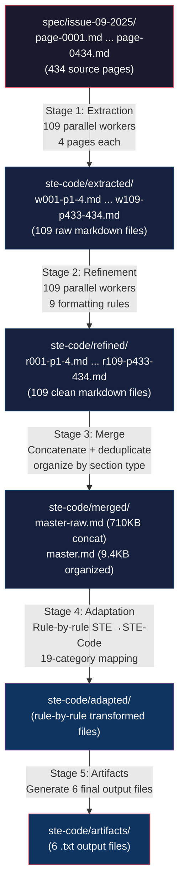
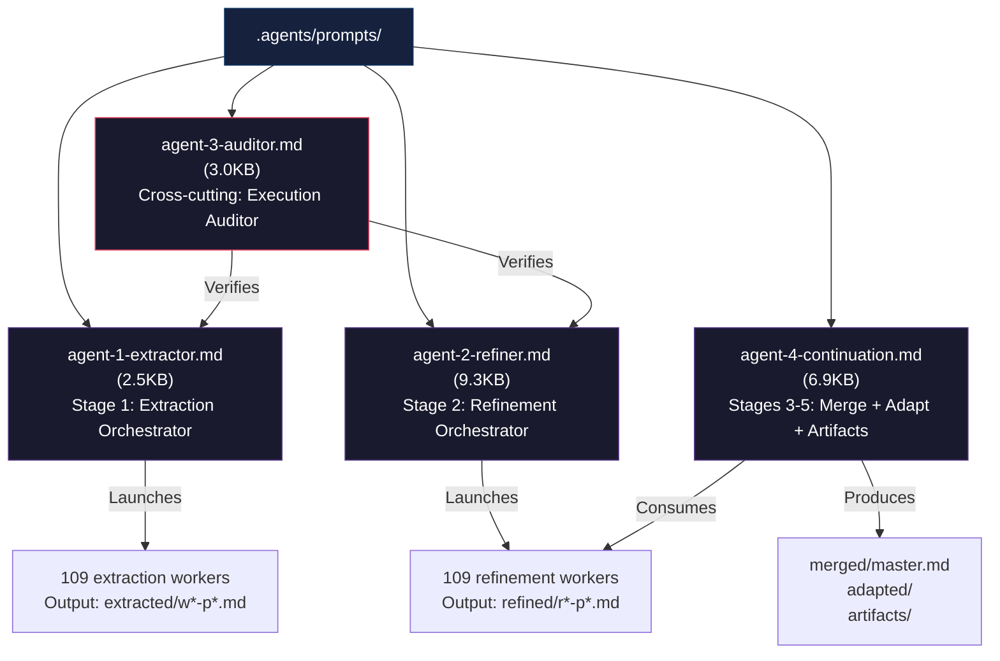
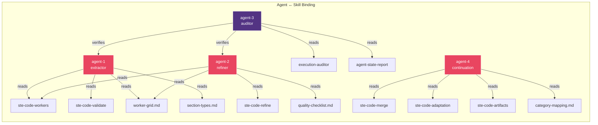

# STE-Code Database Layout — Single Source of Truth

> Generated: 2026-07-30 | Project: ASD-STE100 Issue 9 → STE-Code Pipeline

---

## 1. Complete Directory Tree (erDiagram)

```mermaid
erDiagram
    PROJECT_ROOT ||--o{ STE_CODE : contains
    PROJECT_ROOT ||--o{ DOT_HERMES : contains

    STE_CODE ||--|| EXTRACTED : "stage-1"
    STE_CODE ||--|| REFINED : "stage-2"
    STE_CODE ||--|| MERGED : "stage-3"
    STE_CODE ||--|| ADAPTED : "stage-4"
    STE_CODE ||--|| ARTIFACTS : "stage-5"
    STE_CODE ||--|| PROMPTS : "worker-prompts"
    STE_CODE ||--|| PROMPTS_REFINE : "refine-prompts"
    STE_CODE ||--|| AUDIT : "audit-outputs"
    STE_CODE ||--|| PROGRESS_MD : "tracker"
    STE_CODE ||--|| README_MD : "pipeline-docs"
    STE_CODE ||--o{ SCRIPTS : "utility-scripts"

    EXTRACTED ||--o{ W_FILES : "109 files"
    REFINED ||--o{ R_FILES : "109 files"
    MERGED ||--o{ MASTER_FILES : "2 files"
    ADAPTED ||--o{ ADAPTED_FILES : "stage-4 output"
    ARTIFACTS ||--o{ ARTIFACT_FILES : "6 txt files"
    PROMPTS_REFINE ||--o{ R_PROMPT_FILES : "109 txt files"

    DOT_HERMES ||--|| AGENT_DIR : "agent-prompts"
    DOT_HERMES ||--|| SKILLS_DIR : "skill-hierarchy"
    DOT_HERMES ||--|| AUDIT_DIR : "audit-reports"
    DOT_HERMES ||--|| STATE_DIR : "state-files"
    DOT_HERMES ||--|| FEEDBACK_DIR : "review-feedback"
    DOT_HERMES ||--|| PROMPTS_INTERNAL : "internal-prompts"
    DOT_HERMES ||--|| SCRIPTS_INTERNAL : "helper-scripts"
    DOT_HERMES ||--|| SCRATCH_DIR : "draft-work"
    DOT_HERMES ||--|| UML_DIR : "diagrams"
    DOT_HERMES ||--|| MASTER_DOC : "mission-plan"

    AGENT_DIR ||--|| AGENT_1 : "extraction"
    AGENT_DIR ||--|| AGENT_2 : "refinement"
    AGENT_DIR ||--|| AGENT_3 : "auditor"
    AGENT_DIR ||--|| AGENT_4 : "continuation"

    SKILLS_DIR ||--|| SPEC_EXTRACTION : "ste-code skills"

    SPEC_EXTRACTION ||--|| WORKERS_SKILL : "ste-code-workers"
    SPEC_EXTRACTION ||--|| VALIDATE_SKILL : "ste-code-validate"
    SPEC_EXTRACTION ||--|| REFINE_SKILL : "ste-code-refine"
    SPEC_EXTRACTION ||--|| MERGE_SKILL : "ste-code-merge"
    SPEC_EXTRACTION ||--|| ADAPTATION_SKILL : "ste-code-adaptation"
    SPEC_EXTRACTION ||--|| ARTIFACTS_SKILL : "ste-code-artifacts"
    SPEC_EXTRACTION ||--|| CONTINUE_SKILL : "ste-code-continue"
    SPEC_EXTRACTION ||--|| AUDITOR_SKILL : "execution-auditor"
    SPEC_EXTRACTION ||--|| STATE_REPORT_SKILL : "agent-state-report"
    SPEC_EXTRACTION ||--|| REFERENCES_DIR : "reference-docs"

    REFERENCES_DIR ||--o{ REF_DOCS : "7 reference files"

    PROMPTS_INTERNAL ||--|| REFINE_PROMPTS_INT : "111 refine prompts"
    AUDIT_DIR ||--o{ AUDIT_REPORTS : "timestamped audits"
    STATE_DIR ||--o{ STATE_FILES : "PROGRESS + REFINE-PROGRESS"
    SCRATCH_DIR ||--o{ DRAFT_FILES : "preliminary plans"
```



---

## 2. File Naming Conventions

### 2.1 Extraction Worker Files: `wNNN-pPPPP-PPPP.md`

Pattern: `w{worker_number}-p{start_page}-{end_page}.md`

| Component | Meaning | Example |
|-----------|---------|---------|
| `w` | Worker prefix | `w001` |
| `NNN` | Worker number (001–109) | `w001` = worker 1 |
| `p` | Page prefix | `p1-4` |
| `PPPP-PPPP` | Page range (start-end) | `p1-4` = pages 1 through 4 |

Examples:
- `w001-p1-4.md` → Worker 1, pages 1–4 (FRONT matter)
- `w050-p197-200.md` → Worker 50, pages 197–200 (DICT section)
- `w109-p433-434.md` → Worker 109, pages 433–434 (last worker, 2 pages only)

Total: 109 files covering 434 pages (108 workers × 4 pages + 1 worker × 2 pages)

### 2.2 Refinement Worker Files: `rNNN-pPPPP-PPPP.md`

Pattern: `r{worker_number}-p{start_page}-{end_page}.md`

| Component | Meaning | Example |
|-----------|---------|---------|
| `r` | Refinement prefix | `r001` |
| `NNN` | Worker number (001–109) | `r001` = refinement worker 1 |
| `pPPPP-PPPP` | Same page range as extraction | `p1-4` |

Examples:
- `r001-p1-4.md` → Refined output for worker 1, pages 1–4
- `r050-p197-200.md` → Refined output for worker 50, pages 197–200
- `r109-p433-434.md` → Refined output for worker 109, pages 433–434

Total: 109 files, 1:1 correspondence with extraction files

### 2.3 Refinement Prompt Files: `rNNN-prompt.txt`

Pattern: `r{worker_number}-prompt.txt`

Each file contains the full worker prompt for the refinement pass.

Examples:
- `r001-prompt.txt` → Prompt for refinement worker 1
- `r109-prompt.txt` → Prompt for refinement worker 109

Total: 109 prompt files in `ste-code/prompts-refine/`

---

## 3. Data Flow — Five-Stage Pipeline



### Stage Details

| Stage | Input | Output | Workers | Agent | Status |
|-------|-------|--------|---------|-------|--------|
| 1 — Extraction | `spec/issue-09-2025/page-*.md` (434 pages) | `extracted/w*-p*.md` (109 files) | 109 parallel, 37 batches × 3 | agent-1-extractor | Complete |
| 2 — Refinement | `extracted/w*-p*.md` (109 files) | `refined/r*-p*.md` (109 files) | 109 parallel, 37 batches × 3 | agent-2-refiner | Running |
| 3 — Merge | `refined/r*-p*.md` (109 files) | `merged/master.md` | 1 sequential | agent-4-continuation | Pending |
| 4 — Adaptation | `merged/master.md` | `adapted/` (rule-by-rule) | 1 sequential | agent-4-continuation | Pending |
| 5 — Artifacts | `adapted/` | `artifacts/` (6 .txt files) | 1 sequential | agent-4-continuation | Pending |

### Cross-cutting: Audit (agent-3-auditor)

Runs alongside all stages. Outputs timestamped audit reports to `ste-code/audit/` and `.agents/audit/`.

---

## 4. Prompt Storage

### 4.1 Extraction Prompts: `ste-code/prompts/`

Currently empty (prompts generated on-the-fly during extraction phase, or stored in `ste-code/prompts-refine/`).

### 4.2 Refinement Prompts: `ste-code/prompts-refine/`

Contains 109 prompt files, one per refinement worker.

| Pattern | Example | Contents |
|---------|---------|----------|
| `rNNN-prompt.txt` | `r001-prompt.txt` | Full worker instruction — input file path, 9 refinement rules, output path |

### 4.3 Internal Prompts: `ste-code/prompts-refine/`

Internal refinement worker prompt templates (111 files). Used by the refinement orchestrator to generate per-worker prompts.

### 4.4 UML Worker Prompts: `.agents/uml/`

Contains 5 prompt files (`w1-prompt.txt` through `w5-prompt.txt`) used for UML diagram generation workers.

---

## 5. Metadata and State Files

### 5.1 `ste-code/PROGRESS.md`

Extraction progress tracker:
- 37 batches (batches 1–37)
- 109 workers (W001–W109)
- Checkbox status per batch: `[ ]` pending, `[x]` complete
- Merge verification checklist

### 5.2 `.agents/state/PROGRESS.md`

Overall pipeline state for all 5 stages including extraction, refinement, merge, adaptation, artifacts.

### 5.3 `.agents/state/REFINE-PROGRESS.md`

Refinement-specific progress tracker with per-worker status.

### 5.4 Audit Reports: `.agents/audit/`

Timestamped execution audit reports:
- `audit-20260729-211611.md` — Initial extraction audit
- `audit-20260729-212052.md` — Mid-extraction audit
- `audit-20260729-213422.md` — Post-extraction audit
- `state-20260729-214707.md` — State snapshot
- `state-20260730-000000.md` — State snapshot
- `state-20260730-004500.md` — State snapshot

### 5.5 `ste-code/audit/`

Output directory for cross-cutting audit reports (currently empty).

### 5.6 `ste-code/README.md`

Pipeline documentation — stage descriptions, directory map, status indicators.

### 5.7 `.agents/feedback/exchange.md`

Reviewer feedback exchange log.

---

## 6. Skill Storage: `.agents/skills/`

```mermaid
graph TD
    SKILLS[".agents/skills/"] --> SW["ste-code-workers/<br/>SKILL.md<br/>references/worker-prompts.md"]
    SKILLS --> SV["ste-code-validate/<br/>SKILL.md"]
    SKILLS --> SR["ste-code-refine/<br/>SKILL.md"]
    SKILLS --> SM["ste-code-merge/<br/>SKILL.md"]
    SKILLS --> SA["ste-code-adaptation/<br/>SKILL.md<br/>references/category-mapping.md"]
    SKILLS --> SAR["ste-code-artifacts/<br/>SKILL.md"]
    SKILLS --> SC["ste-code-continue/<br/>continuation.md<br/>extractor.md<br/>refiner.md"]
    SKILLS --> EA["execution-auditor/<br/>SKILL.md<br/>references/evidence-commands.md"]
    SKILLS --> ASR["agent-state-report/<br/>SKILL.md"]
    SKILLS --> REF["references/<br/>granular-strategy.md<br/>quality-checklist.md<br/>rails.md<br/>section-types.md<br/>STE-CODE-IMPLEMENTATION.md<br/>worker-grid.md<br/>worker-rails.md"]

    style SKILLS fill:#16213e,stroke:#0f3460,color:#fff
    style SW fill:#1a1a2e,stroke:#533483,color:#fff
    style SV fill:#1a1a2e,stroke:#533483,color:#fff
    style SR fill:#1a1a2e,stroke:#533483,color:#fff
    style SM fill:#1a1a2e,stroke:#533483,color:#fff
    style SA fill:#1a1a2e,stroke:#533483,color:#fff
    style SAR fill:#1a1a2e,stroke:#533483,color:#fff
    style SC fill:#1a1a2e,stroke:#533483,color:#fff
    style EA fill:#1a1a2e,stroke:#e94560,color:#fff
    style ASR fill:#1a1a2e,stroke:#533483,color:#fff
    style REF fill:#0f3460,stroke:#533483,color:#fff
```



### Skill Directory Map

| Skill Directory | Purpose | Key Files |
|-----------------|---------|-----------|
| `ste-code-workers/` | Worker orchestration protocol | `SKILL.md`, `references/worker-prompts.md` |
| `ste-code-validate/` | Per-batch validation | `SKILL.md` |
| `ste-code-refine/` | Refinement protocol (9 rules) | `SKILL.md` |
| `ste-code-merge/` | Stage 3 merge protocol | `SKILL.md` |
| `ste-code-adaptation/` | Stage 4 adaptation protocol | `SKILL.md`, `references/category-mapping.md` |
| `ste-code-artifacts/` | Stage 5 artifact generation | `SKILL.md` |
| `ste-code-continue/` | Continuation session templates | `continuation.md`, `extractor.md`, `refiner.md` |
| `execution-auditor/` | Auditor protocol | `SKILL.md`, `references/evidence-commands.md` |
| `agent-state-report/` | State report format | `SKILL.md` |
| `references/` | Shared reference documents | 7 files (see below) |

### Reference Documents

| File | Purpose |
|------|---------|
| `worker-grid.md` | 109-worker grid layout (4 pages each, 37 batches) |
| `section-types.md` | Section type classification (FRONT, TOC, INDEX, INTRO, RULES, CATEGORIES, DICT, APPENDIX) |
| `quality-checklist.md` | Per-batch quality verification |
| `rails.md` | Worker guardrails and constraints |
| `worker-rails.md` | Additional worker-specific constraints |
| `granular-strategy.md` | Per-section extraction strategy |
| `STE-CODE-IMPLEMENTATION.md` | STE→STE-Code implementation reference |

---

## 7. Agent Storage: `.agents/prompts/`



### Agent Role Summary

| Agent | File | Stage | Responsibility | Skills Referenced |
|-------|------|-------|----------------|-------------------|
| agent-1 | `agent-1-extractor.md` | 1 — Extraction | Orchestrate 109 workers reading 434 spec pages, 37 batches of 3 | ste-code-workers, ste-code-validate, worker-grid, section-types |
| agent-2 | `agent-2-refiner.md` | 2 — Refinement | Orchestrate 109 workers reformatting extracted files, 9 refinement rules | ste-code-refine, ste-code-workers, worker-grid, quality-checklist |
| agent-3 | `agent-3-auditor.md` | Cross-cutting | Verify agents #1 and #2 executed claims against disk evidence | execution-auditor, agent-state-report, agent-1-extractor, agent-2-refiner |
| agent-4 | `agent-4-continuation.md` | 3–5 — Continuation | Merge → Adapt → Artifacts pipeline end-to-end | ste-code-merge, ste-code-adaptation, ste-code-artifacts, category-mapping |

---

## 8. Complete File System Map

```
PROJECT_ROOT/
├── ste-code/                          # Primary data pipeline
│   ├── README.md                      # Pipeline documentation + status
│   ├── PROGRESS.md                    # Extraction batch tracker (37 batches)
│   ├── check-rails.py                 # Worker rail validation script
│   ├── generate_refine_prompts.py     # Prompt generator for refinement workers
│   ├── extracted/                     # STAGE 1: Raw extraction (109 files)
│   │   ├── w001-p1-4.md
│   │   ├── w002-p5-8.md
│   │   ├── ...
│   │   └── w109-p433-434.md
│   ├── refined/                       # STAGE 2: Formatted output (109 files)
│   │   ├── r001-p1-4.md
│   │   ├── r002-p5-8.md
│   │   ├── ...
│   │   └── r109-p433-434.md
│   ├── merged/                        # STAGE 3: Consolidated output
│   │   ├── master-raw.md              #   Concatenated (710KB)
│   │   └── master.md                  #   Organized/deduplicated (9.4KB)
│   ├── adapted/                       # STAGE 4: Code-adapted rules (pending)
│   ├── artifacts/                     # STAGE 5: Final .txt output (6 files, pending)
│   ├── audit/                         # Cross-cutting audit reports (pending)
│   ├── prompts/                       # Extraction worker prompts (currently empty)
│   └── prompts-refine/                # Refinement worker prompts (109 files)
│       ├── r001-prompt.txt
│       ├── r002-prompt.txt
│       ├── ...
│       └── r109-prompt.txt
│
├── .agents/                           # Agent infrastructure
│   ├── MASTER.md                      # Complete mission plan + terminology
│   ├── agent/                         # Agent orchestration prompts
│   │   ├── agent-1-extractor.md       #   Stage 1: Extraction orchestrator
│   │   ├── agent-2-refiner.md         #   Stage 2: Refinement orchestrator
│   │   ├── agent-3-auditor.md         #   Cross-cutting: Execution auditor
│   │   └── agent-4-continuation.md    #   Stages 3-5: Merge/Adapt/Artifacts
│   ├── skills/                        # Skill hierarchy
│   │   └── spec-extraction/           #   STE-Code specific skills
│   │       ├── ste-code-workers/      #     Worker orchestration
│   │       │   ├── SKILL.md
│   │       │   └── references/
│   │       │       └── worker-prompts.md
│   │       ├── ste-code-validate/     #     Batch validation
│   │       │   └── SKILL.md
│   │       ├── ste-code-refine/       #     Refinement protocol
│   │       │   └── SKILL.md
│   │       ├── ste-code-merge/        #     Merge protocol
│   │       │   └── SKILL.md
│   │       ├── ste-code-adaptation/   #     Adaptation protocol
│   │       │   ├── SKILL.md
│   │       │   └── references/
│   │       │       └── category-mapping.md
│   │       ├── ste-code-artifacts/    #     Artifact generation
│   │       │   └── SKILL.md
│   │       ├── ste-code-continue/     #     Continuation templates
│   │       │   ├── continuation.md
│   │       │   ├── extractor.md
│   │       │   └── refiner.md
│   │       ├── execution-auditor/     #     Auditor protocol
│   │       │   ├── SKILL.md
│   │       │   └── references/
│   │       │       └── evidence-commands.md
│   │       ├── agent-state-report/    #     State report format
│   │       │   └── SKILL.md
│   │       └── references/            #     Shared reference docs
│   │           ├── worker-grid.md
│   │           ├── section-types.md
│   │           ├── quality-checklist.md
│   │           ├── rails.md
│   │           ├── worker-rails.md
│   │           ├── granular-strategy.md
│   │           └── STE-CODE-IMPLEMENTATION.md
│   ├── audit/                         # Timestamped audit reports
│   │   ├── audit-20260729-211611.md
│   │   ├── audit-20260729-212052.md
│   │   ├── audit-20260729-213422.md
│   │   ├── state-20260729-214707.md
│   │   ├── state-20260730-000000.md
│   │   └── state-20260730-004500.md
│   ├── state/                         # Pipeline state trackers
│   │   ├── PROGRESS.md                #   Overall 5-stage progress
│   │   └── REFINE-PROGRESS.md         #   Refinement-specific progress
│   ├── feedback/                      # Reviewer feedback
│   │   └── exchange.md
│   ├── prompts/                       # Internal prompt templates
│   │   └── refine/                    #   111 refinement prompt templates
│   ├── scripts/                       # Helper scripts
│   │   ├── check-rails.py
│   │   ├── generate_refine_prompts.py
│   │   └── verify-batch.sh
│   ├── _scratch/                      # Draft/preliminary work
│   │   ├── coding-rules-part1-sec1.md
│   │   ├── coding-rules-part1-sec2-3.md
│   │   ├── coding-rules-part1-sec4-6.md
│   │   ├── coding-rules-part1-sec7-9.md
│   │   ├── generate_refine_prompts.py
│   │   ├── REFINE-PROGRESS.md
│   │   ├── ste-code-deployment-guide.md
│   │   ├── ste-code-distilled-system-prompt.md
│   │   ├── ste-code-example-turn.md
│   │   └── ste-code-extraction-methodology.md
│   └── uml/                           # UML diagrams
│       ├── database-layout.md         #   THIS FILE
│       ├── w1-prompt.txt
│       ├── w2-prompt.txt
│       ├── w3-prompt.txt
│       ├── w4-prompt.txt
│       └── w5-prompt.txt
│
└── spec/                              # Source specification
    └── issue-09-2025/                 #   ASD-STE100 Issue 9
        ├── page-0001.md
        ├── page-0002.md
        ├── ...
        └── page-0434.md
```

---

## 9. File Count Summary

| Location | Count | Type |
|----------|-------|------|
| `ste-code/extracted/` | 109 | Raw extraction .md |
| `ste-code/refined/` | 109 | Refined .md |
| `ste-code/merged/` | 2 | master-raw.md + master.md |
| `ste-code/adapted/` | 0 | (pending) |
| `ste-code/artifacts/` | 0 | (pending) |
| `ste-code/audit/` | 0 | (pending) |
| `ste-code/prompts/` | 0 | (empty) |
| `ste-code/prompts-refine/` | 109 | Refinement prompt .txt |
| `.agents/prompts/` | 4 | Agent orchestration .md |
| `.agents/skills/` | 21 | Skill + reference .md |
| `.agents/audit/` | 6 | Audit + state reports |
| `.agents/state/` | 2 | Progress trackers |
| `ste-code/prompts-refine/` | 111 | Internal prompt templates |
| `.agents/_scratch/` | 10 | Draft documents |
| `.agents/uml/` | 6 | Diagrams + worker prompts |
| **Total** | **~489** | |

---

## 10. Key Relationships



---

## 11. Naming Convention Reference Card

| Pattern | Where | Example | Meaning |
|---------|-------|---------|---------|
| `wNNN-pPPPP-PPPP.md` | `ste-code/extracted/` | `w001-p1-4.md` | Extraction worker NNN, pages PPPP–PPPP |
| `rNNN-pPPPP-PPPP.md` | `ste-code/refined/` | `r001-p1-4.md` | Refinement worker NNN, pages PPPP–PPPP |
| `rNNN-prompt.txt` | `ste-code/prompts-refine/` | `r001-prompt.txt` | Refinement prompt for worker NNN |
| `master*.md` | `ste-code/merged/` | `master.md` | Consolidated spec (organized) |
| `audit-YYYYMMDD-HHMMSS.md` | `.agents/audit/` | `audit-20260729-211611.md` | Timestamped audit report |
| `state-YYYYMMDD-HHMMSS.md` | `.agents/audit/` | `state-20260729-214707.md` | Timestamped state snapshot |
| `agent-N-role.md` | `.agents/prompts/` | `agent-1-extractor.md` | Agent N orchestration prompt |
| `SKILL.md` | Each skill dir | `SKILL.md` | Canonical skill definition |
| `page-NNNN.md` | `spec/issue-09-2025/` | `page-0001.md` | Source spec page (NNNN = 0001–0434) |

---

*End of STE-Code Database Layout — Single Source of Truth*
