# STE-Code Pipeline — Error Recovery & Edge Cases

> Authoritative troubleshooting reference. All diagrams use Mermaid.
> Cross-references: `rails.md`, `worker-rails.md`, `evidence-commands.md`, `worker-grid.md`, `SKILL.md` (execution-auditor).

---

## 1. FAILURE MODES — Complete Taxonomy

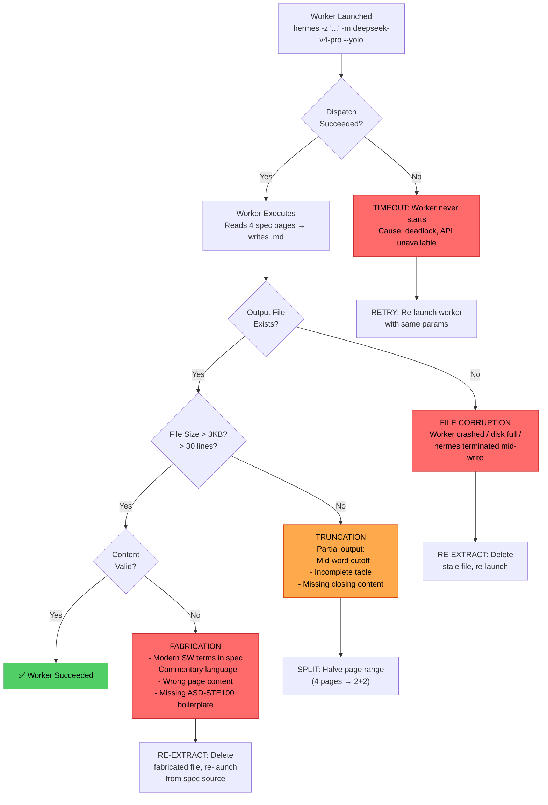

### 1a. Shell Quoting Errors Detail

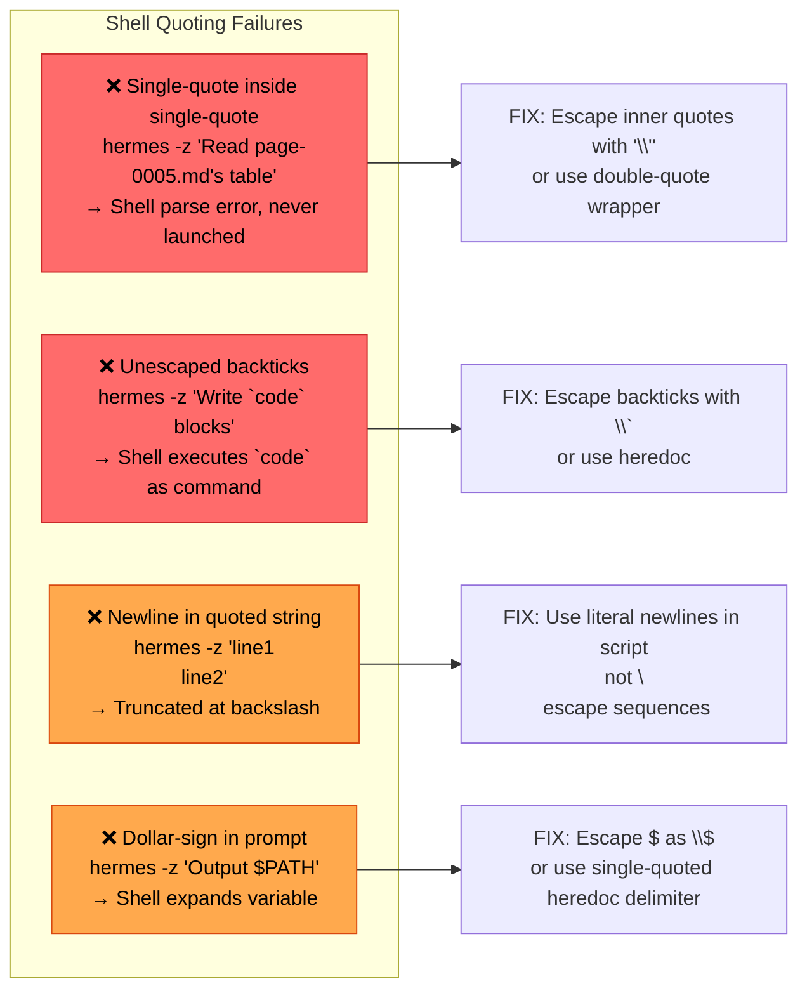

### 1b. Model Normalization Failure

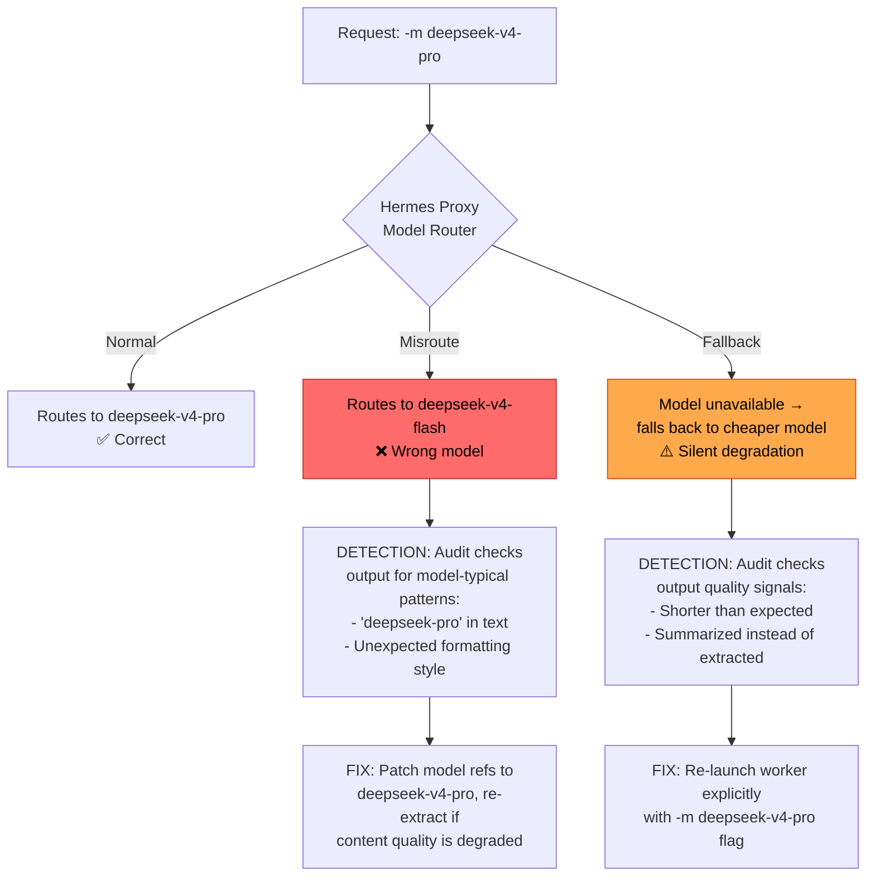

---

## 2. RECOVERY FLOWS — Per-Failure Response Matrix

### 2a. Batch-Level Recovery Decision Tree

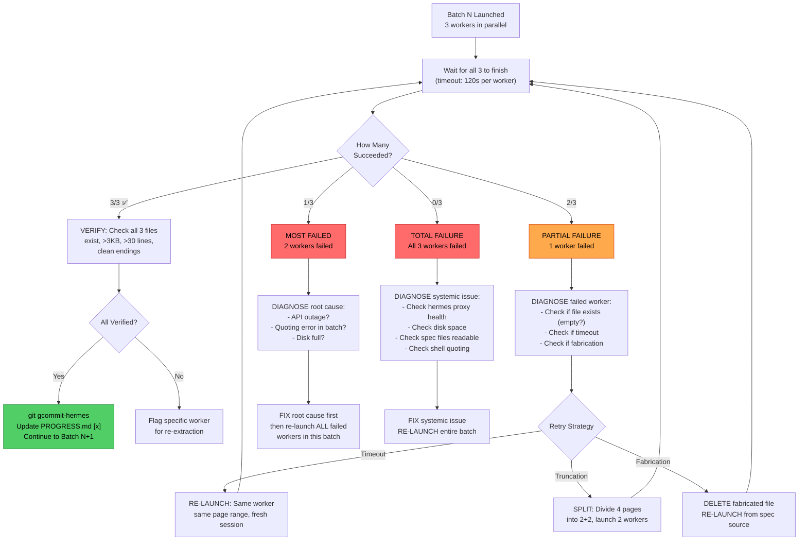

### 2b. Split Strategy for Truncated Workers

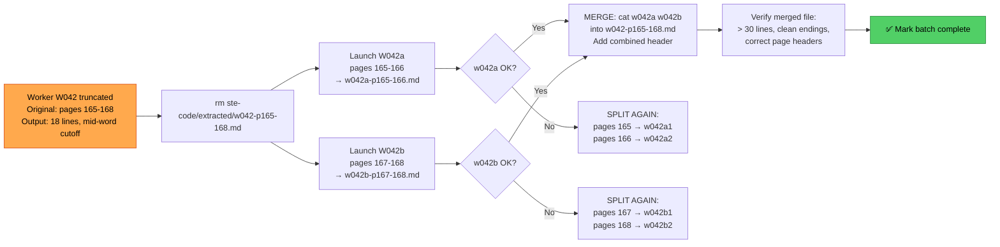

---

## 3. AUDIT DETECTION — How the Auditor Finds Problems

### 3a. Full Audit Flow

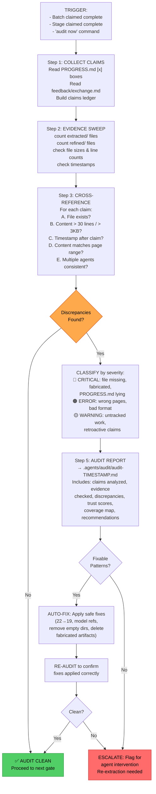

### 3b. Detection Methods Matrix


---

## 4. AUTO-FIXES vs AGENT INTERVENTION

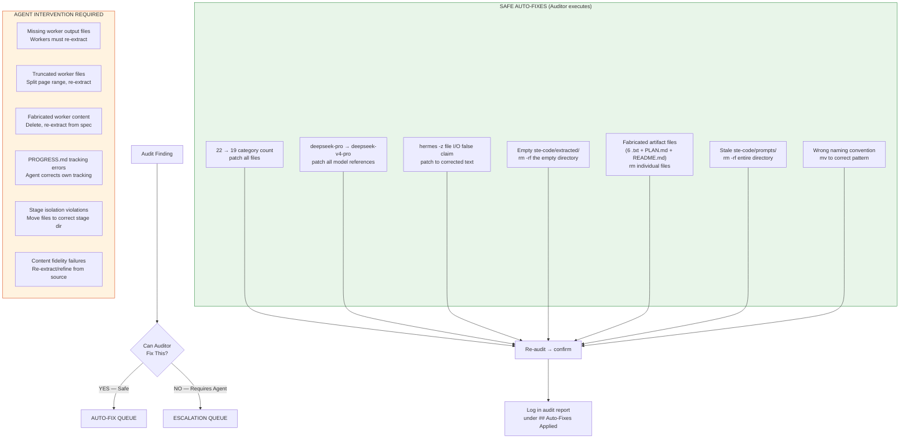

---

## 5. RAILS VIOLATIONS — Detection & Recovery

```mermaid
flowchart TD
    subgraph RAILS["8 Process Rails — Violation Detection & Recovery"]
        direction TB

        R1["RAIL 1: STAGE ISOLATION"]
        R1 --> R1D["DETECT: File in wrong stage dir<br/>e.g. refined/ written during extraction"]
        R1 --> R1R["RECOVER: Move file to _scratch/<br/>Regenerate in correct stage"]

        R2["RAIL 2: NAMING CONVENTION"]
        R2 --> R2D["DETECT: File doesn't match pattern<br/>wNNN-pPPPP-PPPP.md or rNNN-pPPPP-PPPP.md"]
        R2 --> R2R["RECOVER: mv to correct name<br/>Auto-fixable by auditor"]

        R3["RAIL 3: COMPLETION INTEGRITY"]
        R3 --> R3D["DETECT: [x] in PROGRESS.md but<br/>file missing, empty, or truncated"]
        R3 --> R3R["RECOVER: Revert [x] → [ ]/<br/>Re-extract missing files<br/>Verify ALL 3 before marking [x]"]

        R4["RAIL 4: CONTENT FIDELITY"]
        R4 --> R4D["DETECT: Fabrication signals —<br/>modern terms, commentary,<br/>missing boilerplate, wrong facts"]
        R4 --> R4R["RECOVER: Delete fabricated file<br/>Re-extract from spec source<br/>Auto-fix: 22→19, model refs"]

        R5["RAIL 5: FORMATTING STANDARDS"]
        R5 --> R5D["DETECT: Glued headings,<br/>no blank line after tables,<br/>wrong STE/Non-STE format"]
        R5 --> R5R["RECOVER: Re-refine with<br/>formatting rules enforced<br/>Auto-fix: patch glued headings"]

        R6["RAIL 6: FACTUAL CORRECTNESS"]
        R6 --> R6D["DETECT: '22 categories',<br/>'deepseek-pro',<br/>'hermes -z no file I/O'"]
        R6 --> R6R["RECOVER: patch to correct facts<br/>19 categories / deepseek-v4-pro<br/>Auto-fixable by auditor"]

        R7["RAIL 7: PROGRESS TRACKING"]
        R7 --> R7D["DETECT: [x] without verification<br/>[!] never used for failures<br/>Timestamps missing"]
        R7 --> R7R["RECOVER: Correct PROGRESS.md<br/>Update after verification<br/>Use [!] for failed workers"]

        R8["RAIL 8: ERROR RECOVERY"]
        R8 --> R8D["DETECT: Mistake ignored, hidden,<br/>or papered over with false claim"]
        R8 --> R8R["RECOVER: Acknowledge the error<br/>Apply the specific fix for that<br/>error type (see above rows)"]
    end

    style R1 fill:#e3f2fd,stroke:#1565c0
    style R2 fill:#e3f2fd,stroke:#1565c0
    style R3 fill:#e3f2fd,stroke:#1565c0
    style R4 fill:#e3f2fd,stroke:#1565c0
    style R5 fill:#e3f2fd,stroke:#1565c0
    style R6 fill:#e3f2fd,stroke:#1565c0
    style R7 fill:#e3f2fd,stroke:#1565c0
    style R8 fill:#e3f2fd,stroke:#1565c0
```

### 5b. Worker Rails (W1-W10) Violation Recovery

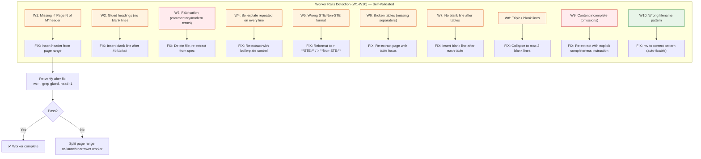

---

## 6. BATCH RESTART — Complete Mid-Pipeline Recovery

```mermaid
stateDiagram-v2
    [*] --> Healthy: Pipeline running

    state "Pipeline State Machine" as PS {
        Healthy --> BatchN: Launch Batch N

        BatchN --> VerifyBatch: All 3 workers finished
        VerifyBatch --> BatchPass: 3/3 verified ✅
        VerifyBatch --> BatchPartial: 1-2/3 failed
        VerifyBatch --> BatchFail: 3/3 failed

        BatchPass --> CommitBatch: git gcommit-hermes
        CommitBatch --> Healthy: Continue to Batch N+1

        BatchPartial --> DiagnosePartial
        DiagnosePartial --> RetryFailed: Retry failed workers (same range)
        DiagnosePartial --> SplitFailed: Split truncated workers (2+2)
        DiagnosePartial --> ReextractFailed: Re-extract fabricated

        RetryFailed --> VerifyBatch
        SplitFailed --> VerifyBatch
        ReextractFailed --> VerifyBatch

        BatchFail --> DiagnoseFull
        DiagnoseFull --> FixSystemic: Fix root cause
        FixSystemic --> BatchN: Re-launch entire batch
    }

    state "Batch Restart Recovery" as BR {
        [*] --> IdentifyLastGood: Read PROGRESS.md for last [x] batch

        IdentifyLastGood --> VerifyLastGood: Audit last good batch on disk
        VerifyLastGood --> NextBatch: Calculate next batch number (last_good + 1)

        NextBatch --> UpdateProgress: Revert any false [x] to [ ] for batches > last_good
        UpdateProgress --> Resume: Launch Batch (last_good + 1)

        Resume --> PS: Resume pipeline from checkpoint
    }

    state "Full Restart Decision" as FR {
        [*] --> AssessDamage: Run Execution Auditor — full audit
        AssessDamage --> Decision{Extraction % complete?}

        Decision --> Continue: > 80% — resume from last good batch
        Decision --> PartialRedo: 30-80% — audit, fix, resume
        Decision --> FullRedo: < 30% — rm -rf extracted/ refined/ merged/, restart from Batch 1

        Continue --> BR
        PartialRedo --> BR
        FullRedo --> FreshStart: Reset PROGRESS.md, re-init directories
        FreshStart --> PS: Start from Batch 1
    }
```

### 6a. Restart Decision Tree

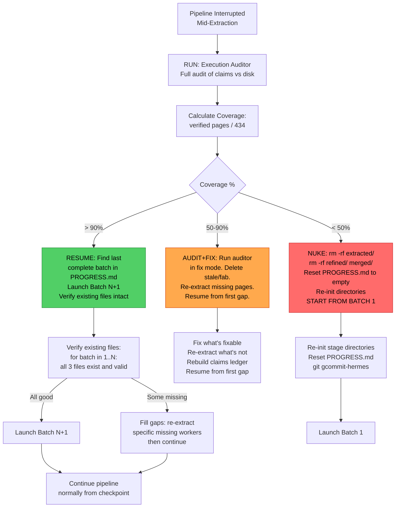

### 6b. PROGRESS.md State During Restart

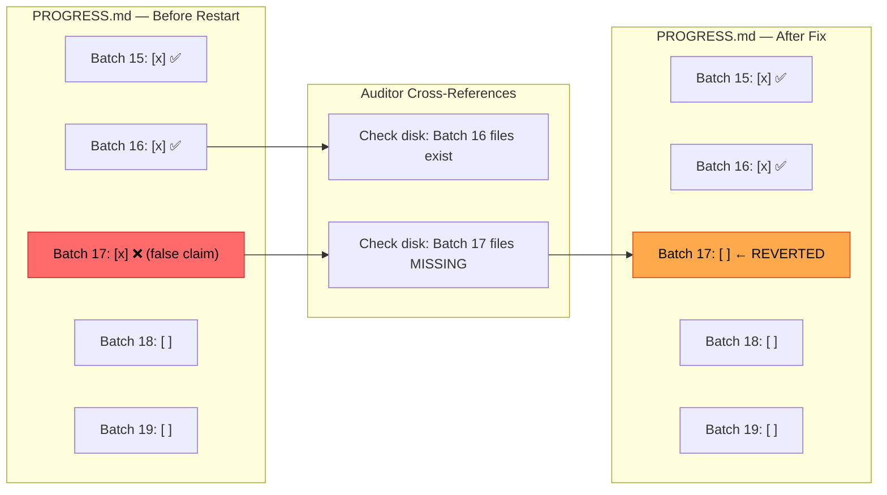

---

## 7. GIT RECOVERY — Commit Failures & Sync Conflicts

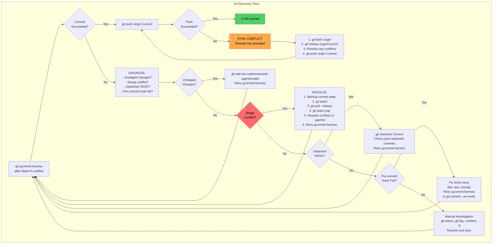

### 7a. Git State After Partial Commit Failure

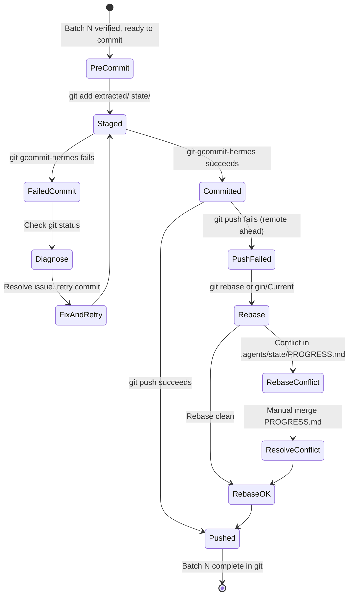

### 7b. Emergency Recovery: Lost Commits

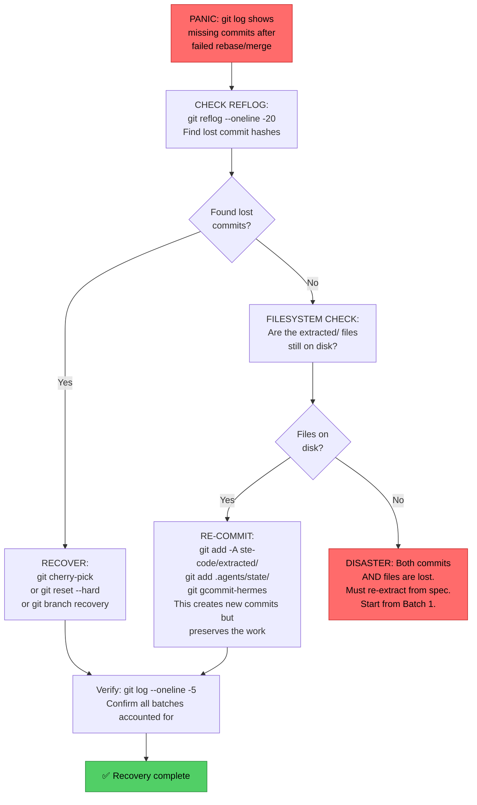

---

## 8. COMPLETE TROUBLESHOOTING STATE MACHINE

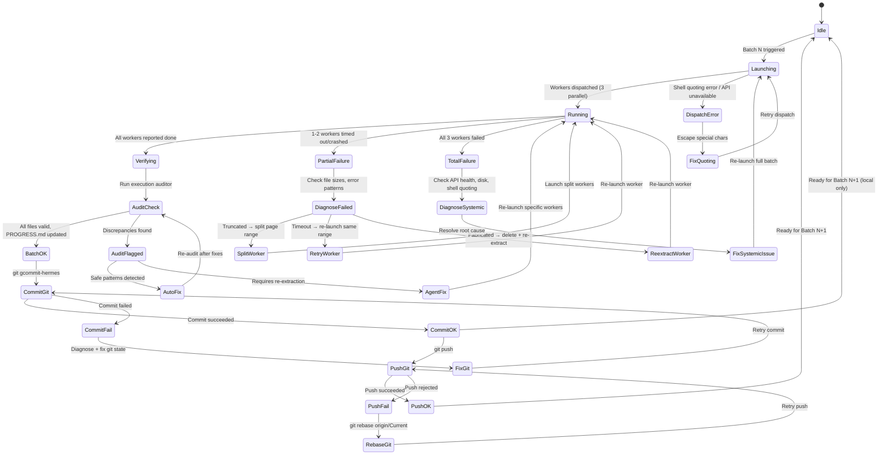

---

## Appendix A: Severity Classification Reference

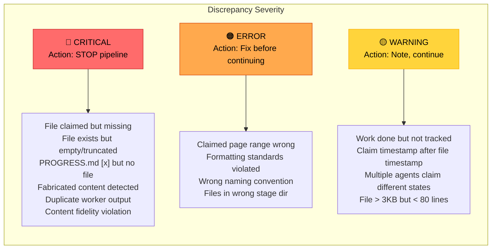

---

## Appendix B: Quick Recovery Command Reference

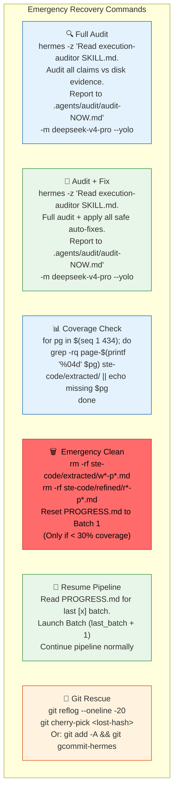

---

## Appendix C: Auditor Trust Score Calculation

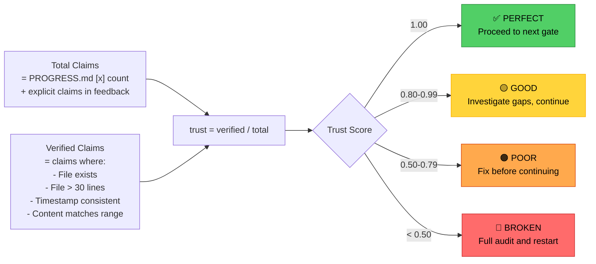
