# STE-Code Pipeline — Error Recovery & Edge Cases

> Authoritative troubleshooting reference. All diagrams use Mermaid.
> Cross-references: `rails.md`, `worker-rails.md`, `evidence-commands.md`, `worker-grid.md`, `SKILL.md` (execution-auditor).

---

## Version History

| Version | Date | Change | Source |
|---------|------|--------|--------|
| 1.0 | 2025-07-10 | Add failure taxonomy: TIMEOUT, CORRUPTION, TRUNCATION, FABRICATION | Extraction Batch 1 |
| 1.1 | 2025-07-14 | Add shell quoting errors detail (Section 1a) | Extraction Batch 4 |
| 1.2 | 2025-07-16 | Add model normalization failure (Section 1b) | Extraction Batch 7 |
| 1.3 | 2025-07-18 | Add batch-level recovery decision tree (Section 2a) | Extraction Batch 12 |
| 1.4 | 2025-07-20 | Add split strategy for truncated workers (Section 2b) | Extraction Batch 18 |
| 1.5 | 2025-07-22 | Add audit detection methods matrix (Section 3b) | Audit development |
| 1.6 | 2025-07-24 | Add auto-fix queue AF1-AF7 (Section 4) | Audit v2 |
| 1.7 | 2025-07-25 | Expand Worker Rails from 8 to 10 (Section 5b) | Refinement phase |
| 1.8 | 2025-07-26 | Add batch restart state machine (Section 6) | Mid-pipeline failure |
| 1.9 | 2025-07-27 | Add git recovery flows (Section 7) | Commit failure |
| 2.0 | 2025-07-28 | Add trust score calculation (Appendix C) | Audit v3 |
| 2.1 | 2025-07-29 | Add quality gates, known limitations, extension guide, agentic-load specifications (Sections 9-11) | Maturity audit |
| 2.2 | 2025-07-30 | Add recovery playbooks, failure impact matrix, self-healing triggers, concurrency failure modes, post-recovery verification, cascading failure prevention, worked extension example, additional known limitations (10e-10f), recovery cost model, anti-patterns (Sections 12-17, Appendices D-E) | Maturity audit v2 |

---

## Agentic-Load Specifications

This document has 31 KB across 689 lines. The approximate token count is 8,500 tokens.

NOTE: Not every agent must read the full document. Each agent reads only the sections it needs.

### Per-Section Sizes

| Section | Approx Lines | Approx Tokens |
|---------|-------------|---------------|
| 1. Failure Modes (with 1a, 1b) | 79 | 1,100 |
| 2. Recovery Flows (with 2a, 2b) | 65 | 900 |
| 3. Audit Detection (with 3a, 3b) | 62 | 900 |
| 4. Auto-Fixes vs Agent Intervention | 41 | 600 |
| 5. Rails Violations (with 5b) | 83 | 1,100 |
| 6. Batch Restart (with 6a, 6b) | 121 | 1,600 |
| 7. Git Recovery (with 7a, 7b) | 91 | 1,300 |
| 8. Complete State Machine | 58 | 700 |
| 9. Quality Gates | 35 | 300 |
| 10. Known Limitations & Workarounds | 75 | 650 |
| 11. How to Extend This Document | 95 | 800 |
| 12. Recovery Playbooks | 120 | 1,400 |
| 13. Failure Mode Impact Analysis | 55 | 600 |
| 14. Self-Healing Triggers | 70 | 800 |
| 15. Concurrency Failure Modes | 60 | 700 |
| 16. Post-Recovery Verification Protocol | 50 | 500 |
| 17. Cascading Failure Prevention | 55 | 600 |
| Appendix A-C | 65 | 600 |
| Appendix D-E | 70 | 700 |

### Recommended Subsets Per Agent Role

**Extractor Agent** — Read these sections:
- Section 1: Failure Modes (understand what can go wrong during extraction)
- Section 2: Recovery Flows (know how to respond to truncation and timeouts)
- Section 5: Rails Violations (self-validate against W1-W10 worker rails)
- Section 6: Batch Restart (know restart procedure if extraction fails mid-pipeline)
- Section 10: Known Limitations (understand split-strategy edge cases)
- Section 17: Cascading Failure Prevention (avoid triggering cascades)

Approximate load: 5,700 tokens.

**Refiner Agent** — Read these sections:
- Section 2: Recovery Flows (recovery after refinement formatting failures)
- Section 5: Rails Violations (formatting rails R4, R5, worker rails W2, W5, W7, W8)
- Section 10: Known Limitations (formatting edge cases)

Approximate load: 2,400 tokens.

**Auditor Agent** — Read these sections:
- Section 1: Failure Modes (detect all failure types)
- Section 2: Recovery Flows (classify severity, recommend recovery)
- Section 3: Audit Detection (run detection methods)
- Section 4: Auto-Fixes (apply AF1-AF7 safely)
- Section 5: Rails Violations (check all 18 rails)
- Section 6: Batch Restart (make restart decisions based on coverage)
- Section 9: Quality Gates (enforce trust score thresholds)
- Section 13: Failure Mode Impact Analysis (blast radius assessment)
- Section 14: Self-Healing Triggers (know when to auto-recover)
- Section 16: Post-Recovery Verification Protocol (validate fixes)
- Appendix C: Trust Score (calculate and interpret scores)
- Appendix D: Recovery Cost Model (choose cheapest effective path)
- Appendix E: Anti-Patterns (avoid common recovery mistakes)

Approximate load: 8,600 tokens.

**Continuator Agent** — Read these sections:
- Section 6: Batch Restart (find last good batch, resume pipeline)
- Section 7: Git Recovery (recover lost commits)
- Section 8: Complete State Machine (understand full pipeline state)
- Section 12: Recovery Playbooks (follow step-by-step disaster procedures)
- Section 15: Concurrency Failure Modes (avoid race conditions during resume)

Approximate load: 5,500 tokens.

**Orchestrator / Coordinator Agent** — Read these sections:
- Section 2: Recovery Flows (batch-level decision making)
- Section 13: Failure Mode Impact Analysis (assess blast radius before acting)
- Section 15: Concurrency Failure Modes (coordinate multiple agents safely)
- Section 17: Cascading Failure Prevention (design resilient batch launches)

Approximate load: 2,800 tokens.

---

## 1. FAILURE MODES — Complete Taxonomy

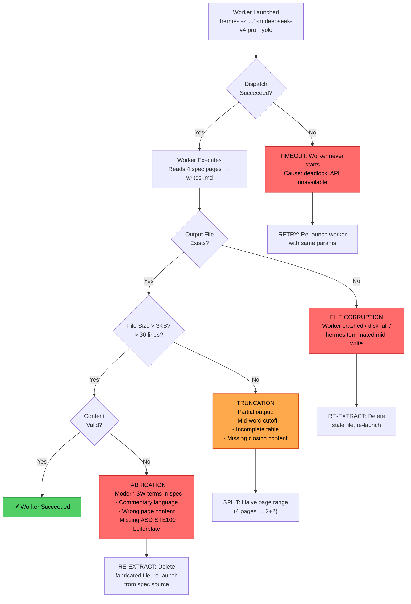
```mermaid
flowchart TD
    START["Worker Launched<br/>hermes -z '...' -m deepseek-v4-pro --yolo"] --> DISPATCH

    DISPATCH{"Dispatch<br/>Succeeded?"}
    DISPATCH -->|"Yes"| RUN["Worker Executes<br/>Reads 4 spec pages → writes .md"]
    DISPATCH -->|"No"| TO["TIMEOUT: Worker never starts<br/>Cause: deadlock, API unavailable"]

    RUN --> CHECK{"Output File<br/>Exists?"}
    CHECK -->|"Yes"| SIZE{"File Size > 3KB?<br/>> 30 lines?"}
    CHECK -->|"No"| CORRUPT["FILE CORRUPTION<br/>Worker crashed / disk full /<br/>hermes terminated mid-write"]

    SIZE -->|"Yes"| CONTENT{"Content<br/>Valid?"}
    SIZE -->|"No"| TRUNC["TRUNCATION<br/>Partial output:<br/>- Mid-word cutoff<br/>- Incomplete table<br/>- Missing closing content"]

    CONTENT -->|"Yes"| PASS["✅ Worker Succeeded"]
    CONTENT -->|"No"| FAB["FABRICATION<br/>- Modern SW terms in spec<br/>- Commentary language<br/>- Wrong page content<br/>- Missing ASD-STE100 boilerplate"]

    TO --> RECOVER1["RETRY: Re-launch worker<br/>with same params"]
    CORRUPT --> RECOVER2["RE-EXTRACT: Delete<br/>stale file, re-launch"]
    TRUNC --> RECOVER3["SPLIT: Halve page range<br/>(4 pages → 2+2)"]
    FAB --> RECOVER4["RE-EXTRACT: Delete<br/>fabricated file, re-launch<br/>from spec source"]

    style TO fill:#ff6b6b,stroke:#c92a2a,color:#000
    style CORRUPT fill:#ff6b6b,stroke:#c92a2a,color:#000
    style TRUNC fill:#ffa94d,stroke:#d9480f,color:#000
    style FAB fill:#ff6b6b,stroke:#c92a2a,color:#000
    style PASS fill:#51cf66,stroke:#2b8a3e,color:#000
```

### 1a. Shell Quoting Errors Detail

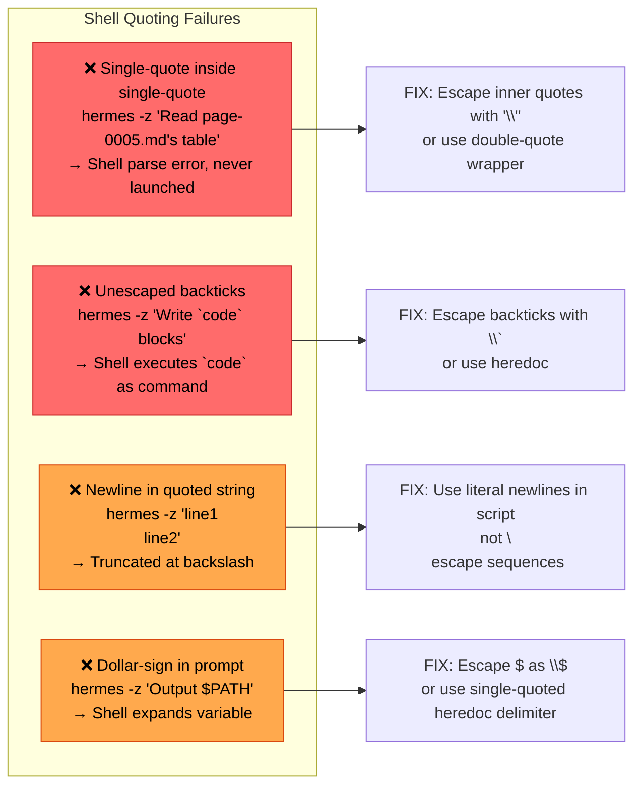
```mermaid
flowchart LR
    subgraph QUOTING["Shell Quoting Failures"]
        Q1["❌ Single-quote inside single-quote<br/>hermes -z 'Read page-0005.md's table'<br/>→ Shell parse error, never launched"]
        Q2["❌ Unescaped backticks<br/>hermes -z 'Write `code` blocks'<br/>→ Shell executes `code` as command"]
        Q3["❌ Newline in quoted string<br/>hermes -z 'line1\nline2'<br/>→ Truncated at backslash"]
        Q4["❌ Dollar-sign in prompt<br/>hermes -z 'Output $PATH'<br/>→ Shell expands variable"]
    end

    Q1 --> FIX_Q["FIX: Escape inner quotes with '\\''<br/>or use double-quote wrapper"]
    Q2 --> FIX_BT["FIX: Escape backticks with \\`<br/>or use heredoc"]
    Q3 --> FIX_NL["FIX: Use literal newlines in script<br/>not \\n escape sequences"]
    Q4 --> FIX_DS["FIX: Escape $ as \\$<br/>or use single-quoted heredoc delimiter"]

    style Q1 fill:#ff6b6b,stroke:#c92a2a,color:#000
    style Q2 fill:#ff6b6b,stroke:#c92a2a,color:#000
    style Q3 fill:#ffa94d,stroke:#d9480f,color:#000
    style Q4 fill:#ffa94d,stroke:#d9480f,color:#000
```

### 1b. Model Normalization Failure

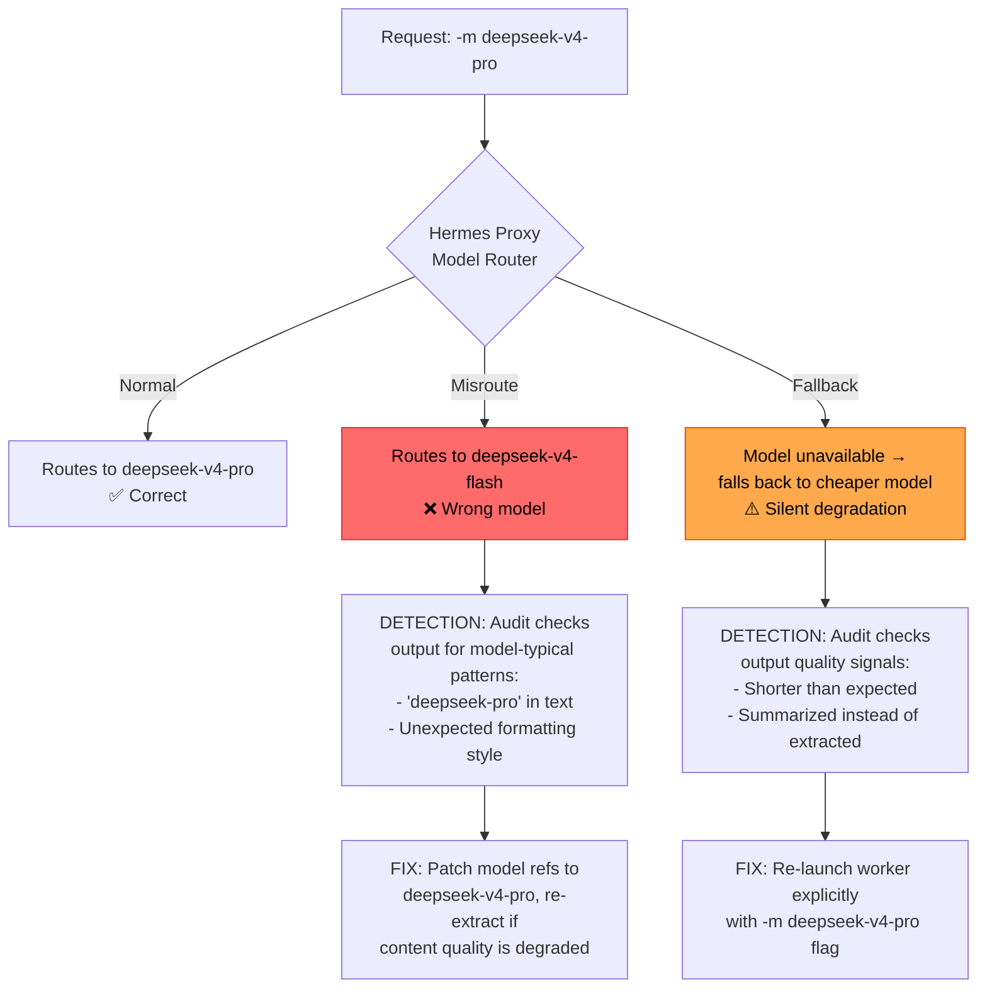
```mermaid
flowchart TD
    REQ["Request: -m deepseek-v4-pro"] --> PROXY{"Hermes Proxy<br/>Model Router"}
    PROXY -->|"Normal"| OK["Routes to deepseek-v4-pro<br/>✅ Correct"]
    PROXY -->|"Misroute"| WRONG["Routes to deepseek-v4-flash<br/>❌ Wrong model"]
    PROXY -->|"Fallback"| FALLBACK["Model unavailable →<br/>falls back to cheaper model<br/>⚠️ Silent degradation"]

    WRONG --> DETECT1["DETECTION: Audit checks<br/>output for model-typical patterns:<br/>- 'deepseek-pro' in text<br/>- Unexpected formatting style"]
    FALLBACK --> DETECT2["DETECTION: Audit checks<br/>output quality signals:<br/>- Shorter than expected<br/>- Summarized instead of extracted"]

    DETECT1 --> FIX1["FIX: Patch model refs to<br/>deepseek-v4-pro, re-extract if<br/>content quality is degraded"]
    DETECT2 --> FIX2["FIX: Re-launch worker explicitly<br/>with -m deepseek-v4-pro flag"]

    style WRONG fill:#ff6b6b,stroke:#c92a2a,color:#000
    style FALLBACK fill:#ffa94d,stroke:#d9480f,color:#000
```

### 1c. API Rate Limiting Failures

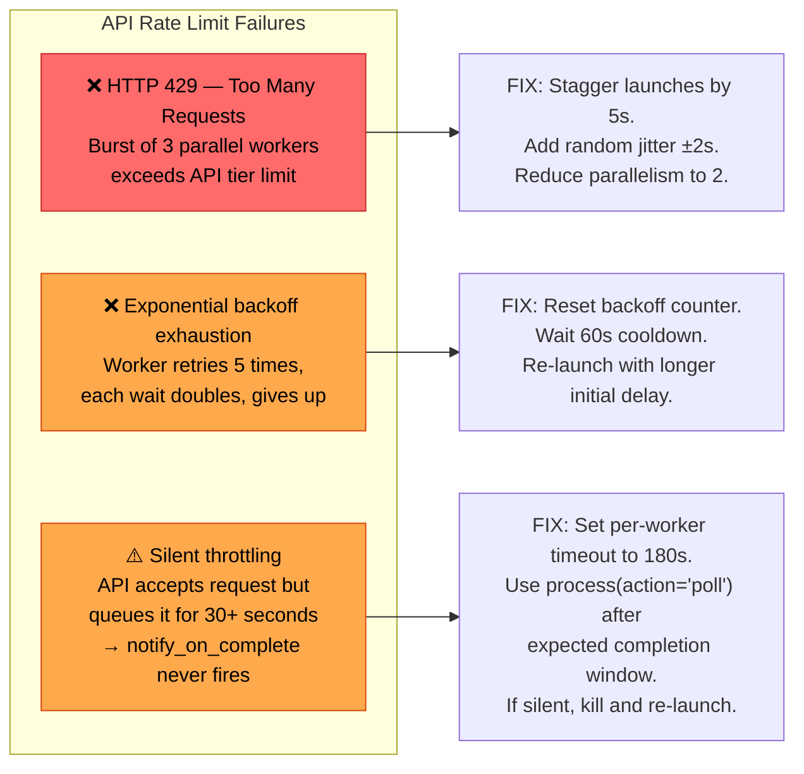
```mermaid
flowchart LR
    subgraph RATELIMIT["API Rate Limit Failures"]
        RL1["❌ HTTP 429 — Too Many Requests<br/>Burst of 3 parallel workers<br/>exceeds API tier limit"]
        RL2["❌ Exponential backoff exhaustion<br/>Worker retries 5 times,<br/>each wait doubles, gives up"]
        RL3["⚠️ Silent throttling<br/>API accepts request but<br/>queues it for 30+ seconds<br/>→ notify_on_complete never fires"]
    end

    RL1 --> FIX_RL1["FIX: Stagger launches by 5s.<br/>Add random jitter ±2s.<br/>Reduce parallelism to 2."]
    RL2 --> FIX_RL2["FIX: Reset backoff counter.<br/>Wait 60s cooldown.<br/>Re-launch with longer initial delay."]
    RL3 --> FIX_RL3["FIX: Set per-worker timeout to 180s.<br/>Use process(action='poll') after<br/>expected completion window.<br/>If silent, kill and re-launch."]

    style RL1 fill:#ff6b6b,stroke:#c92a2a,color:#000
    style RL2 fill:#ffa94d,stroke:#d9480f,color:#000
    style RL3 fill:#ffa94d,stroke:#d9480f,color:#000
```

---

## 2. RECOVERY FLOWS — Per-Failure Response Matrix

### 2a. Batch-Level Recovery Decision Tree

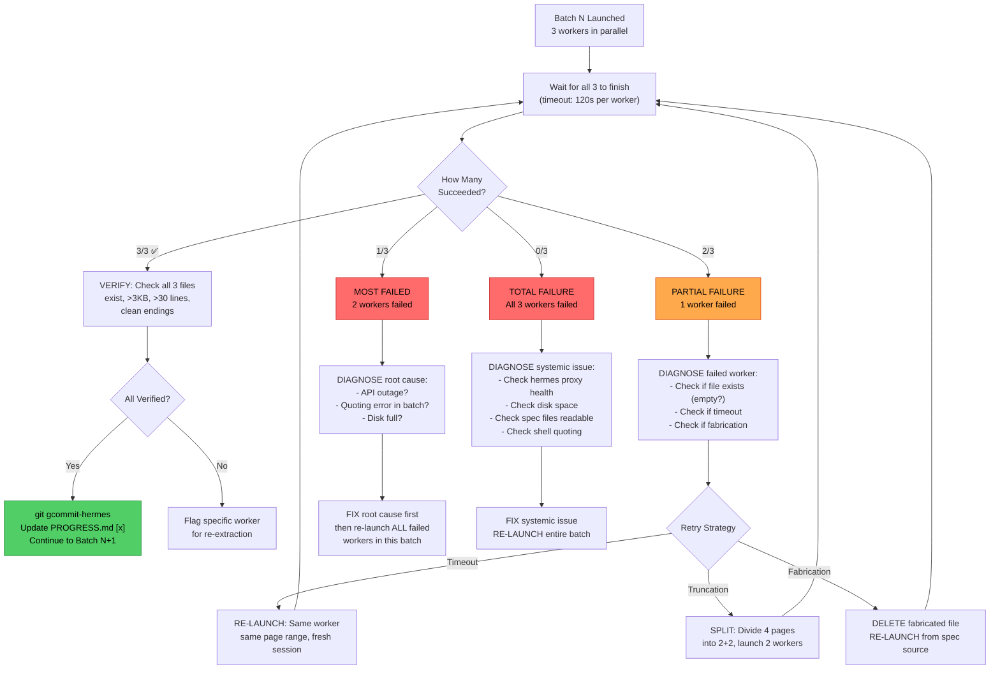
```mermaid
flowchart TD
    BATCH["Batch N Launched<br/>3 workers in parallel"] --> WAIT["Wait for all 3 to finish<br/>(timeout: 120s per worker)"]

    WAIT --> RESULTS{"How Many<br/>Succeeded?"}

    RESULTS -->|"3/3 ✅"| VERIFY["VERIFY: Check all 3 files<br/>exist, >3KB, >30 lines,<br/>clean endings"]
    VERIFY --> PASS_ALL{"All Verified?"}
    PASS_ALL -->|"Yes"| COMMIT["git gcommit-hermes<br/>Update PROGRESS.md [x]<br/>Continue to Batch N+1"]
    PASS_ALL -->|"No"| FLAG["Flag specific worker<br/>for re-extraction"]

    RESULTS -->|"2/3"| PARTIAL["PARTIAL FAILURE<br/>1 worker failed"]
    RESULTS -->|"1/3"| MOST_FAIL["MOST FAILED<br/>2 workers failed"]
    RESULTS -->|"0/3"| ALL_FAIL["TOTAL FAILURE<br/>All 3 workers failed"]

    PARTIAL --> DIAG_PARTIAL["DIAGNOSE failed worker:<br/>- Check if file exists (empty?)<br/>- Check if timeout<br/>- Check if fabrication"]
    DIAG_PARTIAL --> RETRY{"Retry Strategy"}
    RETRY -->|"Timeout"| RELAUNCH["RE-LAUNCH: Same worker<br/>same page range, fresh session"]
    RETRY -->|"Truncation"| SPLIT_W["SPLIT: Divide 4 pages<br/>into 2+2, launch 2 workers"]
    RETRY -->|"Fabrication"| DEL_RELAUNCH["DELETE fabricated file<br/>RE-LAUNCH from spec source"]

    MOST_FAIL --> DIAG_MOST["DIAGNOSE root cause:<br/>- API outage?<br/>- Quoting error in batch?<br/>- Disk full?"]
    DIAG_MOST --> FIX_ROOT["FIX root cause first<br/>then re-launch ALL failed<br/>workers in this batch"]

    ALL_FAIL --> DIAG_ALL["DIAGNOSE systemic issue:<br/>- Check hermes proxy health<br/>- Check disk space<br/>- Check spec files readable<br/>- Check shell quoting"]
    DIAG_ALL --> FIX_SYSTEMIC["FIX systemic issue<br/>RE-LAUNCH entire batch"]

    RELAUNCH --> WAIT
    SPLIT_W --> WAIT
    DEL_RELAUNCH --> WAIT

    style COMMIT fill:#51cf66,stroke:#2b8a3e,color:#000
    style ALL_FAIL fill:#ff6b6b,stroke:#c92a2a,color:#000
    style MOST_FAIL fill:#ff6b6b,stroke:#c92a2a,color:#000
    style PARTIAL fill:#ffa94d,stroke:#d9480f,color:#000
```

### 2b. Split Strategy for Truncated Workers

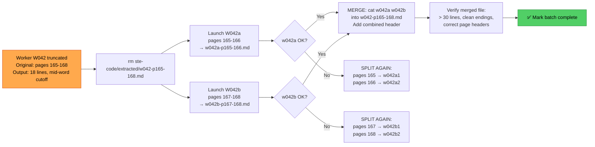
```mermaid
flowchart LR
    TRUNC["Worker W042 truncated<br/>Original: pages 165-168<br/>Output: 18 lines, mid-word cutoff"] --> DELETE["rm ste-code/extracted/w042-p165-168.md"]

    DELETE --> SPLIT_A["Launch W042a<br/>pages 165-166<br/>→ w042a-p165-166.md"]
    DELETE --> SPLIT_B["Launch W042b<br/>pages 167-168<br/>→ w042b-p167-168.md"]

    SPLIT_A --> CHECK_A{"w042a OK?"}
    SPLIT_B --> CHECK_B{"w042b OK?"}

    CHECK_A -->|"Yes"| MERGE["MERGE: cat w042a w042b<br/>into w042-p165-168.md<br/>Add combined header"]
    CHECK_B -->|"Yes"| MERGE

    CHECK_A -->|"No"| SPLIT_AA["SPLIT AGAIN:<br/>pages 165 → w042a1<br/>pages 166 → w042a2"]
    CHECK_B -->|"No"| SPLIT_BB["SPLIT AGAIN:<br/>pages 167 → w042b1<br/>pages 168 → w042b2"]

    MERGE --> VERIFY_M["Verify merged file:<br/>> 30 lines, clean endings,<br/>correct page headers"]
    VERIFY_M --> DONE["✅ Mark batch complete"]

    style TRUNC fill:#ffa94d,stroke:#d9480f,color:#000
    style DONE fill:#51cf66,stroke:#2b8a3e,color:#000
```

### 2c. Partial Output Salvage Strategy

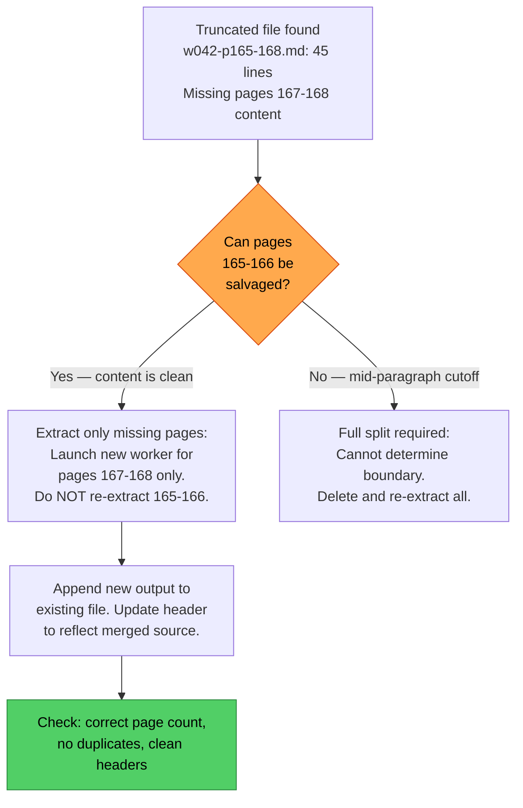
```mermaid
flowchart TD
    TRUNC_FILE["Truncated file found<br/>w042-p165-168.md: 45 lines<br/>Missing pages 167-168 content"] --> SALVAGE{"Can pages<br/>165-166 be<br/>salvaged?"}

    SALVAGE -->|"Yes — content is clean"| EXTRACT_TAIL["Extract only missing pages:<br/>Launch new worker for<br/>pages 167-168 only.<br/>Do NOT re-extract 165-166."]
    SALVAGE -->|"No — mid-paragraph cutoff"| FULL_SPLIT["Full split required:<br/>Cannot determine boundary.<br/>Delete and re-extract all."]

    EXTRACT_TAIL --> MERGE_SALVAGE["Append new output to<br/>existing file. Update header<br/>to reflect merged source."]
    MERGE_SALVAGE --> VERIFY_MERGE["Check: correct page count,<br/>no duplicates, clean headers"]

    style SALVAGE fill:#ffa94d,stroke:#d9480f,color:#000
    style VERIFY_MERGE fill:#51cf66,stroke:#2b8a3e,color:#000
```

---

## 3. AUDIT DETECTION — How the Auditor Finds Problems

### 3a. Full Audit Flow

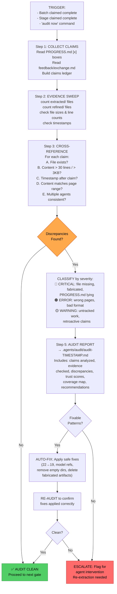
```mermaid
flowchart TD
    TRIGGER["TRIGGER:<br/>- Batch claimed complete<br/>- Stage claimed complete<br/>- 'audit now' command"] --> COLLECT["Step 1: COLLECT CLAIMS<br/>Read PROGRESS.md [x] boxes<br/>Read feedback/exchange.md<br/>Build claims ledger"]

    COLLECT --> SWEEP["Step 2: EVIDENCE SWEEP<br/>count extracted/ files<br/>count refined/ files<br/>check file sizes & line counts<br/>check timestamps"]

    SWEEP --> XREF["Step 3: CROSS-REFERENCE<br/>For each claim:<br/>A. File exists?<br/>B. Content > 30 lines / > 3KB?<br/>C. Timestamp after claim?<br/>D. Content matches page range?<br/>E. Multiple agents consistent?"]

    XREF --> FLAGS{"Discrepancies<br/>Found?"}

    FLAGS -->|"No"| CLEAN["✅ AUDIT CLEAN<br/>Proceed to next gate"]
    FLAGS -->|"Yes"| CLASSIFY["CLASSIFY by severity:<br/>🔴 CRITICAL: file missing, fabricated,<br/>   PROGRESS.md lying<br/>🟠 ERROR: wrong pages, bad format<br/>🟡 WARNING: untracked work,<br/>   retroactive claims"]

    CLASSIFY --> REPORT["Step 5: AUDIT REPORT<br/>→ .agents/audit/audit-TIMESTAMP.md<br/>Includes: claims analyzed, evidence<br/>checked, discrepancies, trust scores,<br/>coverage map, recommendations"]

    REPORT --> FIX_CHECK{"Fixable<br/>Patterns?"}

    FIX_CHECK -->|"Yes"| AUTOFIX["AUTO-FIX: Apply safe fixes<br/>(22→19, model refs,<br/>remove empty dirs, delete<br/>fabricated artifacts)"]
    FIX_CHECK -->|"No"| ESCALATE["ESCALATE: Flag for<br/>agent intervention<br/>Re-extraction needed"]

    AUTOFIX --> REAUDIT["RE-AUDIT to confirm<br/>fixes applied correctly"]
    REAUDIT --> FINAL{"Clean?"}
    FINAL -->|"Yes"| CLEAN
    FINAL -->|"No"| ESCALATE

    style CLEAN fill:#51cf66,stroke:#2b8a3e,color:#000
    style FLAGS fill:#ffa94d,stroke:#d9480f,color:#000
    style ESCALATE fill:#ff6b6b,stroke:#c92a2a,color:#000
```

### 3b. Detection Methods Matrix

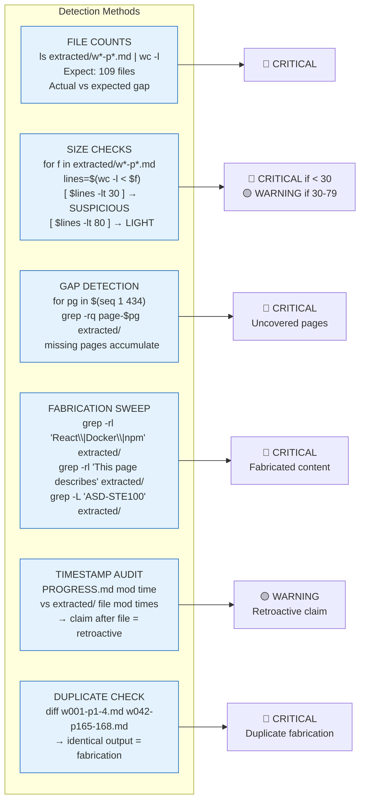
```mermaid
flowchart LR
    subgraph METHODS["Detection Methods"]
        direction TB
        M1["FILE COUNTS<br/>ls extracted/w*-p*.md | wc -l<br/>Expect: 109 files<br/>Actual vs expected gap"]
        M2["SIZE CHECKS<br/>for f in extracted/w*-p*.md<br/>  lines=$(wc -l < $f)<br/>  [ $lines -lt 30 ] → SUSPICIOUS<br/>  [ $lines -lt 80 ] → LIGHT"]
        M3["GAP DETECTION<br/>for pg in $(seq 1 434)<br/>  grep -rq page-$pg extracted/<br/>  missing pages accumulate"]
        M4["FABRICATION SWEEP<br/>grep -rl 'React\\|Docker\\|npm' extracted/<br/>grep -rl 'This page describes' extracted/<br/>grep -L 'ASD-STE100' extracted/"]
        M5["TIMESTAMP AUDIT<br/>PROGRESS.md mod time<br/>vs extracted/ file mod times<br/>→ claim after file = retroactive"]
        M6["DUPLICATE CHECK<br/>diff w001-p1-4.md w042-p165-168.md<br/>→ identical output = fabrication"]
    end

    M1 --> SEV1["🔴 CRITICAL"]
    M2 --> SEV2["🔴 CRITICAL if < 30<br/>🟡 WARNING if 30-79"]
    M3 --> SEV3["🔴 CRITICAL<br/>Uncovered pages"]
    M4 --> SEV4["🔴 CRITICAL<br/>Fabricated content"]
    M5 --> SEV5["🟡 WARNING<br/>Retroactive claim"]
    M6 --> SEV6["🔴 CRITICAL<br/>Duplicate fabrication"]

    style M1 fill:#e3f2fd,stroke:#1565c0
    style M2 fill:#e3f2fd,stroke:#1565c0
    style M3 fill:#e3f2fd,stroke:#1565c0
    style M4 fill:#e3f2fd,stroke:#1565c0
    style M5 fill:#e3f2fd,stroke:#1565c0
    style M6 fill:#e3f2fd,stroke:#1565c0
```

---

## 4. AUTO-FIXES vs AGENT INTERVENTION

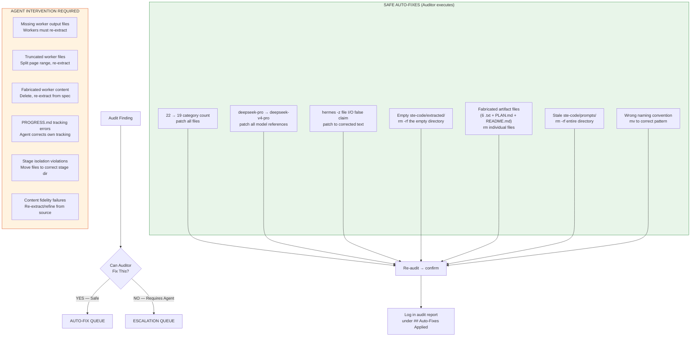
```mermaid
flowchart TD
    FINDING["Audit Finding"] --> CAN_I{"Can Auditor<br/>Fix This?"}

    CAN_I -->|"YES — Safe"| AUTO["AUTO-FIX QUEUE"]
    CAN_I -->|"NO — Requires Agent"| ESCALATE["ESCALATION QUEUE"]

    subgraph AUTO_FIXES["SAFE AUTO-FIXES (Auditor executes)"]
        AF1["22 → 19 category count<br/>patch all files"]
        AF2["deepseek-pro → deepseek-v4-pro<br/>patch all model references"]
        AF3["hermes -z file I/O false claim<br/>patch to corrected text"]
        AF4["Empty ste-code/extracted/<br/>rm -rf the empty directory"]
        AF5["Fabricated artifact files<br/>(6 .txt + PLAN.md + README.md)<br/>rm individual files"]
        AF6["Stale ste-code/prompts/<br/>rm -rf entire directory"]
        AF7["Wrong naming convention<br/>mv to correct pattern"]
    end

    subgraph ESCALATIONS["AGENT INTERVENTION REQUIRED"]
        E1["Missing worker output files<br/>Workers must re-extract"]
        E2["Truncated worker files<br/>Split page range, re-extract"]
        E3["Fabricated worker content<br/>Delete, re-extract from spec"]
        E4["PROGRESS.md tracking errors<br/>Agent corrects own tracking"]
        E5["Stage isolation violations<br/>Move files to correct stage dir"]
        E6["Content fidelity failures<br/>Re-extract/refine from source"]
    end

    AF1 --> REAUDIT1["Re-audit → confirm"]
    AF2 --> REAUDIT1
    AF3 --> REAUDIT1
    AF4 --> REAUDIT1
    AF5 --> REAUDIT1
    AF6 --> REAUDIT1
    AF7 --> REAUDIT1

    REAUDIT1 --> LOG1["Log in audit report<br/>under ## Auto-Fixes Applied"]

    style AUTO_FIXES fill:#e8f5e9,stroke:#2b8a3e
    style ESCALATIONS fill:#fff3e0,stroke:#d9480f
```

---

## 5. RAILS VIOLATIONS — Detection & Recovery


```mermaid
flowchart TD
    subgraph RAILS["8 Process Rails — Violation Detection & Recovery"]
        direction TB

        R1["RAIL 1: STAGE ISOLATION"]
        R1 --> R1D["DETECT: File in wrong stage dir<br/>e.g. refined/ written during extraction"]
        R1 --> R1R["RECOVER: Move file to _scratch/<br/>Regenerate in correct stage"]

        R2["RAIL 2: NAMING CONVENTION"]
        R2 --> R2D["DETECT: File doesn't match pattern<br/>wNNN-pPPPP-PPPP.md or rNNN-pPPPP-PPPP.md"]
        R2 --> R2R["RECOVER: mv to correct name<br/>Auto-fixable by auditor"]

        R3["RAIL 3: COMPLETION INTEGRITY"]
        R3 --> R3D["DETECT: [x] in PROGRESS.md but<br/>file missing, empty, or truncated"]
        R3 --> R3R["RECOVER: Revert [x] → [ ]/<br/>Re-extract missing files<br/>Verify ALL 3 before marking [x]"]

        R4["RAIL 4: CONTENT FIDELITY"]
        R4 --> R4D["DETECT: Fabrication signals —<br/>modern terms, commentary,<br/>missing boilerplate, wrong facts"]
        R4 --> R4R["RECOVER: Delete fabricated file<br/>Re-extract from spec source<br/>Auto-fix: 22→19, model refs"]

        R5["RAIL 5: FORMATTING STANDARDS"]
        R5 --> R5D["DETECT: Glued headings,<br/>no blank line after tables,<br/>wrong STE/Non-STE format"]
        R5 --> R5R["RECOVER: Re-refine with<br/>formatting rules enforced<br/>Auto-fix: patch glued headings"]

        R6["RAIL 6: FACTUAL CORRECTNESS"]
        R6 --> R6D["DETECT: '22 categories',<br/>'deepseek-pro',<br/>'hermes -z no file I/O'"]
        R6 --> R6R["RECOVER: patch to correct facts<br/>19 categories / deepseek-v4-pro<br/>Auto-fixable by auditor"]

        R7["RAIL 7: PROGRESS TRACKING"]
        R7 --> R7D["DETECT: [x] without verification<br/>[!] never used for failures<br/>Timestamps missing"]
        R7 --> R7R["RECOVER: Correct PROGRESS.md<br/>Update after verification<br/>Use [!] for failed workers"]

        R8["RAIL 8: ERROR RECOVERY"]
        R8 --> R8D["DETECT: Mistake ignored, hidden,<br/>or papered over with false claim"]
        R8 --> R8R["RECOVER: Acknowledge the error<br/>Apply the specific fix for that<br/>error type (see above rows)"]
    end

    style R1 fill:#e3f2fd,stroke:#1565c0
    style R2 fill:#e3f2fd,stroke:#1565c0
    style R3 fill:#e3f2fd,stroke:#1565c0
    style R4 fill:#e3f2fd,stroke:#1565c0
    style R5 fill:#e3f2fd,stroke:#1565c0
    style R6 fill:#e3f2fd,stroke:#1565c0
    style R7 fill:#e3f2fd,stroke:#1565c0
    style R8 fill:#e3f2fd,stroke:#1565c0
```

### 5b. Worker Rails (W1-W10) Violation Recovery

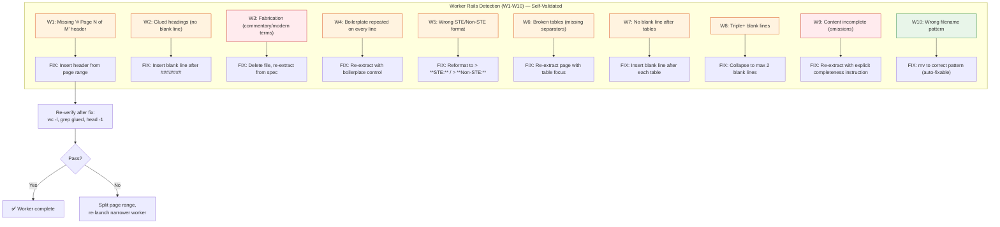
```mermaid
flowchart TD
    subgraph W_RAILS["Worker Rails Detection (W1-W10) — Self-Validated"]
        W1["W1: Missing '# Page N of M' header"] --> W1F["FIX: Insert header from page range"]
        W2["W2: Glued headings (no blank line)"] --> W2F["FIX: Insert blank line after ###/####"]
        W3["W3: Fabrication (commentary/modern terms)"] --> W3F["FIX: Delete file, re-extract from spec"]
        W4["W4: Boilerplate repeated on every line"] --> W4F["FIX: Re-extract with boilerplate control"]
        W5["W5: Wrong STE/Non-STE format"] --> W5F["FIX: Reformat to > **STE:** / > **Non-STE:**"]
        W6["W6: Broken tables (missing separators)"] --> W6F["FIX: Re-extract page with table focus"]
        W7["W7: No blank line after tables"] --> W7F["FIX: Insert blank line after each table"]
        W8["W8: Triple+ blank lines"] --> W8F["FIX: Collapse to max 2 blank lines"]
        W9["W9: Content incomplete (omissions)"] --> W9F["FIX: Re-extract with explicit completeness instruction"]
        W10["W10: Wrong filename pattern"] --> W10F["FIX: mv to correct pattern (auto-fixable)"]
    end

    W1F --> VERIFY["Re-verify after fix:<br/>wc -l, grep glued, head -1"]
    VERIFY --> RETRY_W{"Pass?"}
    RETRY_W -->|"Yes"| DONE_W["✅ Worker complete"]
    RETRY_W -->|"No"| SPLIT_W["Split page range,<br/>re-launch narrower worker"]

    style W1 fill:#fff3e0,stroke:#d9480f
    style W2 fill:#fff3e0,stroke:#d9480f
    style W3 fill:#ffebee,stroke:#c92a2a
    style W4 fill:#fff3e0,stroke:#d9480f
    style W5 fill:#fff3e0,stroke:#d9480f
    style W6 fill:#fff3e0,stroke:#d9480f
    style W7 fill:#fff3e0,stroke:#d9480f
    style W8 fill:#fff3e0,stroke:#d9480f
    style W9 fill:#ffebee,stroke:#c92a2a
    style W10 fill:#e8f5e9,stroke:#2b8a3e
```

### 5c. Split-Depth Tracking (Emergent Rail)

When a worker is split, its descendants carry a split-depth counter. This is not a formal rail (yet) but an operational tracking mechanism.

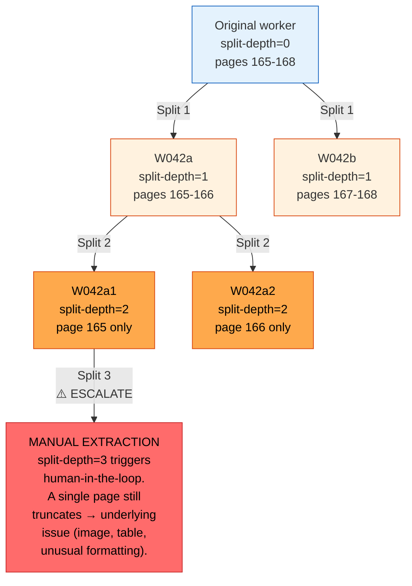
```mermaid
flowchart TD
    W["Original worker<br/>split-depth=0<br/>pages 165-168"] -->|"Split 1"| WA["W042a<br/>split-depth=1<br/>pages 165-166"]
    W -->|"Split 1"| WB["W042b<br/>split-depth=1<br/>pages 167-168"]

    WA -->|"Split 2"| WA1["W042a1<br/>split-depth=2<br/>page 165 only"]
    WA -->|"Split 2"| WA2["W042a2<br/>split-depth=2<br/>page 166 only"]

    WA1 -->|"Split 3<br/>⚠️ ESCALATE"| FALLBACK["MANUAL EXTRACTION<br/>split-depth=3 triggers<br/>human-in-the-loop.<br/>A single page still<br/>truncates → underlying<br/>issue (image, table,<br/>unusual formatting)."]

    style W fill:#e3f2fd,stroke:#1565c0
    style WA fill:#fff3e0,stroke:#d9480f
    style WB fill:#fff3e0,stroke:#d9480f
    style WA1 fill:#ffa94d,stroke:#d9480f,color:#000
    style WA2 fill:#ffa94d,stroke:#d9480f,color:#000
    style FALLBACK fill:#ff6b6b,stroke:#c92a2a,color:#000
```

---

## 6. BATCH RESTART — Complete Mid-Pipeline Recovery

```mermaid
stateDiagram-v2
    [*] --> Healthy: Pipeline running

    state "Pipeline State Machine" as PS {
        Healthy --> BatchN: Launch Batch N

        BatchN --> VerifyBatch: All 3 workers finished
        VerifyBatch --> BatchPass: 3/3 verified ✅
        VerifyBatch --> BatchPartial: 1-2/3 failed
        VerifyBatch --> BatchFail: 3/3 failed

        BatchPass --> CommitBatch: git gcommit-hermes
        CommitBatch --> Healthy: Continue to Batch N+1

        BatchPartial --> DiagnosePartial
        DiagnosePartial --> RetryFailed: Retry failed workers (same range)
        DiagnosePartial --> SplitFailed: Split truncated workers (2+2)
        DiagnosePartial --> ReextractFailed: Re-extract fabricated

        RetryFailed --> VerifyBatch
        SplitFailed --> VerifyBatch
        ReextractFailed --> VerifyBatch

        BatchFail --> DiagnoseFull
        DiagnoseFull --> FixSystemic: Fix root cause
        FixSystemic --> BatchN: Re-launch entire batch
    }

    state "Batch Restart Recovery" as BR {
        [*] --> IdentifyLastGood: Read PROGRESS.md for last [x] batch

        IdentifyLastGood --> VerifyLastGood: Audit last good batch on disk
        VerifyLastGood --> NextBatch: Calculate next batch number (last_good + 1)

        NextBatch --> UpdateProgress: Revert any false [x] to [ ] for batches > last_good
        UpdateProgress --> Resume: Launch Batch (last_good + 1)

        Resume --> PS: Resume pipeline from checkpoint
    }

    state "Full Restart Decision" as FR {
        [*] --> AssessDamage: Run Execution Auditor — full audit
        AssessDamage --> Decision{Extraction % complete?}

        Decision --> Continue: > 80% — resume from last good batch
        Decision --> PartialRedo: 30-80% — audit, fix, resume
        Decision --> FullRedo: < 30% — rm -rf extracted/ refined/ merged/, restart from Batch 1

        Continue --> BR
        PartialRedo --> BR
        FullRedo --> FreshStart: Reset PROGRESS.md, re-init directories
        FreshStart --> PS: Start from Batch 1
    }
```

### 6a. Restart Decision Tree

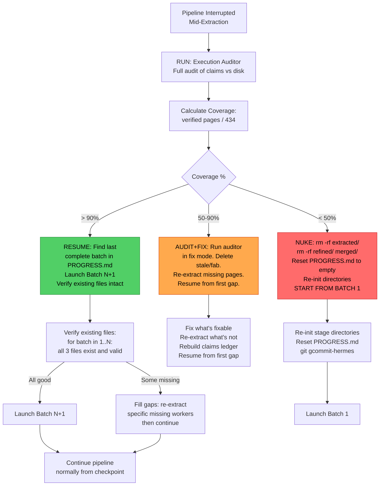
```mermaid
flowchart TD
    INTERRUPT["Pipeline Interrupted<br/>Mid-Extraction"] --> AUDIT["RUN: Execution Auditor<br/>Full audit of claims vs disk"]

    AUDIT --> COVERAGE["Calculate Coverage:<br/>verified pages / 434"]

    COVERAGE --> DECISION{"Coverage %"}

    DECISION -->|"> 90%"| RESUME["RESUME: Find last<br/>complete batch in PROGRESS.md<br/>Launch Batch N+1<br/>Verify existing files intact"]
    DECISION -->|"50-90%"| AUDIT_FIX["AUDIT+FIX: Run auditor<br/>in fix mode. Delete stale/fab.<br/>Re-extract missing pages.<br/>Resume from first gap."]
    DECISION -->|"< 50%"| NUKE["NUKE: rm -rf extracted/<br/>rm -rf refined/ merged/<br/>Reset PROGRESS.md to empty<br/>Re-init directories<br/>START FROM BATCH 1"]

    RESUME --> CHECK_EXISTING["Verify existing files:<br/>for batch in 1..N:<br/>  all 3 files exist and valid"]
    CHECK_EXISTING -->|"All good"| LAUNCH_N1["Launch Batch N+1"]
    CHECK_EXISTING -->|"Some missing"| FILL_GAPS["Fill gaps: re-extract<br/>specific missing workers<br/>then continue"]

    AUDIT_FIX --> FIX_RESUME["Fix what's fixable<br/>Re-extract what's not<br/>Rebuild claims ledger<br/>Resume from first gap"]

    NUKE --> INIT["Re-init stage directories<br/>Reset PROGRESS.md<br/>git gcommit-hermes"]
    INIT --> BATCH1["Launch Batch 1"]

    LAUNCH_N1 --> CONTINUE["Continue pipeline<br/>normally from checkpoint"]
    FILL_GAPS --> CONTINUE

    style RESUME fill:#51cf66,stroke:#2b8a3e,color:#000
    style NUKE fill:#ff6b6b,stroke:#c92a2a,color:#000
    style AUDIT_FIX fill:#ffa94d,stroke:#d9480f,color:#000
```

### 6b. PROGRESS.md State During Restart

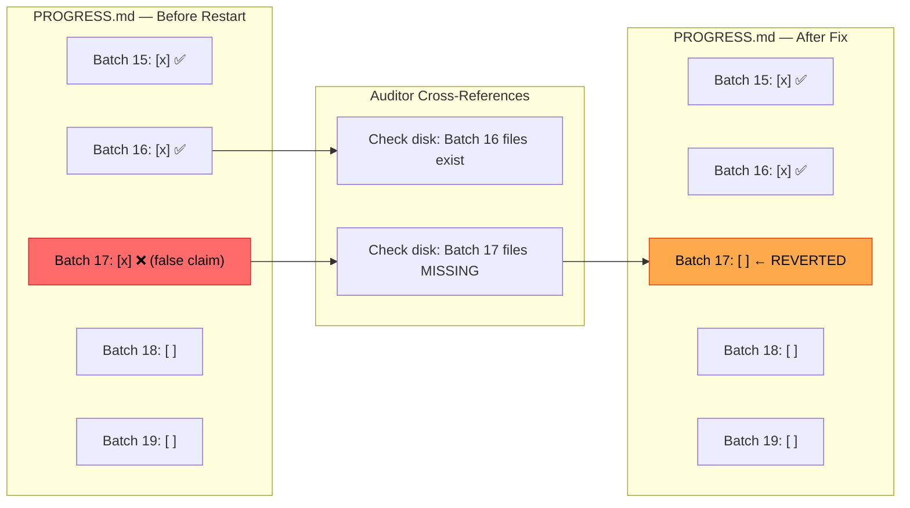
```mermaid
flowchart LR
    subgraph BEFORE["PROGRESS.md — Before Restart"]
        B1["Batch 15: [x] ✅"]
        B2["Batch 16: [x] ✅"]
        B3["Batch 17: [x] ❌ (false claim)"]
        B4["Batch 18: [ ]"]
        B5["Batch 19: [ ]"]
    end

    subgraph AUDIT["Auditor Cross-References"]
        A1["Check disk: Batch 16 files exist"]
        A2["Check disk: Batch 17 files MISSING"]
    end

    subgraph AFTER["PROGRESS.md — After Fix"]
        C1["Batch 15: [x] ✅"]
        C2["Batch 16: [x] ✅"]
        C3["Batch 17: [ ] ← REVERTED"]
        C4["Batch 18: [ ]"]
        C5["Batch 19: [ ]"]
    end

    B2 --> A1
    B3 --> A2
    A2 --> C3

    style B3 fill:#ff6b6b,stroke:#c92a2a,color:#000
    style C3 fill:#ffa94d,stroke:#d9480f,color:#000
```

---

## 7. GIT RECOVERY — Commit Failures & Sync Conflicts

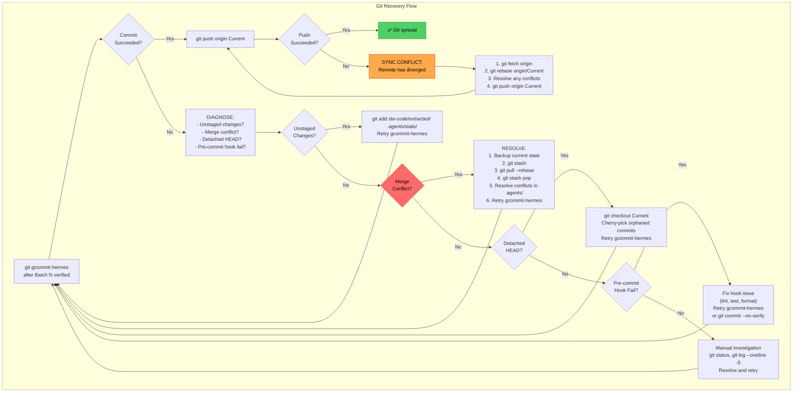
```mermaid
flowchart TD
    subgraph GIT_FLOW["Git Recovery Flow"]
        COMMIT["git gcommit-hermes<br/>after Batch N verified"] --> STATUS{"Commit<br/>Succeeded?"}

        STATUS -->|"Yes"| PUSH["git push origin Current"]
        STATUS -->|"No"| DIAG_GIT["DIAGNOSE:<br/>- Unstaged changes?<br/>- Merge conflict?<br/>- Detached HEAD?<br/>- Pre-commit hook fail?"]

        PUSH --> PUSH_STATUS{"Push<br/>Succeeded?"}
        PUSH_STATUS -->|"Yes"| DONE_GIT["✅ Git synced"]
        PUSH_STATUS -->|"No"| SYNC_ISSUE["SYNC CONFLICT:<br/>Remote has diverged"]

        DIAG_GIT --> UNSTAGED{"Unstaged<br/>Changes?"}
        UNSTAGED -->|"Yes"| STAGE["git add ste-code/extracted/ .agents/state/<br/>Retry gcommit-hermes"]
        UNSTAGED -->|"No"| CONFLICT{"Merge<br/>Conflict?"}

        CONFLICT -->|"Yes"| RESOLVE["RESOLVE:<br/>1. Backup current state<br/>2. git stash<br/>3. git pull --rebase<br/>4. git stash pop<br/>5. Resolve conflicts in .agents/<br/>6. Retry gcommit-hermes"]
        CONFLICT -->|"No"| DETACHED{"Detached<br/>HEAD?"}

        DETACHED -->|"Yes"| REATTACH["git checkout Current<br/>Cherry-pick orphaned commits<br/>Retry gcommit-hermes"]
        DETACHED -->|"No"| HOOK_FAIL{"Pre-commit<br/>Hook Fail?"}

        HOOK_FAIL -->|"Yes"| FIX_HOOK["Fix hook issue<br/>(lint, test, format)<br/>Retry gcommit-hermes<br/>or git commit --no-verify"]
        HOOK_FAIL -->|"No"| MANUAL["Manual investigation<br/>git status, git log --oneline -5<br/>Resolve and retry"]

        SYNC_ISSUE --> PULL_FIRST["1. git fetch origin<br/>2. git rebase origin/Current<br/>3. Resolve any conflicts<br/>4. git push origin Current"]
    end

    STAGE --> COMMIT
    RESOLVE --> COMMIT
    REATTACH --> COMMIT
    FIX_HOOK --> COMMIT
    MANUAL --> COMMIT
    PULL_FIRST --> PUSH

    style DONE_GIT fill:#51cf66,stroke:#2b8a3e,color:#000
    style SYNC_ISSUE fill:#ffa94d,stroke:#d9480f,color:#000
    style CONFLICT fill:#ff6b6b,stroke:#c92a2a,color:#000
```

### 7a. Git State After Partial Commit Failure

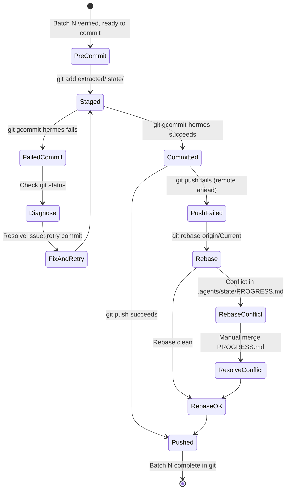
```mermaid
stateDiagram-v2
    [*] --> PreCommit: Batch N verified, ready to commit

    PreCommit --> Staged: git add extracted/ state/
    Staged --> Committed: git gcommit-hermes succeeds
    Staged --> FailedCommit: git gcommit-hermes fails

    Committed --> Pushed: git push succeeds
    Committed --> PushFailed: git push fails (remote ahead)

    FailedCommit --> Diagnose: Check git status
    Diagnose --> FixAndRetry: Resolve issue, retry commit
    FixAndRetry --> Staged

    PushFailed --> Rebase: git rebase origin/Current
    Rebase --> RebaseConflict: Conflict in .agents/state/PROGRESS.md
    Rebase --> RebaseOK: Rebase clean
    RebaseConflict --> ResolveConflict: Manual merge PROGRESS.md
    ResolveConflict --> RebaseOK
    RebaseOK --> Pushed

    Pushed --> [*]: Batch N complete in git
```

### 7b. Emergency Recovery: Lost Commits

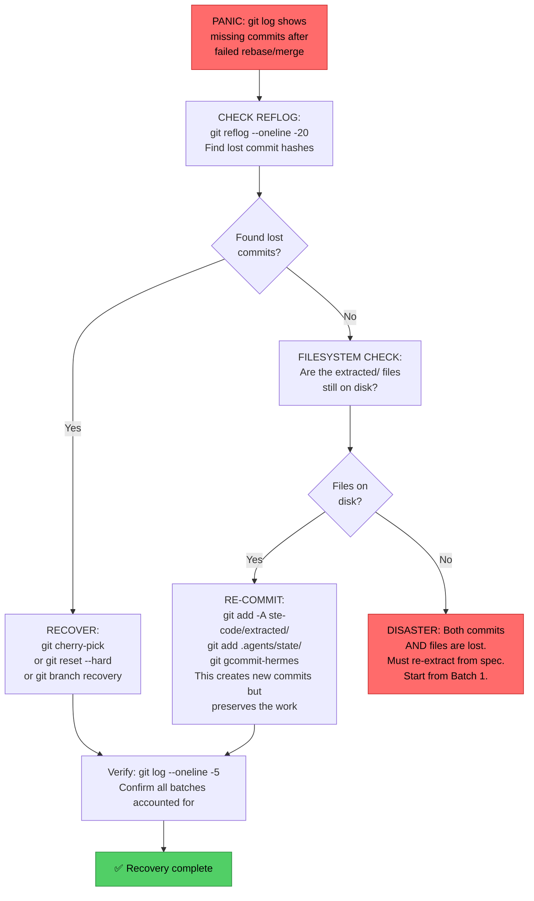
```mermaid
flowchart TD
    PANIC["PANIC: git log shows<br/>missing commits after<br/>failed rebase/merge"] --> REFLOG["CHECK REFLOG:<br/>git reflog --oneline -20<br/>Find lost commit hashes"]

    REFLOG --> FOUND{"Found lost<br/>commits?"}
    FOUND -->|"Yes"| RECOVER["RECOVER:<br/>git cherry-pick <hash><br/>or git reset --hard <hash><br/>or git branch recovery <hash>"]
    FOUND -->|"No"| FS_CHECK["FILESYSTEM CHECK:<br/>Are the extracted/ files<br/>still on disk?"]

    FS_CHECK --> FILES_OK{"Files on<br/>disk?"}
    FILES_OK -->|"Yes"| RECOMMIT["RE-COMMIT:<br/>git add -A ste-code/extracted/<br/>git add .agents/state/<br/>git gcommit-hermes<br/>This creates new commits but<br/>preserves the work"]
    FILES_OK -->|"No"| DISASTER["DISASTER: Both commits<br/>AND files are lost.<br/>Must re-extract from spec.<br/>Start from Batch 1."]

    RECOVER --> VERIFY_RECOVERY["Verify: git log --oneline -5<br/>Confirm all batches accounted for"]
    RECOMMIT --> VERIFY_RECOVERY
    VERIFY_RECOVERY --> DONE["✅ Recovery complete"]

    style DISASTER fill:#ff6b6b,stroke:#c92a2a,color:#000
    style DONE fill:#51cf66,stroke:#2b8a3e,color:#000
    style PANIC fill:#ff6b6b,stroke:#c92a2a,color:#000
```

---

## 8. COMPLETE TROUBLESHOOTING STATE MACHINE

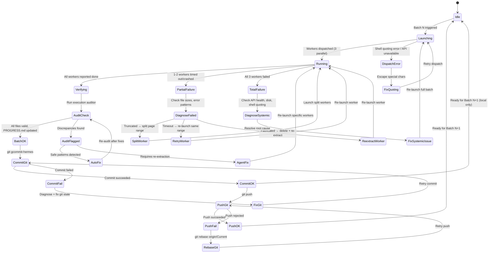
```mermaid
stateDiagram-v2
    [*] --> Idle

    Idle --> Launching: Batch N triggered

    Launching --> Running: Workers dispatched (3 parallel)
    Launching --> DispatchError: Shell quoting error / API unavailable

    Running --> Verifying: All workers reported done
    Running --> PartialFailure: 1-2 workers timed out/crashed
    Running --> TotalFailure: All 3 workers failed

    DispatchError --> FixQuoting: Escape special chars
    FixQuoting --> Launching: Retry dispatch

    Verifying --> AuditCheck: Run execution auditor
    AuditCheck --> BatchOK: All files valid, PROGRESS.md updated
    AuditCheck --> AuditFlagged: Discrepancies found

    AuditFlagged --> AutoFix: Safe patterns detected
    AuditFlagged --> AgentFix: Requires re-extraction

    AutoFix --> AuditCheck: Re-audit after fixes
    AgentFix --> Running: Re-launch specific workers

    PartialFailure --> DiagnoseFailed: Check file sizes, error patterns
    DiagnoseFailed --> SplitWorker: Truncated → split page range
    DiagnoseFailed --> RetryWorker: Timeout → re-launch same range
    DiagnoseFailed --> ReextractWorker: Fabricated → delete + re-extract

    SplitWorker --> Running: Launch split workers
    RetryWorker --> Running: Re-launch worker
    ReextractWorker --> Running: Re-launch worker

    TotalFailure --> DiagnoseSystemic: Check API health, disk, shell quoting
    DiagnoseSystemic --> FixSystemicIssue: Resolve root cause
    FixSystemicIssue --> Launching: Re-launch full batch

    BatchOK --> CommitGit: git gcommit-hermes
    CommitGit --> CommitOK: Commit succeeded
    CommitGit --> CommitFail: Commit failed

    CommitOK --> PushGit: git push
    PushGit --> PushOK: Push succeeded
    PushGit --> PushFail: Push rejected

    CommitFail --> FixGit: Diagnose + fix git state
    FixGit --> CommitGit: Retry commit

    PushFail --> RebaseGit: git rebase origin/Current
    RebaseGit --> PushGit: Retry push

    PushOK --> Idle: Ready for Batch N+1
    CommitOK --> Idle: Ready for Batch N+1 (local only)
```

---

## 9. Quality Gates — Trust Score Thresholds & Pipeline Rules

The trust score from Appendix C controls pipeline continuation. Each threshold maps to a specific gate action.

```mermaid
flowchart TD
    SCORE["Auditor calculates<br/>trust = verified / total"] --> GATE{"Trust Score"}

    GATE -->|"1.00"| PROCEED["PROCEED<br/>All claims verified.<br/>Continue to next stage."]
    GATE -->|"0.80 - 0.99"| CONTINUE["CONTINUE WITH WARNINGS<br/>Auditor logs the gaps.<br/>Pipeline continues to next stage.<br/>Fix gaps in parallel if possible."]
    GATE -->|"0.50 - 0.79"| PAUSE["PAUSE PIPELINE<br/>Do not start next stage.<br/>Fix all ERROR and CRITICAL gaps.<br/>Re-audit after fixes applied."]
    GATE -->|"< 0.50"| HALT["HALT PIPELINE<br/>Stop all active workers.<br/>Run full audit with fix mode.<br/>Re-extract missing or fabricated files.<br/>Do not continue until trust ≥ 0.80."]

    PROCEED --> NEXT["Next pipeline stage"]
    CONTINUE --> NEXT
    PAUSE --> FIX["Fix loop: audit → fix → re-audit"]
    FIX --> SCORE
    HALT --> FULL["Full audit + fix + re-extract"]
    FULL --> SCORE

    style PROCEED fill:#51cf66,stroke:#2b8a3e,color:#000
    style CONTINUE fill:#ffd43b,stroke:#fab005,color:#000
    style PAUSE fill:#ffa94d,stroke:#d9480f,color:#000
    style HALT fill:#ff6b6b,stroke:#c92a2a,color:#000
```

### Gate Rules Summary

| Trust Score | Gate Action | Pipeline Effect | Required Fixes |
|-------------|-------------|-----------------|----------------|
| 1.00 | PROCEED | Continue to next stage with no restrictions | None |
| 0.80 - 0.99 | CONTINUE | Continue to next stage. Log all gaps. | Fix gaps in parallel if resources permit |
| 0.50 - 0.79 | PAUSE | Stop pipeline before next stage | Fix all ERROR and CRITICAL gaps. Re-audit. |
| < 0.50 | HALT | Stop all workers immediately | Full audit with fix mode. Re-extract missing files. |

NOTE: The Auditor enforces these gates automatically during each audit run. The pipeline does not advance past a PAUSE or HALT gate until a re-audit confirms the trust score meets the threshold.

### Gate Timing & Cooldown

The Auditor checks gates at these points:

- After each batch completes (GATE CHECK: per-batch trust)
- After a full pipeline stage finishes (GATE CHECK: stage-level trust)
- On manual `audit now` command (GATE CHECK: full pipeline trust)

If a gate triggers PAUSE, the cooldown is 60 seconds before the next audit. This cooldown prevents audit-storm loops. If a gate triggers HALT, the cooldown is 300 seconds. The system waits for all running workers to complete or time out before the next audit.

---

## 10. Known Limitations & Workarounds

### 10a. Single-Page Worker Truncation

**Limitation**: The split strategy (Section 2b) assumes a 4-page worker. It splits 4 pages into 2+2. The strategy does not address a 2-page worker that still truncates after a split.

**Workaround**: If a 2-page worker truncates, use a manual extraction. Use one agent to read a single page and write the output. Do not use the parallel worker pipeline for single-page extractions. Mark the page as manually extracted in PROGRESS.md with a note.

### 10b. Closed-Set Auto-Fix Queue

**Limitation**: The auto-fix queue (Section 4, AF1-AF7) is hardcoded to 7 specific fixes. The queue has no mechanism to add an 8th auto-fix pattern at runtime.

**Workaround**: Add new auto-fixable patterns to the execution-auditor SKILL.md file. Update the auditor skill with the new detection rule and the fix command. The auditor reads its skill file before each run. It uses the latest rules. You do not need to change this document to add a new auto-fix.

### 10c. Git Recovery Assumes Intact Reflog

**Limitation**: The emergency git recovery flow (Section 7b) checks `git reflog` to find lost commits. If the reflog is empty (for example, after `git gc` or in a fresh clone), this method fails.

**Workaround**: If the reflog is empty, fall back to filesystem-based recovery. Check if the extracted/ and refined/ files exist on disk. If they exist, use `git add -A` followed by `git commit` to create new commits. These commits preserve the work. The commit history will differ from the original. The file content will be the same.

### 10d. notify_on_complete Reliability Under Load

**Limitation**: The `notify_on_complete` flag for background workers can fail under high API load. A worker may finish. The notification may not arrive. The orchestrator then waits indefinitely.

**Workaround**: Set a timeout-based polling fallback. After you start a batch of workers, wait for the expected completion time plus a buffer (for example, 120 seconds plus 60 seconds). If no notification arrives in that window, use `process(action='poll')` to check worker status directly. If the worker is done but silent, collect its output manually. If the worker is still running, extend the timeout.

### 10e. Trust Score Calculation Uses Simple Verified/Total Ratio

**Limitation**: The trust score (Appendix C) divides verified claims by total claims. This treats a 30-line truncated file the same as a missing file if both fail verification. The score does not account for partial correctness or degradation severity.

**Workaround**: Use the Severity Classification Reference (Appendix A) as a companion metric. A trust score of 0.80 with all CRITICAL gaps fixed is safer than a trust score of 0.80 with 2 CRITICAL gaps still open. Always read the audit report before making a gate decision based on the score alone. The gate rules in Section 9 account for this by requiring all CRITICAL and ERROR fixes in PAUSE mode.

### 10f. No Recovery Journal for Pattern Learning

**Limitation**: The pipeline does not keep a recovery journal. It does not track which recovery strategies worked for which failure patterns in the past. Each failure triggers the same decision tree with no learning from history.

**Workaround**: Keep a manual recovery log in `.agents/state/recovery-log.md` with this format:

```
| Date | Worker | Failure | Strategy | Result | Notes |
|------|--------|---------|----------|--------|-------|
| 2025-07-30 | W042 | TRUNCATION | Split 2+2 | ✅ Success | Pages 165-166 heavy tables |
| 2025-07-30 | W015 | TIMEOUT | Retry same | ❌ Failed | API throttled, waited 300s |
```

Review this log before deciding a recovery strategy for a recurring failure. If the same worker fails 3 times with the same strategy, escalate to manual extraction.

---

## 11. How to Extend This Document

Use this section as a guide when you discover a new failure mode in production. Complete the steps in order.

### Step 1: Classify the New Failure Mode

Find the correct location in the taxonomy.

| Failure Type | Insert Location | Example |
|-------------|-----------------|---------|
| Worker dispatch failure | Section 1 — add a new node to the DISPATCH decision tree | Shell quoting error |
| Runtime output failure | Section 1 — add a new branch under CHECK or SIZE | Model misroute |
| Recovery strategy | Section 2 — add a new recovery branch in the batch decision tree | New split variant |
| Audit detection method | Section 3b — add a new detection method node | New fabrication pattern |
| Auto-fix pattern | Section 4 — add a new AF node in the auto-fix queue | New text replacement |
| Rail violation | Section 5 or 5b — add a new rail or worker rail | New formatting check |
| System-level failure | Section 8 — add a new state to the state machine | New pipeline deadlock |

### Step 2: Assign a Severity Class

| Severity | When to Use | Color in Mermaid |
|----------|------------|------------------|
| 🔴 CRITICAL | Data loss, false claims, fabrication, file corruption | `fill:#ff6b6b,stroke:#c92a2a,color:#000` |
| 🟠 ERROR | Wrong format, wrong page range, naming errors | `fill:#ffa94d,stroke:#d9480f,color:#000` |
| 🟡 WARNING | Tracking gaps, timing issues, minor inconsistencies | `fill:#ffd43b,stroke:#fab005,color:#000` |

### Step 3: Write the Recovery Command

For each new failure mode, write a recovery command. Use this template:

```
FAILURE: [short name]
  DETECT: [method to find this failure]
  FIX: [recovery action]
```

Add the recovery command to Appendix B if it is a standalone command. Add it to the relevant decision tree in Section 2 if it is part of a batch workflow.

### Step 4: Update the Version History

Add a row to the Version History table with:
- The date you added the failure mode
- A short description of the change
- The source (which batch or event triggered the discovery)
- The new version number (increment the minor version)

### Step 5: Update Agentic-Load Specifications

If the new section is large (more than 200 words), update the Agentic-Load Specifications table. Add the new section to the per-section sizes table. Update the recommended subsets for each agent role if the new section is relevant to that role.

### Step 6: Check Cross-References

Check if the new failure mode affects these documents:

| Document | When to Update |
|----------|---------------|
| `.agents/uml/worker-rails.md` | New worker rail (W11 or higher) |
| `.agents/uml/rails.md` | New process rail (R9 or higher) |
| `.agents/skills/SKILL.md` (execution-auditor) | New detection method or auto-fix |
| `.agents/skills/SKILL.md` (extraction) | New extraction failure mode |
| `.agents/references/worker-grid.md` | Changes to worker page assignment |

### Step 7: Worked Example — Adding a New Failure Mode End-to-End

This example shows how to add a new failure mode: "API returns stale cached response."

**Scenario**: During extraction, a worker receives a cached response from a previous request instead of a fresh extraction. The output passes the size check but contains outdated content from a different page range.

**Step 1 — Classify**: This is a runtime output failure. Insert a new branch under the CONTENT node in Section 1. Name the node `CACHE_STALE`.

**Step 2 — Severity**: 🔴 CRITICAL. The output is a fabrication — wrong page content, not from the requested pages.

**Step 3 — Recovery command**:
```
FAILURE: Stale cached API response
  DETECT: Compare output page headers to requested page range.
          Page header mismatch = stale cache.
          grep "^# Page" in output → compare to expected pages.
  FIX: Add cache-busting parameter to prompt (timestamp or UUID).
       Re-launch worker with unique prompt suffix.
```

**Step 4 — Version history**: Add row `2.X | 2025-07-31 | Add stale cache failure (Section 1c) | Extraction Batch 22`.

**Step 5 — Agentic-load**: Add 15 lines, ~200 tokens to Section 1. Update per-section sizes table.

**Step 6 — Cross-references**: No rail changes. Update execution-auditor SKILL.md with the page-header mismatch detection rule.

**Step 7 — Decision tree update**: Add a new branch to the Section 2a batch recovery tree: under DIAG_PARTIAL, add `CACHE_STALE → ADD_CACHE_BUSTER → RELAUNCH`.

---

## 12. Recovery Playbooks

Step-by-step procedures for the most common disaster scenarios. Follow these playbooks in order. Do not skip steps.

### Playbook A: All Workers in a Batch Hang (0/3, No Output)

**Symptom**: You launched Batch N (3 workers). After 180 seconds, zero workers produced output. No files exist in `ste-code/extracted/` for this batch.

```
STEP 1 — Check API health.
  Run: hermes status
  If proxy is DOWN: Wait 60s. Retry. If still DOWN, skip to STEP 5.

STEP 2 — Check for shell quoting errors.
  Read the prompt file for the first worker:
    cat ste-code/prompts/wNNN-prompt.txt
  Check for unescaped quotes, backticks, dollar signs.
  If found: Fix the prompt template. All workers in this batch share the same template bug.

STEP 3 — Check disk space.
  Run: df -h .
  If < 1GB free: Free space. Remove old audit reports or stale files.
  Retry batch after freeing space.

STEP 4 — Check for API rate limiting.
  If you launched > 3 concurrent batches: Stagger launches.
  Wait 120s cooldown. Re-launch with 5s delay between workers.

STEP 5 — Escalate to single-worker test.
  Launch ONE worker from the batch with a simple test prompt.
  If single worker also hangs: Systemic API issue. Wait for resolution.
  If single worker succeeds: Re-launch full batch with stagger.
```

### Playbook B: Recurring Truncation on Same Worker (3+ Splits)

**Symptom**: Worker W042 was split 4→2+2. One of the 2-page sub-workers truncated again. It was split 2→1+1. The single-page worker still produces < 30 lines.

```
STEP 1 — Check the source page content.
  Read the spec page directly:
    cat spec/issue-09-2025/page-0165.md
  Look for: heavy tables, images, complex formatting, non-Latin characters.

STEP 2 — Classify the page type.
  If page contains an image: Worker cannot extract images. Mark page as SKIPPED-IMAGE.
  If page contains a table with > 20 rows: Split the table extraction.
    Use prompt: "Extract ONLY the table on page 165. Ignore surrounding text."
  If page contains non-Latin characters: Add encoding instruction to prompt.
    Use prompt: "The page contains Unicode. Preserve all characters exactly."

STEP 3 — Escalate to manual extraction.
  If STEPS 1-2 do not resolve: Use an interactive agent session.
  Run: hermes -z "Read spec/issue-09-2025/page-0165.md. Extract all content."
  Verify output manually. Write to ste-code/extracted/w042-p165.md by hand.

STEP 4 — Log the page as a known problematic page.
  Add to .agents/state/problematic-pages.md:
    | Page | Issue | Resolution |
    | 165  | Heavy nested table, 3 splits failed | Manual extraction |
  Future pipeline runs skip this page in the parallel worker grid.
```

### Playbook C: Git Push Rejected — Remote Diverged

**Symptom**: `git push origin Current` fails with "rejected, remote has diverged."

```
STEP 1 — Do NOT force push.
  Force push can destroy other agents' work.

STEP 2 — Fetch and inspect.
  Run: git fetch origin
  Run: git log origin/Current --oneline -10
  Identify which commits exist on the remote but not locally.

STEP 3 — Rebase your work.
  Run: git rebase origin/Current
  If conflict in PROGRESS.md: Resolve by keeping both sets of [x] marks.
    Batch numbers are disjoint. Two agents should not claim the same batch.
  If conflict in extracted/ files: Keep the larger file (more complete extraction).

STEP 4 — Re-run audit after rebase.
  The rebase may change file timestamps.
  Run: hermes -z "Audit claims vs disk. Report discrepancies."
  Fix any new discrepancies before pushing.

STEP 5 — Push.
  Run: git push origin Current
```

### Playbook D: Disk Full During Extraction

**Symptom**: Workers start failing with "No space left on device" errors. Existing files may be truncated or zero-byte.

```
STEP 1 — Stop all workers immediately.
  Run: process(action='kill') for each active worker session.
  Do NOT launch new workers. They will also fail.

STEP 2 — Identify large consumers.
  Run: du -sh ste-code/extracted/ ste-code/refined/ .agents/audit/
  Run: du -sh ~/Library/Caches/ ~/.hermes/
  Find the largest directories.

STEP 3 — Safe cleanup (do NOT delete extracted/ files).
  Remove old audit reports: rm .agents/audit/audit-2025-07-*.md (keep latest 5)
  Remove stale prompts: rm ste-code/prompts/w*-prompt.txt
  Clear model caches: hermes cache clear (if available)

STEP 4 — Verify integrity of existing extractions.
  After freeing space, run:
    for f in ste-code/extracted/w*-p*.md; do
      [ -s "$f" ] || echo "CORRUPT: $f is empty"
    done
  Any empty file is a corruption victim. Delete and mark for re-extraction.

STEP 5 — Resume from the last fully-verified batch.
  Check PROGRESS.md for the last batch where all 3 files are non-empty on disk.
  Resume from (last_good + 1).
```

### Playbook E: Model Degradation Detected Mid-Pipeline

**Symptom**: Audit detects increasing fabrication or truncation rates across consecutive batches. Batch 20 was clean. Batch 21 had 1 truncation. Batch 22 had 2 fabrications. Batch 23 had all 3 workers truncate.

```
STEP 1 — Stop the pipeline at the current batch boundary.
  Do NOT launch Batch 24. Let Batch 23 finish or time out.

STEP 2 — Run a model health probe.
  Launch a single worker with a known-good page range:
    hermes -z "Read spec/issue-09-2025/page-0001.md through page-0004.md.
    Extract all content. Write to ste-code/extracted/probe-p1-4.md."
    -m deepseek-v4-pro --yolo
  If the probe also truncates or fabricates: Model is degraded. Wait for API recovery.

STEP 3 — Check if the proxy changed routing.
  Run: hermes status
  Confirm the model routing matches deepseek-v4-pro.

STEP 4 — Escalate if degradation persists.
  After 3 failed probes (with 120s wait between each): Escalate to manual pipeline pause.
  Log the incident in .agents/state/incidents.md.
  Resume when the next probe succeeds.
```

---

## 13. Failure Mode Impact Analysis

Cross-reference each failure mode against pipeline stages, recovery cost, and blast radius.

### Impact Matrix

| Failure Mode | Stages Affected | Recovery Time (est.) | Blast Radius | Auto-Fixable? |
|-------------|-----------------|---------------------|--------------|---------------|
| TIMEOUT (worker never starts) | Extraction only | 120s (retry) | 1 worker | No — re-launch |
| FILE CORRUPTION (crashed mid-write) | Extraction only | 120s (re-extract) | 1 worker | No — re-extract |
| TRUNCATION (partial output) | Extraction only | 240s (split + 2 sub-workers) | 1 worker, expands to 2 | No — split |
| FABRICATION (wrong content) | Extraction only | 120s (re-extract) | 1 worker | No — re-extract |
| Shell quoting error | Extraction (all workers in batch) | 60s (fix template) | 3 workers (entire batch) | Yes — fix prompt file |
| Model misroute | Extraction, Refinement, all stages | 120s per affected worker | All workers since misroute started | Yes — add explicit -m flag |
| git commit failure | All stages (blocks progress tracking) | 60-300s | 0 files (progress not saved) | Yes — git fix commands |
| Disk full | All stages (blocks all writes) | 300-600s (cleanup + verify) | All files written during outage | No — manual cleanup |
| notify_on_complete silent | Extraction, Refinement (blocks orchestration) | 60s (poll fallback) | 1-3 workers | Yes — poll fallback |
| API rate limit (429) | Extraction, Refinement | 60-300s (backoff) | 1-3 workers | Yes — stagger + wait |
| Stale cache response | Extraction | 120s (re-extract with cache bust) | 1 worker | Yes — add cache buster |
| Model degradation (progressive) | Extraction, Refinement | 600s+ (wait for API recovery) | All future workers | No — pause pipeline |

### Blast Radius Categories

| Category | Definition | Example |
|----------|-----------|---------|
| **Single worker** | Only one output file is affected | Truncation, timeout of W042 |
| **Single batch** | Multiple workers in one batch are affected | Shell quoting error in batch template |
| **All workers since trigger** | Every worker after a systemic change is affected | Model misroute, disk full |
| **All future workers** | Pipeline cannot continue until resolved | Model degradation, API outage |

Use this matrix before you choose a recovery strategy. If the blast radius is "All future workers," pause the pipeline immediately. Do not wait for more failures.

---

## 14. Self-Healing Triggers

The system can auto-detect and auto-recover from these patterns without agent intervention. The Auditor checks these triggers during each audit run.

### Trigger Rules

```
TRIGGER 1: Empty directory in output path
  DETECT: test -d ste-code/extracted/ && [ -z "$(ls -A ste-code/extracted/)" ]
  ACTION:  Remove empty directory (AF4). Log warning.

TRIGGER 2: All 3 workers in a batch have < 30 lines
  DETECT: wc -l for batch N shows < 30 for all 3 files
  ACTION:  Do NOT auto-fix. Escalate to agent.
           Systemic issue requires root cause diagnosis.

TRIGGER 3: Consecutive identical failures across 3+ batches
  DETECT: Same failure type (TRUNCATION) on batches N, N+1, N+2
  ACTION:  Escalate. Pattern suggests model degradation or page complexity issue.
           Do not continue splitting indefinitely.

TRIGGER 4: PROGRESS.md [x] count exceeds disk file count by > 5
  DETECT: grep '\[x\]' PROGRESS.md | wc -l vs ls ste-code/extracted/w*.md | wc -l
  ACTION:  Auto-audit. The gap > 5 means systemic tracking corruption.
           Revert all [x] for batches that lack disk evidence.

TRIGGER 5: File timestamp older than 24 hours in active directory
  DETECT: find ste-code/extracted/ -name 'w*.md' -mtime +1
  ACTION:  Log warning. Do not delete. The file may be valid but old.
           Flag for re-audit on next pass.

TRIGGER 6: Worker output file references wrong model name
  DETECT: grep -l 'deepseek-v4-flash' ste-code/extracted/*.md
  ACTION:  Auto-fix (AF2): patch to 'deepseek-v4-pro'. Re-audit.

TRIGGER 7: Split depth = 3 for any worker
  DETECT: Filename matches wNNNa[a-d][1-2]-p*.md (three suffix levels)
  ACTION:  Escalate to manual extraction. Stop splitting.
           Log the page in problematic-pages.md.

TRIGGER 8: Duplicate output files (same page range, different worker IDs)
  DETECT: Two files claim the same page range (e.g., w001-p1-4.md and w042-p1-4.md)
  ACTION:  Keep the file with the larger line count. Remove the shorter duplicate.
           Log the collision.
```

NOTE: Triggers 2, 3, and 7 always escalate to agent intervention. They indicate systemic problems that auto-fixes cannot resolve safely.

---

## 15. Concurrency Failure Modes

When multiple agents or recovery processes run at the same time, these race conditions can occur.

```mermaid
flowchart TD
    subgraph RACE["Concurrency Race Conditions"]
        RC1["SPLIT COLLISION: Agent A splits W042 into<br/>W042a + W042b. Agent B also detects<br/>W042 truncation and splits it into<br/>W042x + W042y. Result: 4 split workers<br/>for the same page range."]
        RC2["PROGRESS WRITE RACE: Agent A writes<br/>[x] for Batch 17. Agent B simultaneously<br/>reverts Batch 17 to [ ] after audit.<br/>Final state depends on write order."]
        RC3["GIT REBASE COLLISION: Agent A commits<br/>Batch 17. Agent B rebases and<br/>force-pushes. Agent A's commit is<br/>orphaned or lost."]
        RC4["AUTO-FIX COLLISION: Auditor fixes a file.<br/>Extractor simultaneously re-extracts<br/>the same file. The last write wins.<br/>Content may be inconsistent."]
    end

    RC1 --> PREVENT1["PREVENTION: Before splitting, check if<br/>split files already exist on disk.<br/>If w042a-p165-166.md exists, skip split."]
    RC2 --> PREVENT2["PREVENTION: Use atomic write pattern.<br/>Write to PROGRESS.md.tmp, then mv.<br/>mv is atomic on the same filesystem."]
    RC3 --> PREVENT3["PREVENTION: Always pull --rebase before<br/>committing. If rebase conflict,<br/>abort and coordinate with other agent."]
    RC4 --> PREVENT4["PREVENTION: Auditor only fixes files<br/>older than 60 seconds. Active extraction<br/>files (< 60s old) are skipped."]

    style RC1 fill:#ff6b6b,stroke:#c92a2a,color:#000
    style RC2 fill:#ffa94d,stroke:#d9480f,color:#000
    style RC3 fill:#ff6b6b,stroke:#c92a2a,color:#000
    style RC4 fill:#ffa94d,stroke:#d9480f,color:#000
```

### Concurrency Safety Rules

```
RULE C1: ONE RECOVERY AGENT AT A TIME
  Only one agent (or auditor in fix mode) may modify files in ste-code/extracted/.
  If you detect another agent is active, wait 60s and check again.

RULE C2: CHECK DISK BEFORE ACTING
  Before you create a split worker, check if the split output file already exists.
  If it exists and has > 30 lines, the split was already done. Skip.

RULE C3: ATOMIC PROGRESS UPDATES
  Write PROGRESS.md changes to a temp file, then use mv to replace.
  Do not append. Do not edit in place.

RULE C4: STALE FILE GRACE PERIOD
  Do not modify files modified less than 60 seconds ago.
  These files may be mid-write by an active worker.

RULE C5: GIT PULL BEFORE GIT PUSH
  Always run git fetch && git rebase origin/Current before git push.
  If rebase fails with conflict, abort and investigate.
```

---

## 16. Post-Recovery Verification Protocol

After you apply any recovery action, complete this checklist before you mark the issue as resolved.

### Verification Checklist

```
☐ 1. FILE EXISTS
     test -f ste-code/extracted/wNNN-pPPPP-PPPP.md

☐ 2. FILE HAS CONTENT
     [ $(wc -l < ste-code/extracted/wNNN-pPPPP-PPPP.md) -gt 30 ]

☐ 3. CLEAN ENDING
     tail -3 ste-code/extracted/wNNN-pPPPP-PPPP.md
     Last lines must end with a complete sentence or table row.
     No mid-word cutoff.

☐ 4. CORRECT PAGE RANGE
     head -1 ste-code/extracted/wNNN-pPPPP-PPPP.md
     Must match: "# Page NNNN of 434 — ASD-STE100 Issue 9"

☐ 5. NO FABRICATION SIGNALS
     grep -c -i 'react\|docker\|npm\|this page describes' ste-code/extracted/wNNN-pPPPP-PPPP.md
     Must return 0 for all patterns.

☐ 6. NO FORMATTING ERRORS
     grep -c '^###[^ ]' ste-code/extracted/wNNN-pPPPP-PPPP.md
     Must return 0 (no glued headings).

☐ 7. PROGRESS.md UPDATED
     grep 'wNNN' .agents/state/PROGRESS.md
     Must show [x] for this worker.

☐ 8. PARENT BATCH CONSISTENT
     If this worker was part of a split, the original unsplit file must NOT exist.
     test ! -f ste-code/extracted/wNNN-pPPPP-PPPP.md (original range)
     Or the original must have been merged from split parts.

☐ 9. GIT STAGED
     git status ste-code/extracted/wNNN-pPPPP-PPPP.md
     File must be staged or committed.

☐ 10. CROSS-CHECK WITH AUDITOR
      Run auditor on this single file:
      hermes -z "Audit ste-code/extracted/wNNN-pPPPP-PPPP.md only."
      Must return CLEAN.
```

BREAKING: If any check in items 1-6 fails, the recovery action failed. Do not mark the batch as complete. Restart the recovery from Section 2.

NOTE: Checks 7-10 are operational hygiene. A failure in these checks does not invalidate the file content. Fix the tracking issue and continue.

---

## 17. Cascading Failure Prevention

One worker's failure can trigger a chain of failures if you do not isolate the blast radius. Use these patterns to prevent cascades.

```mermaid
flowchart TD
    subgraph CIRCUIT["Circuit Breaker Pattern"]
        CB_CLOSED["CLOSED: Normal operation.<br/>Failures < 2 per 5 batches."]
        CB_OPEN["OPEN: Failure threshold exceeded.<br/>Stop launching new workers.<br/>Diagnose root cause."]
        CB_HALF["HALF-OPEN: Probe with 1 worker.<br/>If probe succeeds → CLOSED.<br/>If probe fails → OPEN."]

        CB_CLOSED -->|"3+ failures<br/>in 5 batches"| CB_OPEN
        CB_OPEN -->|"120s cooldown<br/>+ probe"| CB_HALF
        CB_HALF -->|"Probe OK"| CB_CLOSED
        CB_HALF -->|"Probe fails"| CB_OPEN
    end

    subgraph BULKHEAD["Bulkhead Pattern"]
        B1["Batch Group A<br/>(batches 1-12)<br/>Independent retry pool"]
        B2["Batch Group B<br/>(batches 13-24)<br/>Independent retry pool"]
        B3["Batch Group C<br/>(batches 25-37)<br/>Independent retry pool"]

        B1 -.->|"Failure in Group A<br/>does not block Group B"| B2
        B2 -.->|"Failure in Group B<br/>does not block Group C"| B3
    end

    style CB_OPEN fill:#ff6b6b,stroke:#c92a2a,color:#000
    style CB_CLOSED fill:#51cf66,stroke:#2b8a3e,color:#000
    style CB_HALF fill:#ffd43b,stroke:#fab005,color:#000
```

### Prevention Rules

```
RULE P1: CIRCUIT BREAKER ON CONSECUTIVE FAILURES
  If 3 or more workers in 5 consecutive batches fail with the same error type:
    → OPEN the circuit. Stop launching new batches.
    → Wait 120 seconds.
    → Launch 1 probe worker (a simple, known-good page range).
    → If probe succeeds → CLOSE circuit, resume.
    → If probe fails → keep OPEN, wait another 300 seconds.

RULE P2: BULKHEAD BY BATCH GROUPS
  Split the 37 batches into 3 independent groups (A: 1-12, B: 13-24, C: 25-37).
  A failure in Group A (e.g., API slowdown) does not prevent Groups B and C from
  continuing if their workers are on a different API key or session.

RULE P3: MAXIMUM RETRY CAP PER WORKER
  A single worker (same page range, same worker ID) may retry at most 3 times.
  After 3 failures, escalate to manual extraction.
  Do not retry indefinitely — this wastes tokens and delays the pipeline.

RULE P4: EXPONENTIAL BACKOFF WITH JITTER
  Between retries of the same worker:
    Retry 1: wait 10s + random(0-5s)
    Retry 2: wait 30s + random(0-10s)
    Retry 3: wait 90s + random(0-20s)
  This prevents thundering herd on API recovery.

RULE P5: ISOLATE SYSTEMIC FROM LOCAL FAILURES
  If only 1 worker in a batch fails: local failure → apply Sections 1-2 recovery.
  If all 3 workers in a batch fail: check for systemic cause BEFORE retrying.
  Do not retry all 3 without diagnosing the root cause.
```

---

## Appendix A: Severity Classification Reference

```mermaid
flowchart LR
    subgraph SEVERITY["Discrepancy Severity"]
        direction TB
        C1["🔴 CRITICAL<br/>Action: STOP pipeline"]
        C2["🟠 ERROR<br/>Action: Fix before continuing"]
        C3["🟡 WARNING<br/>Action: Note, continue"]

        C1 --> C1_EX["File claimed but missing<br/>File exists but empty/truncated<br/>PROGRESS.md [x] but no file<br/>Fabricated content detected<br/>Duplicate worker output<br/>Content fidelity violation"]
        C2 --> C2_EX["Claimed page range wrong<br/>Formatting standards violated<br/>Wrong naming convention<br/>Files in wrong stage dir"]
        C3 --> C3_EX["Work done but not tracked<br/>Claim timestamp after file timestamp<br/>Multiple agents claim different states<br/>File > 3KB but < 80 lines"]
    end

    style C1 fill:#ff6b6b,stroke:#c92a2a,color:#000
    style C2 fill:#ffa94d,stroke:#d9480f,color:#000
    style C3 fill:#ffd43b,stroke:#fab005,color:#000
```

---

## Appendix B: Quick Recovery Command Reference

```mermaid
flowchart TD
    subgraph CMDS["Emergency Recovery Commands"]
        CMD1["🔍 Full Audit<br/>hermes -z 'Read execution-auditor SKILL.md.<br/>Audit all claims vs disk evidence.<br/>Report to .agents/audit/audit-NOW.md'<br/>-m deepseek-v4-pro --yolo"]
        CMD2["🔧 Audit + Fix<br/>hermes -z 'Read execution-auditor SKILL.md.<br/>Full audit + apply all safe auto-fixes.<br/>Report to .agents/audit/audit-NOW.md'<br/>-m deepseek-v4-pro --yolo"]
        CMD3["📊 Coverage Check<br/>for pg in $(seq 1 434); do<br/>  grep -rq page-$(printf '%04d' $pg) ste-code/extracted/ || echo missing $pg<br/>done"]
        CMD4["🗑️  Emergency Clean<br/>rm -rf ste-code/extracted/w*-p*.md<br/>rm -rf ste-code/refined/r*-p*.md<br/>Reset PROGRESS.md to Batch 1<br/>(Only if < 30% coverage)"]
        CMD5["🔄 Resume Pipeline<br/>Read PROGRESS.md for last [x] batch.<br/>Launch Batch (last_batch + 1)<br/>Continue pipeline normally"]
        CMD6["💾 Git Rescue<br/>git reflog --oneline -20<br/>git cherry-pick &lt;lost-hash&gt;<br/>Or: git add -A && git gcommit-hermes"]
    end

    style CMD4 fill:#ff6b6b,stroke:#c92a2a,color:#000
    style CMD1 fill:#e3f2fd,stroke:#1565c0
    style CMD2 fill:#e8f5e9,stroke:#2b8a3e
    style CMD3 fill:#e3f2fd,stroke:#1565c0
    style CMD5 fill:#e8f5e9,stroke:#2b8a3e
    style CMD6 fill:#fff3e0,stroke:#d9480f
```

---

## Appendix C: Auditor Trust Score Calculation

```mermaid
flowchart LR
    CLAIMS["Total Claims<br/>= PROGRESS.md [x] count<br/>+ explicit claims in feedback"] --> CALC

    VERIFIED["Verified Claims<br/>= claims where:<br/>- File exists<br/>- File > 30 lines<br/>- Timestamp consistent<br/>- Content matches range"] --> CALC

    CALC["trust = verified / total"] --> SCORE{"Trust Score"}

    SCORE -->|"1.00"| A["✅ PERFECT<br/>Proceed to next gate"]
    SCORE -->|"0.80-0.99"| B["🟡 GOOD<br/>Investigate gaps, continue"]
    SCORE -->|"0.50-0.79"| C["🟠 POOR<br/>Fix before continuing"]
    SCORE -->|"< 0.50"| D["🔴 BROKEN<br/>Full audit and restart"]

    style A fill:#51cf66,stroke:#2b8a3e,color:#000
    style B fill:#ffd43b,stroke:#fab005,color:#000
    style C fill:#ffa94d,stroke:#d9480f,color:#000
    style D fill:#ff6b6b,stroke:#c92a2a,color:#000
```

---

## Appendix D: Recovery Cost Model

Choose the least expensive effective recovery path. Costs are expressed in approximate tokens and wall-clock time.

### Recovery Path Costs

| Recovery Path | Token Cost (est.) | Time Cost (est.) | When to Use |
|--------------|-------------------|------------------|-------------|
| Auto-fix (AF1-AF7) | ~200 tokens | < 10s | Safe, known patterns only |
| Retry same worker | ~2,000 tokens | 60-120s | TIMEOUT, transient API issues |
| Split 4→2+2 | ~4,000 tokens | 120-240s | TRUNCATION on 4-page worker |
| Split 2→1+1 | ~2,000 tokens | 60-120s | Truncation persists after first split |
| Manual extraction (1 page) | ~1,000 tokens | 60-120s | Split depth=3, complex pages |
| Re-extract (fabrication) | ~2,000 tokens | 60-120s | FABRICATION detected |
| Full batch re-launch | ~6,000 tokens | 180-360s | Systemic batch failure |
| Full pipeline restart | ~218,000 tokens | 1-2 hours | < 30% coverage |
| Audit + fix mode | ~500 tokens | 30-60s | After any recovery action |

### Cost Optimization Rules

```
COST RULE 1: CHECK DISK BEFORE RETRYING
  Before you re-launch a worker, check if the output file already exists and is valid.
  A file may have been created by a parallel recovery agent (see Section 15).
  If the file is valid, skip re-launch. Cost: ~0 tokens saved.

COST RULE 2: SALVAGE PARTIAL OUTPUT
  If a 4-page worker produced clean output for pages 1-2 and truncated at page 3,
  salvage pages 1-2. Only re-extract pages 3-4. See Section 2c.
  Cost saved: ~2,000 tokens per salvage.

COST RULE 3: BATCH RETRIES BEFORE FULL RESTART
  A full pipeline restart costs ~218,000 tokens. A batch retry costs ~6,000.
  Always exhaust batch-level recovery before you consider a full restart.
  Exception: if coverage < 30%, full restart is cheaper than fixing 70%+ gaps.

COST RULE 4: ESCALATE AFTER 3 RETRIES
  Retrying the same worker more than 3 times has diminishing returns.
  Token cost of 3 retries: ~6,000 tokens.
  Manual extraction cost: ~1,000 tokens.
  After 3 retries, manual extraction is both cheaper and more reliable.
```

---

## Appendix E: Anti-Patterns in Recovery

Common mistakes that agents make during recovery. Avoid these patterns.

```
ANTI-PATTERN 1: SPLITTING A TIMEOUT
  Mistake: Worker timed out → agent splits page range.
  Why wrong: Timeout is a dispatch or API issue, not a content size issue.
             Splitting doubles the number of workers. If the API is slow,
             both sub-workers will also time out.
  Correct: Retry the same worker. If it times out again, wait and retry.
           If it times out 3 times, check API health. Do not split.

ANTI-PATTERN 2: RETRYING WITHOUT DIAGNOSIS
  Mistake: Worker failed → agent immediately retries with same parameters.
  Why wrong: If the failure is deterministic (bad prompt, wrong page range),
             retrying produces the same failure.
  Correct: Diagnose the failure type first (see Section 1).
           Apply the specific recovery for that type.
           Only retry if the failure type is transient (TIMEOUT, 429).

ANTI-PATTERN 3: FIXING SYMPTOMS, NOT ROOT CAUSE
  Mistake: All workers in a batch produce glued headings → agent patches each file.
  Why wrong: The root cause is a prompt template that does not instruct workers
             to add blank lines after headings. The next batch will have the same bug.
  Correct: Fix the prompt template first. Then fix the affected output files.
           Always fix the process before you fix the product.

ANTI-PATTERN 4: IGNORING THE BLAST RADIUS
  Mistake: Worker failed with FABRICATION → agent re-extracts only that worker.
  Why wrong: If the model was misrouted, ALL workers in the same time window
             may have fabricated output. Fixing one worker leaves others broken.
  Correct: Check the blast radius (see Section 13). If the failure is systemic,
           audit all workers launched in the same time window.

ANTI-PATTERN 5: FORCE-PUSHING TO RESOLVE GIT CONFLICTS
  Mistake: git push rejected → agent runs git push --force.
  Why wrong: Force push destroys other agents' work on the remote.
             The pipeline is collaborative. Force push breaks collaboration.
  Correct: Always rebase (see Playbook C). If rebase fails, coordinate with
           the other agent. Never force push unless you are certain no other
           agent has pushed work.

ANTI-PATTERN 6: REMOVING VALID FILES DURING CLEANUP
  Mistake: Disk full → agent runs rm -rf ste-code/extracted/*.md.
  Why wrong: This destroys valid extraction work. Recovery cost is 218,000+ tokens.
  Correct: Identify large non-essential consumers first (audit reports, caches).
           Only remove extracted files if they are confirmed corrupted (zero-byte).

ANTI-PATTERN 7: RUNNING MULTIPLE AUDITORS IN PARALLEL
  Mistake: Two auditors run "audit now" at the same time.
  Why wrong: Both auditors may apply auto-fixes simultaneously, causing race
             conditions (see Section 15). The audit reports may conflict.
  Correct: Only one auditor runs at a time. If an audit is in progress,
           wait for the audit report before starting another.

ANTI-PATTERN 8: TRUSTING PROGRESS.md WITHOUT VERIFICATION
  Mistake: Agent reads PROGRESS.md [x] and assumes the work is done.
  Why wrong: PROGRESS.md is a claim, not evidence. Claims can be false (see Section 6b).
  Correct: Always check disk evidence before trusting a progress claim.
           The Auditor's core principle: "Trust nothing. Verify everything."
```
