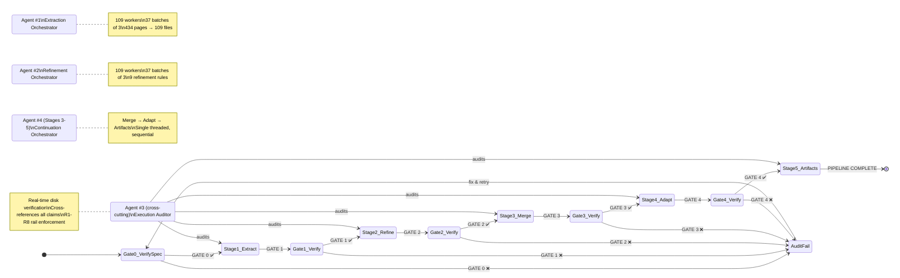
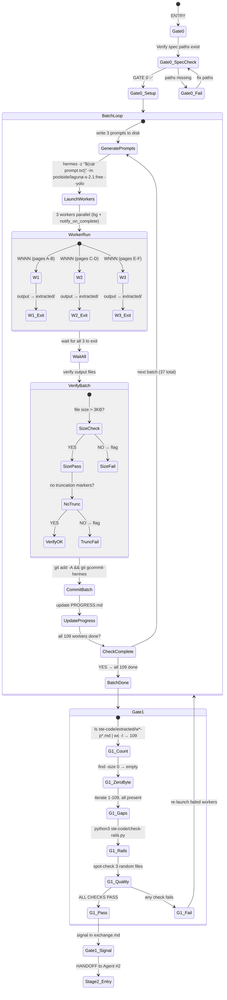
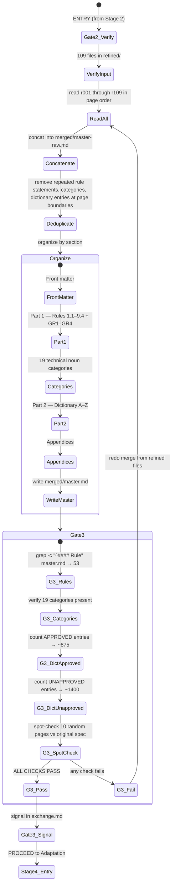
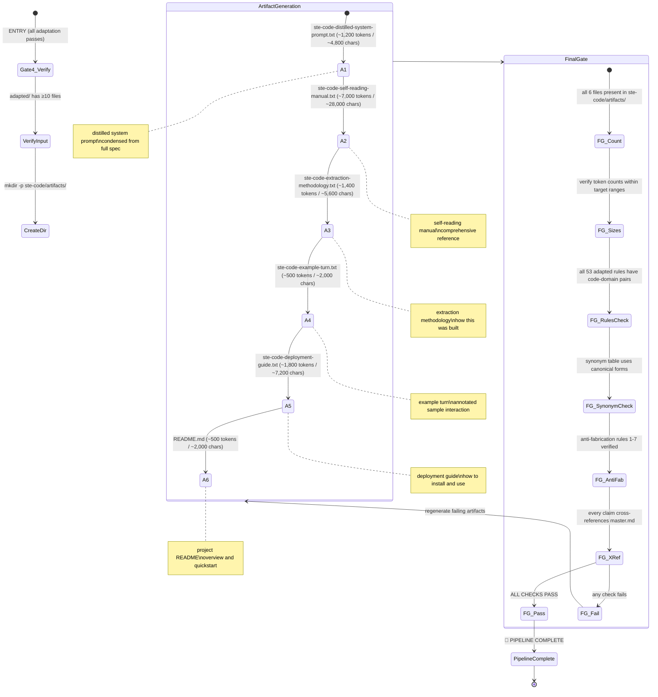
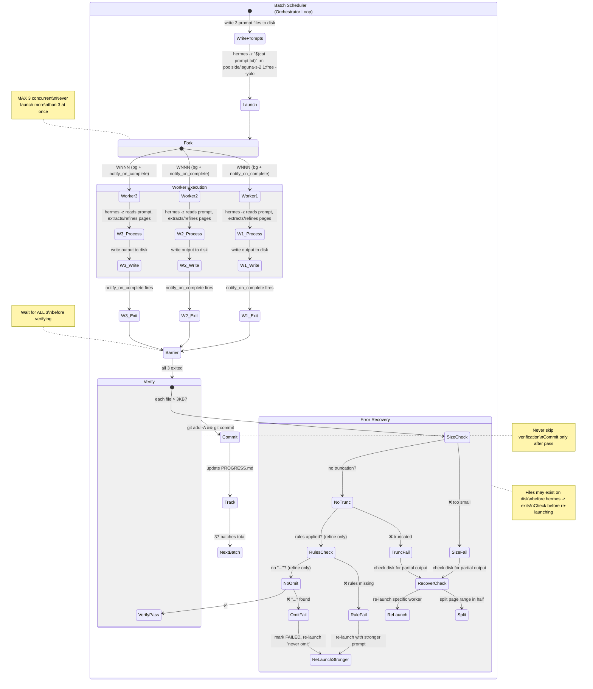
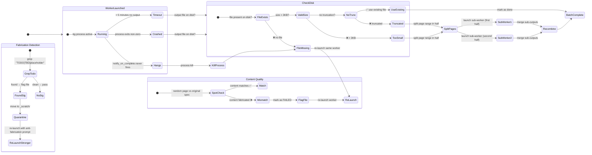

# STE-Code Pipeline — Master State Machine Blueprint

> **Source:** ASD-STE100 Issue 9, January 2025 (434 pages)
> **Agents:** Extraction (#1), Refinement (#2), Auditor (#3), Continuation (#4)
> **Model:** poolside/laguna-s-2.1:free exclusively
> **Key Facts:** 53 writing rules + 4 GR rules, 19 technical noun categories, ~875 approved + ~1400 unapproved dictionary entries

---

## Version History

| Date | Version | Change | Author |
|------|---------|--------|--------|
| 2025-06 | 1.0 | Initial pipeline design: 5-stage state machine, 4 agents, 109 workers | Agent #1 (Extraction) |
| 2025-06 | 1.1 | Added GATE 1–4 failure paths; cross-cutting Auditor audit edges | Agent #2 (Refinement) |
| 2025-06 | 1.2 | Added Section 8 (Gate Checkpoints) with detailed sub-checks per gate | Agent #3 (Auditor) |
| 2025-06 | 1.3 | Added Section 9 (Parallelism Architecture) and Section 10 (Error State Machine) | Agent #4 (Continuation) |
| 2025-07 | 1.4 | Added Section 11 (Rails Compliance) with R1–R8 cross-cutting constraints | Agent #3 (Auditor) |
| 2025-07 | 1.5 | Added Section 12 (Complete Pipeline Unified) for end-to-end view | Agent #4 (Continuation) |
| 2025-07 | 2.0 | Maturity audit: added Sections 13–17 + Appendices A–B; version history, meta-instructions, quality gates checklist, known limitations, agentic-load specs, dependency map, invariants, glossary | Maturity Worker |

> **NOTE:** This version history tracks structural changes to this document only. For pipeline execution history, refer to `.agents/state/PROGRESS.md` and `exchange.md`.

---

## How to Read This Document

This document uses Mermaid `stateDiagram-v2` diagrams to describe the pipeline. Each diagram is a standalone view of one aspect:

| Section | Focus | Best For |
|---------|-------|----------|
| 1 | High-level 5-stage flow with agent assignments | Newcomers, overview |
| 2–6 | Per-stage detail with gate checkpoints | Operators debugging a specific stage |
| 7 | Data flow between directories | Understanding file layout |
| 8 | Gate verification criteria in checklist form | Auditors, pre-flight checks |
| 9 | 3-worker batch concurrency internals | Extending/changing parallelism |
| 10 | Failure modes and recovery paths | Troubleshooting crashes |
| 11 | Cross-cutting rails (R1–R8) | Compliance audits |
| 12 | End-to-end unified view | Full system understanding |

---

## 1. High-Level Pipeline Flow



---

## 2. Stage 1 — Extraction (Agent #1)



---

## 3. Stage 2 — Refinement (Agent #2)

```mermaid
stateDiagram-v2
    [*] --> Gate1_Verify : ENTRY (from Stage 1)
    Gate1_Verify --> VerifyInput : 109 files in extracted/
    VerifyInput --> Gate1_Precheck : all > 3KB, no gaps

    Gate1_Precheck --> Setup : mkdir -p ste-code/refined .agents/prompts/refine
    Setup --> BatchLoop

    state BatchLoop {
        [*] --> GeneratePrompts : write 3 full prompts (no abbreviation)
        GeneratePrompts --> LaunchWorkers : hermes -z "$(cat ste-code/prompts-refine/rNNN-prompt.txt)" -m poolside/laguna-s-2.1:free --yolo
        LaunchWorkers --> WorkerRun : 3 workers parallel (bg + notify_on_complete)
        WorkerRun --> WaitAll : wait for all 3 to exit
        WaitAll --> VerifyBatch : verify output files
        VerifyBatch --> CommitBatch : git add && git commit "Batch N"
        CommitBatch --> UpdateProgress : update REFINE-PROGRESS.md + exchange.md every 10
        UpdateProgress --> CheckComplete : all 109 workers done?
        CheckComplete --> GeneratePrompts : next batch (37 total)
        CheckComplete --> BatchDone : YES → all 109 done

        state WorkerRun {
            [*] --> R1 : rNNN (pages A-B)
            [*] --> R2 : rNNN (pages C-D)
            [*] --> R3 : rNNN (pages E-F)

            R1 --> R1_Exit : output → refined/
            R2 --> R2_Exit : output → refined/
            R3 --> R3_Exit : output → refined/
        }

        state VerifyBatch {
            [*] --> SizeCheck : file size > 3KB?
            SizeCheck --> SizePass : YES
            SizeCheck --> RecoverMissing : NO → check disk (may have written before hang)
            RecoverMissing --> SplitAndRetry : still missing → split page range in half
            SizePass --> RuleCheck : 9 refinement rules applied?
            RuleCheck --> OmissionCheck : grep for "..." omissions?
            OmissionCheck --> OmissionFound : YES → mark FAILED, re-launch stronger
            OmissionCheck --> VerifyOK : NO → passes
        }
    }

    BatchDone --> Gate2

    state Gate2 {
        [*] --> G2_Count : ls ste-code/refined/r*-p*.md | wc -l → 109
        G2_Count --> G2_ZeroByte : find ste-code/refined -size 0 → empty
        G2_ZeroByte --> G2_Gaps : iterate r001-r109, all present
        G2_Gaps --> G2_Rails : python3 .agents/tools/quality/check-rails.py
        G2_Rails --> G2_SpotCheck : spot-check 3 random files (formatting, no "...")
        G2_SpotCheck --> G2_Pass : ALL CHECKS PASS
        G2_SpotCheck --> G2_Fail : any check fails
    }

    G2_Pass --> Gate2_Signal : signal in exchange.md + state report
    Gate2_Signal --> Stage3_Entry : HANDOFF to Agent #4
    G2_Fail --> BatchLoop : re-launch failed workers
```



---

## 4. Stage 3 — Merge (Agent #4, first phase)



---

## 5. Stage 4 — Adaptation (Agent #4, second phase)

```mermaid
stateDiagram-v2
    [*] --> Gate3_Verify : ENTRY (from Stage 3)
    Gate3_Verify --> VerifyInput : merged/master.md validated

    VerifyInput --> PrepareAdapt : create ste-code/adapted/ directory

    state AdaptProcess {
        [*] --> Preserve : preserve unchanged elements
        Preserve --> Replace : replace with code-domain equivalents

        state Preserve {
            [*] --> P_Rules : all 53 rule numbers + 9-section org
            P_Rules --> P_Pipeline : 6-pass transformation pipeline
            P_Pipeline --> P_DictArch : APPROVED vs UNAPPROVED architecture
            P_DictArch --> P_TCCats : 19 Technical Code Noun categories
            P_TCCats --> P_VerbCats : 4 Technical Code Verb categories
        }

        state Replace {
            [*] --> R_Examples : STE/non-STE → code doc examples
            R_Examples --> R_Categories : aerospace categories → code-domain categories
            R_Categories --> R_Vocab : STE vocabulary → code-domain words
            R_Vocab --> R_Severity : WARNING/CAUTION → BREAKING/DEPRECATED/NOTE
            R_Severity --> R_CatMapping : apply 19-category mapping table
        }
    }

    AdaptProcess --> WriteAdapted : write adapted files to ste-code/adapted/
    WriteAdapted --> Gate4_Precheck

    state Gate4_Precheck {
        [*] --> G4_AdaptCount : ls ste-code/adapted/*.md | wc -l → ≥10
        G4_AdaptCount --> G4_RulesAdapted : all 53 rules have code-domain example pairs
        G4_RulesAdapted --> G4_SynonymTable : synonym table uses canonical forms from master.md
        G4_SynonymTable --> G4_AntiPatterns : anti-patterns are code-specific (not aerospace)
        G4_AntiPatterns --> G4_XRefs : every claim cross-references master.md entry
        G4_XRefs --> G4_NoFabrication : anti-fabrication rules 1-7 verified
        G4_NoFabrication --> G4_Pass : ALL CHECKS PASS
        G4_NoFabrication --> G4_Fail : any check fails
    }

    G4_Pass --> Stage5_Entry : PROCEED to Artifacts
    G4_Fail --> AdaptProcess : redo adaptation
```



---

## 6. Stage 5 — Artifacts (Agent #4, third phase)



---

## 7. State Transition Map — Data Flow Between Stages

```mermaid
stateDiagram-v2
    direction LR

    state extracted_dir <<directory>>
    state refined_dir <<directory>>
    state merged_dir <<directory>>
    state adapted_dir <<directory>>
    state artifacts_dir <<directory>>

    state "434 pages\nASD-STE100 Issue 9\n(January 2025)" as SpecSource

    state extracted_dir {
        w001 : w001-p1-4.md
        w002 : w002-p5-8.md
        more_w : ... 107 more files
        w109 : w109-p433-434.md
    }

    state refined_dir {
        r001 : r001-p1-4.md
        r002 : r002-p5-8.md
        more_r : ... 107 more files
        r109 : r109-p433-434.md
    }

    state merged_dir {
        master_raw : master-raw.md (concat)
        master : master.md (deduplicated, organized)
    }

    state adapted_dir {
        rules : coding-rules-*.md (≥10 files)
        dict : dictionary entries adapted
        categories : 19 categories mapped
    }

    state artifacts_dir {
        art1 : ste-code-distilled-system-prompt.txt
        art2 : ste-code-self-reading-manual.txt
        art3 : ste-code-extraction-methodology.txt
        art4 : ste-code-example-turn.txt
        art5 : ste-code-deployment-guide.txt
        art6 : README.md
    }

    SpecSource --> extracted_dir : Stage 1 — Extract\n109 workers, 4pp each
    extracted_dir --> refined_dir : Stage 2 — Refine\n109 workers, 9 rules
    refined_dir --> merged_dir : Stage 3 — Merge\nconcat + dedup + organize
    merged_dir --> adapted_dir : Stage 4 — Adapt\n19-category code mapping
    adapted_dir --> artifacts_dir : Stage 5 — Artifacts\n6 final output files

    note left of extracted_dir : 912 KB, 10,927 lines\ntotal across 109 files
    note left of refined_dir : 916 KB, 21,852 lines\ntotal across 109 files
    note left of merged_dir : 2 files:\nmaster-raw.md + master.md
    note left of adapted_dir : ≥10 files covering\nall 53 rules + 19 categories
    note left of artifacts_dir : 6 files:\n~12,400 total tokens\n~49,600 total chars
```

---

## 8. Gate Checkpoints — Full Verification Criteria

```mermaid
stateDiagram-v2
    direction TB

    state "GATE 0: Pre-Extraction" as G0 {
        [*] --> G0_1 : spec source pages exist on disk
        G0_1 --> G0_2 : ste-code/ directory structure created
        G0_2 --> G0_3 : worker-grid.md populated (109 workers, 4pp each)
        G0_3 --> G0_4 : prompt generation infrastructure ready
        G0_4 --> G0_PASS : GATE 0 ✅
    }

    state "GATE 1: Post-Extraction" as G1 {
        [*] --> G1_1 : 109 files in ste-code/extracted/
        G1_1 --> G1_2 : all files > 3KB (no truncation)
        G1_2 --> G1_3 : no zero-byte files
        G1_3 --> G1_4 : no gaps in w001-w109
        G1_4 --> G1_5 : check-rails.py passes all 4 checks
        G1_5 --> G1_6 : spot-check 3 files for real content
        G1_6 --> G1_7 : no fabrication ("TODO", "TBD", "placeholder")
        G1_7 --> G1_8 : PROGRESS.md matches disk state
        G1_8 --> G1_PASS : GATE 1 ✅
    }

    state "GATE 2: Post-Refinement" as G2 {
        [*] --> G2_1 : 109 files in ste-code/refined/
        G2_1 --> G2_2 : all files > 3KB
        G2_2 --> G2_3 : no zero-byte files
        G2_3 --> G2_4 : no gaps in r001-r109
        G2_4 --> G2_5 : all 9 refinement rules applied
        G2_5 --> G2_6 : no "..." omissions in any file
        G2_6 --> G2_7 : heading hierarchy correct (# → ## → ### → ####)
        G2_7 --> G2_8 : STE/Non-STE blockquote format correct
        G2_8 --> G2_9 : dictionary entries structured properly
        G2_9 --> G2_10 : REFINE-PROGRESS.md matches disk
        G2_10 --> G2_PASS : GATE 2 ✅
    }

    state "GATE 3: Post-Merge" as G3 {
        [*] --> G3_1 : master-raw.md exists (concatenation)
        G3_1 --> G3_2 : master.md exists (deduplicated + organized)
        G3_2 --> G3_3 : grep -c "^#### Rule" master.md = 53
        G3_3 --> G3_4 : 19 categories present and accounted for
        G3_4 --> G3_5 : ~875 APPROVED dictionary entries
        G3_5 --> G3_6 : ~1400 UNAPPROVED dictionary entries
        G3_6 --> G3_7 : section organization correct (front → Part 1 → categories → Part 2 → appendices)
        G3_7 --> G3_8 : spot-check 10 random pages against original spec
        G3_8 --> G3_PASS : GATE 3 ✅
    }

    state "GATE 4: Post-Adaptation" as G4 {
        [*] --> G4_1 : ≥10 files in ste-code/adapted/
        G4_1 --> G4_2 : all 53 rules have code-domain example pairs
        G4_2 --> G4_3 : synonym table uses canonical forms from master.md
        G4_3 --> G4_4 : anti-patterns are code-specific (not aerospace)
        G4_4 --> G4_5 : every claim cross-references master.md entry
        G4_5 --> G4_6 : anti-fabrication rules 1-7 verified
        G4_6 --> G4_7 : 19 categories (NOT 22), poolside/laguna-s-2.1:free (NOT deepseek-pro)
        G4_7 --> G4_PASS : GATE 4 ✅
    }

    G0_PASS --> G1 : proceed to Extraction
    G1_PASS --> G2 : proceed to Refinement
    G2_PASS --> G3 : proceed to Merge
    G3_PASS --> G4 : proceed to Adaptation
    G4_PASS --> FINAL : proceed to Artifacts

    G0_1 --> G0_FAIL : ❌ → fix and retry
    G1_1 --> G1_FAIL : ❌ → re-launch failed workers
    G2_1 --> G2_FAIL : ❌ → re-launch + split page ranges
    G3_1 --> G3_FAIL : ❌ → redo merge from refined files
    G4_1 --> G4_FAIL : ❌ → redo adaptation
```



---

## 9. Parallelism Architecture — 3-Worker Batch Concurrency



---

## 10. Error State Machine — Failure Modes and Recovery



---

## 11. Rails Compliance — Cross-Cutting Constraints

```mermaid
stateDiagram-v2
    direction TB

    state "R1 — Stage Isolation" as R1 {
        note: Never cross-contaminate stage directories\nExtract writes only to extracted/\nRefine writes only to refined/\netc.
    }

    state "R2 — Naming Convention" as R2 {
        note: wNNN-pPPPP-PPPP.md for extracted\nrNNN-pPPPP-PPPP.md for refined\nStrict format, no deviations
    }

    state "R3 — Completion Integrity" as R3 {
        note: Never claim completion without disk proof\nAuditor verifies all claims against filesystem
    }

    state "R4 — Content Fidelity" as R4 {
        note: Zero fabrication — every word from spec\nNo "TODO", "TBD", "placeholder", or invented content
    }

    state "R5 — Formatting Standards" as R5 {
        note: All 9 refinement rules applied\nHeadings, tables, blockquotes, spacing, lists, code blocks
    }

    state "R6 — Factual Correctness" as R6 {
        note: 19 categories (NOT 22)\n53+4 rules (NOT 65)\npoolside/laguna-s-2.1:free (NOT deepseek-pro)\n434 pages (Issue 9, Jan 2025)
    }

    state "R7 — Progress Tracking" as R7 {
        note: PROGRESS.md matches disk reality\nUpdated after EVERY batch\nAuditor re-syncs if stale
    }

    state "R8 — Error Recovery" as R8 {
        note: All fixes documented\nStale files moved to _scratch/\nNo silent overwrites without audit trail
    }

    R1 --> R2 --> R3 --> R4 --> R5 --> R6 --> R7 --> R8

    state "Auditor Verifies All Rails" as AuditCheck {
        note: Agent #3 runs disk-verified audits\nNever trusts claims alone\nCompares PROGRESS.md against filesystem\nProduces state report with PASS/FAIL per rail
    }

    AuditCheck --> R1 : verify
    AuditCheck --> R2 : verify
    AuditCheck --> R3 : verify
    AuditCheck --> R4 : verify
    AuditCheck --> R5 : verify
    AuditCheck --> R6 : verify
    AuditCheck --> R7 : verify
    AuditCheck --> R8 : verify
```

---

## 12. Complete Pipeline — All States Unified

```mermaid
stateDiagram-v2
    direction TB

    state "STE-Code Pipeline End-to-End" as Pipeline {

        state "Agent #3 — Auditor (cross-cutting)" as Auditor {
            [*] --> AuditIdle : waiting for triggers
            AuditIdle --> AuditActive : "state", "status", "report", "audit"
            AuditActive --> RunChecks : file counts, zero-byte, gaps, rails
            RunChecks --> ProduceReport : state-YYYYMMDD-HHMMSS.md
            ProduceReport --> AutoFix : move stale files, sync PROGRESS.md
            AutoFix --> FlagExchange : update exchange.md
            FlagExchange --> AuditIdle : done
        }

        state "Stage 1 — Extract (Agent #1)" as S1 {
            [*] --> S1_G0 : GATE 0
            S1_G0 --> S1_Batches : 37 batches × 3 workers
            S1_Batches --> S1_G1 : GATE 1
            S1_G1 --> S1_Done : ✅ 109/109 (912KB, 10,927 lines)
        }

        state "Stage 2 — Refine (Agent #2)" as S2 {
            [*] --> S2_G1 : GATE 1 (109 extracted)
            S2_G1 --> S2_Batches : 37 batches × 3 workers
            S2_Batches --> S2_G2 : GATE 2
            S2_G2 --> S2_Done : ✅ 109/109 (916KB, 21,852 lines)
        }

        state "Stage 3 — Merge (Agent #4)" as S3 {
            [*] --> S3_G2 : GATE 2 (109 refined)
            S3_G2 --> S3_Concat : read all 109 → master-raw.md
            S3_Concat --> S3_Dedup : deduplicate + organize
            S3_Dedup --> S3_G3 : GATE 3
            S3_G3 --> S3_Done : ✅ master.md validated
        }

        state "Stage 4 — Adapt (Agent #4)" as S4 {
            [*] --> S4_G3 : GATE 3 (master.md)
            S4_G3 --> S4_Preserve : preserve 5 immutable elements
            S4_Preserve --> S4_Replace : replace with code-domain equivalents
            S4_Replace --> S4_G4 : GATE 4 precheck
            S4_G4 --> S4_Done : ✅ ≥10 adapted files
        }

        state "Stage 5 — Artifacts (Agent #4)" as S5 {
            [*] --> S5_G4 : GATE 4 (adapted)
            S5_G4 --> S5_Gen1 : distilled-system-prompt.txt
            S5_Gen1 --> S5_Gen2 : self-reading-manual.txt
            S5_Gen2 --> S5_Gen3 : extraction-methodology.txt
            S5_Gen3 --> S5_Gen4 : example-turn.txt
            S5_Gen4 --> S5_Gen5 : deployment-guide.txt
            S5_Gen5 --> S5_Gen6 : README.md
            S5_Gen6 --> S5_Final : FINAL GATE
            S5_Final --> S5_Done : 🎉 PIPELINE COMPLETE
        }

        S1_Done --> S2 : handoff (exchange.md)
        S2_Done --> S3 : handoff (exchange.md + state report)
        S3_Done --> S4 : proceed (same agent)
        S4_Done --> S5 : proceed (same agent)

        Auditor --> S1 : audits
        Auditor --> S2 : audits
        Auditor --> S3 : audits
        Auditor --> S4 : audits
        Auditor --> S5 : audits
    }

    Pipeline --> [*] : all 5 stages complete\n6 artifacts delivered
```



---

## Pipeline Summary

| Stage | Agent | Input | Output | Workers | Files | Gate |
|-------|-------|-------|--------|---------|-------|------|
| 1 — Extract | #1 | 434 spec pages | `ste-code/extracted/` | 109 (37×3) | 109 | GATE 0 → GATE 1 |
| 2 — Refine | #2 | `extracted/` | `ste-code/refined/` | 109 (37×3) | 109 | GATE 1 → GATE 2 |
| 3 — Merge | #4 | `refined/` | `ste-code/merged/` | 1 (sequential) | 2 | GATE 2 → GATE 3 |
| 4 — Adapt | #4 | `merged/` | `ste-code/adapted/` | 1 (sequential) | ≥10 | GATE 3 → GATE 4 |
| 5 — Artifacts | #4 | `adapted/` | `ste-code/artifacts/` | 1 (sequential) | 6 | GATE 4 → FINAL |

**Agent #3 (Auditor)** operates across all stages — disk-verified, never trusts claims, enforces R1-R8 rails.

**Model:** poolside/laguna-s-2.1:free exclusively. **Key facts:** 53 writing rules + 4 GR rules, 19 categories (NOT 22), 434 pages.

---

## 13. How to Update This Document

This section gives meta-instructions for agents and humans who must change this document when the pipeline evolves.

### 13.1 General Update Rules

1. Add a row to the Version History table before you make content changes.
2. Use the format `YYYY-MM | version | description | author`.
3. Increment the minor version for additions (`1.X` → `1.X+1`).
4. Increment the major version for breaking changes (`1.X` → `2.0`).
5. Do not delete any existing section unless it is deprecated. Mark deprecated sections with `**DEPRECATED:** reason` at the top.
6. Run `python3 .agents/tools/quality/check-rails.py` after any change to verify data consistency.

### 13.2 Scenario: Adding Stage 6 to the Pipeline

When you add a new stage (for example, Stage 6 — Validation), update these sections:

| Section | Action |
|---------|--------|
| 1 (High-Level Flow) | Add `Gate5_Verify` → `Stage6_*` transitions; add Stage 6 node to Agent #4's state |
| Pipeline Summary table | Add Stage 6 row |
| 8 (Gate Checkpoints) | Add GATE 5 with sub-checks |
| 12 (Complete Pipeline) | Add Stage 6 state block in Agent #4 |
| 7 (Data Flow) | Add Stage 6 directory and file artifacts |
| 13.3 (Agent Role Cross-Reference) | Update matrix |
| A (Quality Gates Checklist) | Add GATE-5 items |
| Agentic-Load (Section 17) | Update token counts |

### 13.3 Scenario: Changing Worker Count (109 → N)

When the spec source changes size and the worker count changes:

| Section | Action |
|---------|--------|
| 1 (High-Level Flow) | Update `note right of A1` and `note right of A2` annotations |
| 2 (Stage 1) | Update `CheckComplete` guard text; recalculate batch count (`ceil(N/3)`) |
| 3 (Stage 2) | Same as Stage 1 |
| 7 (Data Flow) | Update file counts and size annotations |
| 8 (Gate Checkpoints) | Update `G1_1`, `G1_4`, `G2_1`, `G2_4` counts |
| Pipeline Summary table | Update Workers and Files columns |
| 14.4 (Known Limitations) | Update item about hardcoded 109 |

The batch count formula: `batches = ceil(worker_count / 3)`. For 109 workers: `ceil(109/3) = 37` (36 full batches + 1 partial with 1 worker). For N workers: `ceil(N/3)`.

### 13.4 Scenario: Changing the Model Name

When you switch from `poolside/laguna-s-2.1:free` to a different model:

| Section | Action |
|---------|--------|
| Header metadata block | Update `> **Model:**` line |
| 2 (Stage 1), BatchLoop → LaunchWorkers | Update `-m` flag |
| 3 (Stage 2), BatchLoop → LaunchWorkers | Update `-m` flag |
| 9 (Parallelism), Launch | Update `-m` flag |
| Pipeline Summary | Update Model line |
| 14.6 (Known Limitations) | Add note if new model has different token limits or behavior |

### 13.5 Scenario: Changing the Concurrency Limit (3 → K)

When you change the batch size from 3 workers to K:

| Section | Action |
|---------|--------|
| 2 (Stage 1), BatchLoop → Fork | Change from 3 sub-states to K sub-states |
| 3 (Stage 2), BatchLoop → Fork | Same |
| 9 (Parallelism), Fork | Change from 3 sub-states to K sub-states |
| 9 (Parallelism), Barrier note | Update `ALL 3` → `ALL K` |
| 9 (Parallelism), Fork note | Update `MAX 3` → `MAX K` |
| 14.2 (Known Limitations) | Update 3-worker limit rationale; test new K for notify_on_complete reliability |
| Pipeline Summary table | Recalculate batch count: `ceil(109/K)` |

### 13.6 Scenario: Updating the Artifact List

When artifacts change (add, remove, rename):

| Section | Action |
|---------|--------|
| 6 (Stage 5), ArtifactGeneration | Add/remove sub-states |
| 7 (Data Flow), artifacts_dir | Add/remove file entries |
| Pipeline Summary table | Update Files column |
| A (Quality Gates), GATE-5 | Update FG_Count check |

---

## 14. Known Limitations & Workarounds

### 14.1 notify_on_complete Reliability

**Limitation:** The pipeline assumes `notify_on_complete=true` always fires when a worker exits. In practice, notifications can be dropped if:
- The Hermes runtime crashes between worker completion and notification delivery.
- Network instability causes a timeout on the notification channel.
- The coordinator process is restarted and loses track of pending notifications.

**Workaround:** The Error State Machine (Section 10) handles this with the `Hangs` → `KillProcess` → `CheckDisk` path. After terminating a stalled worker, the coordinator checks for output files on disk. If a file exists and passes validation, the batch proceeds. This means a dropped notification does not halt the pipeline — it only adds latency (the 5-minute timeout window).

**Detection:** If a batch takes longer than `(timeout_seconds + 60)` and no notification arrives, poll manually with `process(action='list')` and check disk state.

### 14.2 3-Worker Concurrency Limit

**Limitation:** The pipeline hardcodes a maximum of 3 concurrent workers per batch. This limit exists for three reasons:
1. Hermes Agent runs on a single process; more than 3 parallel `hermes -z` invocations risk context-window memory pressure.
2. The `notify_on_complete` channel has not been tested at scale beyond 3 concurrent signals.
3. `poolside/laguna-s-2.1:free` API rate limits may trigger if 4+ workers submit prompts simultaneously.

**What happens if violated:** Launching 4+ workers may cause:
- Silent notification drops (one or more workers complete but the coordinator never learns).
- API 429 errors (rate limiting) causing worker failures.
- System OOM if total context memory exceeds host capacity.

**Workaround:** If you need higher throughput, run two independent pipeline instances on different spec page ranges (for example, pages 1–217 and 218–434) and merge results after both complete.

### 14.3 git gcommit-hermes Dependency

**Limitation:** The pipeline uses `git gcommit-hermes` as a custom git alias for commit formatting. This alias must be configured in the local git config:

```
[alias]
    gcommit-hermes = !git add -A && git commit -m
```

**What happens if missing:** The commit step fails with `git: 'gcommit-hermes' is not a git command`. The batch continues but no commit is created. Later batches may overwrite uncommitted work.

**Workaround:** Fall back to `git add -A && git commit -m "Batch N: workers W_X–W_Z (pages A–B)"` if the alias is absent. The coordinator should check for the alias at GATE 0.

### 14.4 Hardcoded 109-Worker Assumption

**Limitation:** The worker count (109) is derived from `ceil(434 pages / 4 pages per worker)`. If the spec source changes:
- ASD-STE100 Issue 10 is released with more/fewer pages.
- A different specification is used as input.
- The pages-per-worker split changes (for example, 2 pages per worker instead of 4).

**What to change:** See Section 13.3 (Changing Worker Count). The affected variables are: worker count, batch count, page ranges in `worker-grid.md`, and all gate checks that reference `109` or `37`.

**Edge case — partial final batch:** 109 workers with batch size 3 gives `36 * 3 = 108` + 1 leftover worker (batch 37 has only 1 worker, not 3). The pipeline must handle partial batches gracefully: the Barrier waits for 1 notification instead of 3 on the final batch.

### 14.5 Batch Barrier Blocking

**Limitation:** The coordinator blocks at the Barrier until all 3 (or K) workers exit. If one worker hangs indefinitely and `notify_on_complete` never fires, the coordinator stays blocked.

**Workaround:** The Error State Machine (Section 10) handles hangs with a 5-minute timeout. The coordinator must implement a watchdog timer: after 5 minutes of waiting, it polls `process(action='list')`, kills the stalled worker, and checks disk. If no file exists, it re-launches the worker. If a partial file exists, it uses it after validation.

### 14.6 Memory Pressure at Scale

**Limitation:** Each `hermes -z` worker loads the full system prompt (~18K tokens) plus the worker prompt (~2K tokens) into context. With poolside/laguna-s-2.1:free's context window, this is well within limits for a single worker. However, running 3 workers concurrently on a single host consumes ~3× context memory. On constrained systems, this may cause swapping.

**Workaround:** Reduce batch size to 2 or 1 on low-memory hosts. This increases pipeline wall-clock time but avoids OOM conditions.

### 14.7 Mermaid Rendering Dependency

**Limitation:** This document uses Mermaid `stateDiagram-v2` diagrams. These render correctly in GitHub, GitLab, and most Markdown viewers with Mermaid support. They do not render in:
- Plain text editors.
- Terminal-based Markdown viewers without Mermaid support.
- Some static site generators without Mermaid plugins.

**Workaround:** The YAML checklist in Appendix A provides a text-based alternative to all diagram content. Use the checklist for environments where Mermaid does not render.

### 14.8 Spec Source File Naming Assumption

**Limitation:** The pipeline assumes spec pages follow a naming convention like `page-0001.md` through `page-0434.md`. If the naming convention changes, the worker grid and prompt generation must be updated.

**Detection:** GATE 0 checks for spec paths. If they do not match the expected pattern, the pipeline halts with a clear error.

---

## 15. Dependency Map

### 15.1 External Dependencies

| Dependency | Required By | Version/Constraint | Failure Mode |
|------------|-------------|--------------------|--------------|
| `git` | Commit steps (all stages) | ≥ 2.30 | Cannot commit batches; pipeline stalls |
| `git gcommit-hermes` alias | Commit steps | Custom alias | Commit fails; fall back to raw `git commit` |
| `hermes` CLI | Worker launch (Stages 1–2) | v0.19.0+ | Cannot launch workers; pipeline cannot start |
| `poolside/laguna-s-2.1:free` API | All worker and orchestrator agents | Model endpoint | Workers fail on API errors (429, 503, timeout) |
| `python3` | Scripts (`check-rails.py`, prompt generators) | ≥ 3.9 | Gate checks cannot run; rails unverified |
| `bash` | Shell commands in pipeline steps | ≥ 4.0 | Command execution fails |
| `grep`, `find`, `wc`, `ls` | Gate verification checks | POSIX standard | Individual gate sub-checks fail |
| `mkdir`, `cat` | Directory creation, prompt reading | POSIX standard | Setup steps fail |

### 15.2 Internal Scripts

| Script | Used At | Purpose |
|--------|---------|---------|
| `.agents/tools/quality/check-rails.py` | GATE 1, GATE 2 | Validates R1–R8 compliance on extracted/refined files |
| `.agents/tools/refinement/generate_refinement_prompts.py` | Stage 2 setup | Generates 109 refinement prompts from extracted files |
| `.agents/tools/refinement/generate_expansion_prompts.py` | Extension phase | Generates gap-filler prompts for dictionary/categories |

### 15.3 State Files

| File | Purpose | Updated By |
|------|---------|------------|
| `.agents/state/PROGRESS.md` | Extraction progress tracker | Agent #1 (batch commits) |
| `.agents/state/REFINE-PROGRESS.md` | Refinement progress tracker | Agent #2 (batch commits) |
| `exchange.md` | Inter-agent handoff signals | All agents (at stage boundaries) |
| `.agents/audit/state-*.md` | Auditor reports | Agent #3 (on trigger) |

### 15.4 What Breaks If Dependencies Are Missing

```
GATE 0 checks:
  Is git installed?              → NO → pipeline cannot commit
  Is hermes on PATH?             → NO → pipeline cannot launch workers
  Is python3 on PATH?            → NO → check-rails.py cannot run
  Is poolside/laguna-s-2.1:free reachable?  → NO → workers fail after launch
  Does gcommit-hermes alias exist? → NO → fall back to raw git commit
```

---

## 16. Invariants

These conditions must always be true across all pipeline runs. The Auditor (Agent #3) verifies these invariants.

### 16.1 Stage Integrity Invariants

- **I1 — Stage Isolation:** `extracted/` contains only Stage 1 output. `refined/` contains only Stage 2 output. No cross-contamination.
- **I2 — One-Way Flow:** Data flows strictly forward: spec → extracted → refined → merged → adapted → artifacts. No stage writes to a previous stage's directory.
- **I3 — Handoff Signal:** Every stage transition writes to `exchange.md` before the next stage reads it.

### 16.2 File Integrity Invariants

- **I4 — No Zero-Byte Files:** No output file is ever empty. Minimum valid size is 3KB for extracted and refined files.
- **I5 — No Gaps:** Worker file numbering is contiguous: w001, w002, ..., w109 (no missing numbers).
- **I6 — Naming Convention:** All extracted files match `wNNN-pPPPP-PPPP.md`. All refined files match `rNNN-pPPPP-PPPP.md`.

### 16.3 Content Integrity Invariants

- **I7 — No Fabrication:** No output file contains "TODO", "TBD", "placeholder", or invented content not present in the source spec.
- **I8 — No Truncation:** No output file ends mid-sentence or mid-table. Every file ends with a complete section.
- **I9 — Rule Count Preservation:** Stage 3 output (`master.md`) always contains exactly 53 rules + 4 GR rules from the source spec.

### 16.4 Agent Integrity Invariants

- **I10 — Single Agent Per Stage:** Stages 1–2 each have one dedicated agent. Stages 3–5 share Agent #4.
- **I11 — Auditor Cross-Cutting:** Agent #3 audits all stages but never modifies stage output directly. It moves files only to `_scratch/` for quarantine.
- **I12 — Model Immutability:** All agents use `poolside/laguna-s-2.1:free`. No model switching mid-pipeline.

### 16.5 Progress Tracking Invariants

- **I13 — Disk Reality:** PROGRESS.md and REFINE-PROGRESS.md always match the actual files on disk. The Auditor re-syncs if stale.
- **I14 — Batch Atomicity:** A batch is committed only after all 3 workers pass verification. No partial batch commits.

---

## 17. Glossary

| Term | Definition |
|------|------------|
| **Agent** | A Hermes agent profile with a specific role (for example, Agent #1 = Extractor). Each agent has its own skills, prompts, and state. |
| **Batch** | A group of 3 workers launched in parallel. Stages 1–2 use 37 batches each. |
| **Barrier** | The synchronization point where the coordinator waits for all 3 workers in a batch to exit before verifying output. |
| **Coordinator** | The orchestrator that launches workers, monitors their progress, verifies output, and commits batches. |
| **exchange.md** | The inter-agent communication file. Agents signal stage completion and handoff by writing to this file. |
| **Fabrication** | Invented content not present in the source specification. Detected by grepping for signal words (TODO, TBD, placeholder) and spot-checking against the original spec. |
| **Gate** | A verification checkpoint between stages. All gate sub-checks must pass before the pipeline proceeds. |
| **Handoff** | The transfer of control from one agent to the next at a stage boundary, signaled via `exchange.md`. |
| **Orchestrator** | See Coordinator. |
| **Rail** | A cross-cutting constraint that applies across all stages (R1–R8). Enforced by the Auditor. |
| **Spec** | The ASD-STE100 Issue 9 specification document (434 pages). The source of all extracted content. |
| **Stage** | One of the five sequential pipeline phases: Extract, Refine, Merge, Adapt, Artifacts. |
| **State Report** | A timestamped markdown file produced by the Auditor detailing pipeline state, rail compliance, and discrepancies. |
| **Worker** | A single `hermes -z` invocation that processes a page range. Workers are launched in batches and write output to disk. |

---

## 18. Agentic-Load Specifications

This section describes the context-window cost of loading this document for different agent roles.

### 18.1 Token Counts by Section

| Section | Lines | Approx. Tokens | Approx. Characters |
|---------|-------|---------------|--------------------|
| Header + Version History + How to Read | 40 | ~200 | ~800 |
| 1 — High-Level Pipeline Flow | 43 | ~350 | ~1,400 |
| 2 — Stage 1: Extraction | 56 | ~480 | ~1,900 |
| 3 — Stage 2: Refinement | 58 | ~500 | ~2,000 |
| 4 — Stage 3: Merge | 38 | ~380 | ~1,500 |
| 5 — Stage 4: Adaptation | 50 | ~420 | ~1,700 |
| 6 — Stage 5: Artifacts | 50 | ~400 | ~1,600 |
| 7 — Data Flow Between Stages | 56 | ~530 | ~2,100 |
| 8 — Gate Checkpoints | 72 | ~600 | ~2,400 |
| 9 — Parallelism Architecture | 68 | ~620 | ~2,500 |
| 10 — Error State Machine | 58 | ~520 | ~2,100 |
| 11 — Rails Compliance | 50 | ~400 | ~1,600 |
| 12 — Complete Pipeline Unified | 72 | ~620 | ~2,500 |
| Pipeline Summary | 10 | ~80 | ~300 |
| 13 — How to Update This Document | 105 | ~850 | ~3,400 |
| 14 — Known Limitations | 120 | ~1,000 | ~4,000 |
| 15 — Dependency Map | 55 | ~450 | ~1,800 |
| 16 — Invariants | 55 | ~420 | ~1,700 |
| 17 — Glossary | 25 | ~200 | ~800 |
| 18 — Agentic-Load (this section) | 75 | ~600 | ~2,400 |
| 19 — Cross-Reference Matrix | 25 | ~200 | ~800 |
| Appendix A — Quality Gates Checklist | 200 | ~1,600 | ~6,400 |
| Appendix B — Quick Reference | 50 | ~400 | ~1,600 |
| **TOTAL** | **~1,431** | **~11,820** | **~47,300** |

> **NOTE:** Mermaid diagram source code counts toward token totals even though it is not rendered in plain-text contexts. The diagram source is approximately 40% of the total character count.

### 18.2 Recommended Loading Strategy by Agent Role

| Agent Role | Load Sections | Approx. Tokens | Rationale |
|------------|---------------|---------------|-----------|
| **Agent #1 (Extraction)** | Header, 1, 2, 7, 9, 10, 14.1–14.2, 16.1, Pipeline Summary, B | ~3,500 | Needs: stage flow, extraction detail, parallelism, error recovery, invariants |
| **Agent #2 (Refinement)** | Header, 1, 3, 7, 9, 10, 14.1–14.2, 16.1, Pipeline Summary, B | ~3,600 | Needs: stage flow, refinement detail, parallelism, error recovery, invariants |
| **Agent #3 (Auditor)** | Header, 8, 10, 11, 12, 14, 15, 16, Pipeline Summary, A, B | ~5,800 | Needs: all gate criteria, rails, error recovery, dependency map, invariants, checklist |
| **Agent #4 (Continuation)** | Header, 1, 4, 5, 6, 7, 8, 10, 12, 13, 14, 16, Pipeline Summary, A, B | ~7,500 | Needs: full pipeline view, stages 3–5 detail, gate criteria, update instructions, all invariants |
| **New Agent Onboarding** | Header + How to Read + 1 + Pipeline Summary + 17 + 19 + B | ~1,200 | Needs: overview, terminology, role mapping, quick reference |
| **Maturity/Improvement Worker** | Full document | ~11,820 | Needs: complete context for structural improvements |

### 18.3 Loading Efficiency Tips

- **Skip Mermaid source when not rendering:** If the agent cannot render diagrams, load the YAML checklist (Appendix A) instead of Sections 1–12 diagrams. This saves ~4,500 tokens.
- **Load on demand:** Sections 7, 10, and 14 are only needed for debugging. Skip them during normal pipeline operation.
- **Use the Quick Reference (Appendix B) as a cache:** After initial full-document loading, agents can refer to Appendix B for fast recall without re-loading all sections.

---

## 19. Cross-Reference: Agent Roles vs. Required Sections

| Section | Agent #1 Extract | Agent #2 Refine | Agent #3 Audit | Agent #4 Continue |
|---------|:---:|:---:|:---:|:---:|
| 1 — High-Level Flow | ✅ | ✅ | ✅ | ✅ |
| 2 — Stage 1 Detail | ✅ | — | — | — |
| 3 — Stage 2 Detail | — | ✅ | — | — |
| 4 — Stage 3 Detail | — | — | — | ✅ |
| 5 — Stage 4 Detail | — | — | — | ✅ |
| 6 — Stage 5 Detail | — | — | — | ✅ |
| 7 — Data Flow | ✅ | ✅ | — | ✅ |
| 8 — Gate Checkpoints | — | — | ✅ | ✅ |
| 9 — Parallelism | ✅ | ✅ | — | — |
| 10 — Error Recovery | ✅ | ✅ | ✅ | ✅ |
| 11 — Rails | — | — | ✅ | ✅ |
| 12 — Unified View | — | — | ✅ | ✅ |
| 13 — Update Instructions | — | — | — | ✅ |
| 14 — Known Limitations | — | — | ✅ | ✅ |
| 15 — Dependency Map | — | — | ✅ | — |
| 16 — Invariants | — | — | ✅ | ✅ |
| 17 — Glossary | Any (onboarding) | Any (onboarding) | Any (onboarding) | Any (onboarding) |
| 18 — Agentic-Load | Any (onboarding) | Any (onboarding) | Any (onboarding) | Any (onboarding) |
| 19 — Cross-Reference | Any (onboarding) | Any (onboarding) | Any (onboarding) | Any (onboarding) |
| A — Checklist | — | — | ✅ | ✅ |
| B — Quick Ref | ✅ | ✅ | ✅ | ✅ |

**Legend:** ✅ = required reading | — = not needed for this role

---

## Appendix A: Quality Gates Checklist

This appendix extracts every verification step from Sections 2–8 into a machine-parseable checklist. An auditor agent can mechanically execute these checks in order.

### GATE 0 — Pre-Extraction Verification

```yaml
gate: GATE-0
description: "Verify all preconditions before extraction starts"
checks:
  - id: G0-01
    description: "Spec source pages exist on disk"
    command: "ls spec/issue-09-2025/page-0001.md"
    expected: "file exists"
    severity: critical
    fail_action: "fix paths and retry"
  - id: G0-02
    description: "ste-code/ directory structure created"
    command: "test -d ste-code/extracted && test -d ste-code/refined && test -d ste-code/merged && test -d ste-code/adapted && test -d ste-code/artifacts"
    expected: "exit 0"
    severity: critical
    fail_action: "mkdir -p for missing directories"
  - id: G0-03
    description: "worker-grid.md populated with 109 workers, 4 pages each"
    command: "grep -c '^| W' .agents/references/worker-grid.md"
    expected: "109"
    severity: critical
    fail_action: "regenerate worker grid"
  - id: G0-04
    description: "Prompt generation infrastructure ready"
    command: "test -f .agents/tools/refinement/generate_refinement_prompts.py"
    expected: "file exists"
    severity: warning
    fail_action: "locate or create prompt generator"
  - id: G0-05
    description: "git gcommit-hermes alias configured"
    command: "git config --get alias.gcommit-hermes"
    expected: "non-empty output"
    severity: warning
    fail_action: "fall back to raw git commit -m"
```

### GATE 1 — Post-Extraction Verification

```yaml
gate: GATE-1
description: "Verify all 109 extraction workers produced valid output"
checks:
  - id: G1-01
    description: "109 files in ste-code/extracted/"
    command: "ls ste-code/extracted/w*-p*.md | wc -l"
    expected: "109"
    severity: critical
    fail_action: "re-launch missing workers"
  - id: G1-02
    description: "All files larger than 3KB"
    command: "find ste-code/extracted -name 'w*-p*.md' -size -3072c"
    expected: "no output (empty)"
    severity: critical
    fail_action: "re-launch undersized workers"
  - id: G1-03
    description: "No zero-byte files"
    command: "find ste-code/extracted -name 'w*-p*.md' -size 0"
    expected: "no output (empty)"
    severity: critical
    fail_action: "re-launch zero-byte workers"
  - id: G1-04
    description: "No gaps in w001-w109 numbering"
    command: "for i in $(seq -w 1 109); do test -f ste-code/extracted/w${i}-p*.md || echo \"MISSING: w${i}\"; done"
    expected: "no output (all present)"
    severity: critical
    fail_action: "re-launch specific missing workers"
  - id: G1-05
    description: "check-rails.py passes all checks"
    command: "python3 .agents/tools/quality/check-rails.py ste-code/extracted/"
    expected: "exit 0"
    severity: critical
    fail_action: "inspect rail violations; fix or re-extract"
  - id: G1-06
    description: "Spot-check 3 random files for real content"
    command: "manual: open 3 random w*-p*.md files, verify structured markdown, no gibberish"
    expected: "human-readable, structured content"
    severity: warning
    fail_action: "flag specific files for re-extraction"
  - id: G1-07
    description: "No fabrication markers"
    command: "grep -rl 'TODO\|TBD\|placeholder' ste-code/extracted/"
    expected: "no output (empty)"
    severity: critical
    fail_action: "quarantine to _scratch/, re-launch with anti-fabrication prompt"
  - id: G1-08
    description: "PROGRESS.md matches disk state"
    command: "python3 -c \"import os; files=os.listdir('ste-code/extracted'); print(len([f for f in files if f.startswith('w')]))\""
    expected: "109 (compare against PROGRESS.md count)"
    severity: warning
    fail_action: "re-sync PROGRESS.md"
```

### GATE 2 — Post-Refinement Verification

```yaml
gate: GATE-2
description: "Verify all 109 refinement workers produced valid output"
checks:
  - id: G2-01
    description: "109 files in ste-code/refined/"
    command: "ls ste-code/refined/r*-p*.md | wc -l"
    expected: "109"
    severity: critical
    fail_action: "re-launch missing workers"
  - id: G2-02
    description: "All files larger than 3KB"
    command: "find ste-code/refined -name 'r*-p*.md' -size -3072c"
    expected: "no output (empty)"
    severity: critical
    fail_action: "re-launch undersized workers with split page ranges"
  - id: G2-03
    description: "No zero-byte files"
    command: "find ste-code/refined -name 'r*-p*.md' -size 0"
    expected: "no output (empty)"
    severity: critical
    fail_action: "re-launch zero-byte workers"
  - id: G2-04
    description: "No gaps in r001-r109 numbering"
    command: "for i in $(seq -w 1 109); do test -f ste-code/refined/r${i}-p*.md || echo \"MISSING: r${i}\"; done"
    expected: "no output (all present)"
    severity: critical
    fail_action: "re-launch specific missing workers"
  - id: G2-05
    description: "All 9 refinement rules applied"
    command: "manual: verify heading hierarchy, table formatting, blockquotes, spacing, lists, code blocks, STE/non-STE pairs, emphasis, dictionary structure"
    expected: "consistent formatting across files"
    severity: critical
    fail_action: "re-launch non-compliant files"
  - id: G2-06
    description: "No '...' omission markers in any file"
    command: "grep -rl '\.\.\.' ste-code/refined/"
    expected: "no output (empty)"
    severity: critical
    fail_action: "mark FAILED, re-launch with 'never omit' directive"
  - id: G2-07
    description: "Heading hierarchy correct"
    command: "grep -c '^#### Rule' ste-code/refined/r*-p*.md | awk -F: '{sum+=$2} END {print sum}'"
    expected: "53 (total across all files)"
    severity: warning
    fail_action: "flag files with incorrect heading levels"
  - id: G2-08
    description: "STE/Non-STE blockquote format correct"
    command: "grep -c '^> \\*\\*STE:' ste-code/refined/r*-p*.md"
    expected: "> 0 (at least one per rule)"
    severity: warning
    fail_action: "flag files with missing blockquotes"
  - id: G2-09
    description: "Dictionary entries structured properly"
    command: "grep -c '^|' ste-code/refined/r*-p*.md | awk -F: '{sum+=$2} END {print sum}'"
    expected: "> 0 (table rows present)"
    severity: warning
    fail_action: "flag files with malformed tables"
  - id: G2-10
    description: "REFINE-PROGRESS.md matches disk"
    command: "python3 -c \"import os; files=os.listdir('ste-code/refined'); print(len([f for f in files if f.startswith('r')]))\""
    expected: "109 (compare against REFINE-PROGRESS.md count)"
    severity: warning
    fail_action: "re-sync REFINE-PROGRESS.md"
```

### GATE 3 — Post-Merge Verification

```yaml
gate: GATE-3
description: "Verify the merged master document is complete and correct"
checks:
  - id: G3-01
    description: "master-raw.md exists"
    command: "test -f ste-code/merged/master-raw.md"
    expected: "exit 0"
    severity: critical
    fail_action: "redo concatenation from refined files"
  - id: G3-02
    description: "master.md exists (deduplicated)"
    command: "test -f ste-code/merged/master.md"
    expected: "exit 0"
    severity: critical
    fail_action: "redo deduplication and organization pass"
  - id: G3-03
    description: "Exactly 53 rules present"
    command: "grep -c '^#### Rule' ste-code/merged/master.md"
    expected: "53"
    severity: critical
    fail_action: "redo merge; check for missing or duplicated rules"
  - id: G3-04
    description: "19 technical noun categories present"
    command: "grep -c '^### Category' ste-code/merged/master.md"
    expected: "19"
    severity: critical
    fail_action: "redo merge; check category boundary deduplication"
  - id: G3-05
    description: "Approximately 875 APPROVED dictionary entries"
    command: "grep -c 'APPROVED' ste-code/merged/master.md"
    expected: ">= 800 AND <= 950"
    severity: warning
    fail_action: "investigate discrepancy; may indicate boundary merge errors"
  - id: G3-06
    description: "Approximately 1400 UNAPPROVED dictionary entries"
    command: "grep -c 'UNAPPROVED' ste-code/merged/master.md"
    expected: ">= 1300 AND <= 1500"
    severity: warning
    fail_action: "investigate discrepancy; may indicate boundary merge errors"
  - id: G3-07
    description: "Section organization correct"
    command: "grep '^## ' ste-code/merged/master.md"
    expected: "Front matter, Part 1, Categories, Part 2, Appendices (in order)"
    severity: critical
    fail_action: "reorganize sections"
  - id: G3-08
    description: "Spot-check 10 random pages against original spec"
    command: "manual: pick 10 random page ranges, compare master.md content against spec/issue-09-2025/page-*.md"
    expected: "content matches; no fabrication"
    severity: critical
    fail_action: "flag discrepancies; redo merge for affected sections"
```

### GATE 4 — Post-Adaptation Verification

```yaml
gate: GATE-4
description: "Verify adapted code-domain content is complete and correct"
checks:
  - id: G4-01
    description: "At least 10 files in ste-code/adapted/"
    command: "ls ste-code/adapted/*.md | wc -l"
    expected: ">= 10"
    severity: critical
    fail_action: "redo adaptation pass"
  - id: G4-02
    description: "All 53 rules have code-domain example pairs"
    command: "grep -c '^#### Rule.*Code Example' ste-code/adapted/*.md | awk -F: '{sum+=$2} END {print sum}'"
    expected: "53"
    severity: critical
    fail_action: "add missing code-domain examples"
  - id: G4-03
    description: "Synonym table uses canonical forms from master.md"
    command: "manual: compare synonym table in adapted files against master.md canonical pairs"
    expected: "all entries match"
    severity: warning
    fail_action: "correct non-canonical synonyms"
  - id: G4-04
    description: "Anti-patterns are code-specific (not aerospace)"
    command: "grep -i 'aircraft\|flight\|maintenance\|landing' ste-code/adapted/*.md"
    expected: "no output (no aerospace terms remain)"
    severity: critical
    fail_action: "replace remaining aerospace terms with code-domain equivalents"
  - id: G4-05
    description: "Every claim cross-references master.md entry"
    command: "grep -c '(see master.md' ste-code/adapted/*.md | awk -F: '{sum+=$2} END {print sum}'"
    expected: ">= 53 (at least one per rule)"
    severity: warning
    fail_action: "add missing cross-references"
  - id: G4-06
    description: "Anti-fabrication rules 1-7 verified"
    command: "grep -rl 'TODO\|TBD\|placeholder\|invented' ste-code/adapted/"
    expected: "no output (empty)"
    severity: critical
    fail_action: "quarantine and regenerate affected files"
  - id: G4-07
    description: "Correct category count and model name"
    command: "grep -c '19 categories' ste-code/adapted/*.md && grep -c 'poolside/laguna-s-2.1:free' ste-code/adapted/*.md"
    expected: "19 referenced, poolside/laguna-s-2.1:free referenced (not 22, not deepseek-pro)"
    severity: critical
    fail_action: "correct category count or model name"
```

### GATE 5 — Post-Artifacts (Final) Verification

```yaml
gate: GATE-5
description: "Verify all 6 artifacts are complete and correct"
checks:
  - id: G5-01
    description: "All 6 artifact files present"
    command: "ls ste-code/artifacts/*.txt ste-code/artifacts/README.md | wc -l"
    expected: "6"
    severity: critical
    fail_action: "regenerate missing artifacts"
  - id: G5-02
    description: "Token counts within target ranges"
    command: "wc -w ste-code/artifacts/*.txt ste-code/artifacts/README.md"
    expected: |
      distilled-system-prompt:  900-1500 words
      self-reading-manual:     5500-8500 words
      extraction-methodology:  1100-1700 words
      example-turn:             300-700 words
      deployment-guide:        1400-2200 words
      README:                   300-700 words
    severity: warning
    fail_action: "regenerate files outside target ranges"
  - id: G5-03
    description: "All 53 adapted rules have code-domain pairs"
    command: "same as G4-02, applied to artifacts"
    expected: "53"
    severity: critical
    fail_action: "regenerate artifacts from validated adapted files"
  - id: G5-04
    description: "Synonym table uses canonical forms"
    command: "same as G4-03, applied to artifacts"
    expected: "all entries match"
    severity: warning
    fail_action: "correct and regenerate"
  - id: G5-05
    description: "Anti-fabrication rules 1-7 verified"
    command: "same as G4-06, applied to artifacts"
    expected: "no fabrication markers"
    severity: critical
    fail_action: "regenerate from validated adapted files"
  - id: G5-06
    description: "Every claim cross-references master.md"
    command: "same as G4-05, applied to artifacts"
    expected: ">= 53 cross-references"
    severity: warning
    fail_action: "add missing cross-references, regenerate"
```

### Checklist Usage Notes

- **Execution order:** Run gates sequentially (GATE 0 → GATE 1 → GATE 2 → GATE 3 → GATE 4 → GATE 5). Each gate depends on the previous gate passing.
- **Severity levels:** `critical` = pipeline cannot proceed. `warning` = pipeline can proceed but requires investigation.
- **Manual checks:** Some checks require human or agent judgment. These are marked `manual:` in the command field.
- **Re-check on retry:** After any `fail_action`, re-run the entire gate from the first check to ensure no cascading issues.

---

## Appendix B: Quick Reference Card

```
┌─────────────────────────────────────────────────────────────┐
│            STE-CODE PIPELINE — QUICK REFERENCE              │
├─────────────────────────────────────────────────────────────┤
│ MODEL: poolside/laguna-s-2.1:free   SPEC: ASD-STE100 Issue 9 (434 pp) │
│ AGENTS: #1 Extract  #2 Refine  #3 Audit  #4 Continue       │
├──────────┬──────────┬──────────┬──────────┬────────────────┤
│ STAGE 1  │ STAGE 2  │ STAGE 3  │ STAGE 4  │ STAGE 5        │
│ Extract  │ Refine   │ Merge    │ Adapt    │ Artifacts      │
│ 109 wkrs │ 109 wkrs │ 1 agent  │ 1 agent  │ 1 agent        │
│ 37 btchs │ 37 btchs │ 2 files  │ ≥10 fls  │ 6 files        │
│ G0→G1    │ G1→G2    │ G2→G3    │ G3→G4    │ G4→FINAL       │
├──────────┴──────────┴──────────┴──────────┴────────────────┤
│ RAILS (R1-R8): Isolation • Naming • Completion • Fidelity  │
│                Formatting • Correctness • Progress • Errors │
├─────────────────────────────────────────────────────────────┤
│ LAUNCH: hermes -z "$(cat prompt.txt)" -m poolside/laguna-s-2.1:free   │
│         --yolo bg=true notify_on_complete=true              │
├─────────────────────────────────────────────────────────────┤
│ COMMIT: git add -A && git gcommit-hermes "Batch N: …"     │
│ GATE:   python3 .agents/tools/quality/check-rails.py              │
│ AUDIT:  "state" → Agent #3 state report                     │
├─────────────────────────────────────────────────────────────┤
│ INVARIANTS: 109 files • >3KB • no gaps • no fabrication     │
│             • 53 rules • 19 categories • disk = progress    │
├─────────────────────────────────────────────────────────────┤
│ LIMITS: 3 workers max concurrent • 5 min worker timeout     │
│         • notify_on_complete can drop → check disk          │
│         • git gcommit-hermes alias must exist               │
├─────────────────────────────────────────────────────────────┤
│ DIRS: extracted/ → refined/ → merged/ → adapted/ → artfcts/│
│ STATE: PROGRESS.md + REFINE-PROGRESS.md + exchange.md       │
│ AUDIT: .agents/audit/state-YYYYMMDD-HHMMSS.md               │
├─────────────────────────────────────────────────────────────┤
│ See: Appendix A for runnable gate checklist (YAML)          │
│ See: Section 13 for how to update this document             │
│ See: Section 14 for known limitations and workarounds       │
└─────────────────────────────────────────────────────────────┘
```

---

## Document Maintenance Log

| Date | Action | Section(s) | Reason |
|------|--------|------------|--------|
| 2025-07-30 | Maturity audit: added Sections 13–19, Appendices A–B | 13, 14, 15, 16, 17, 18, 19, A, B | Document lacked version history, meta-instructions, quality gates checklist, known limitations, agentic-load specs; now fully maintainable by agents |
