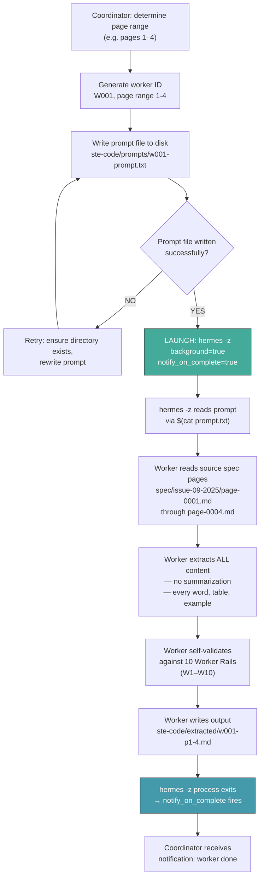
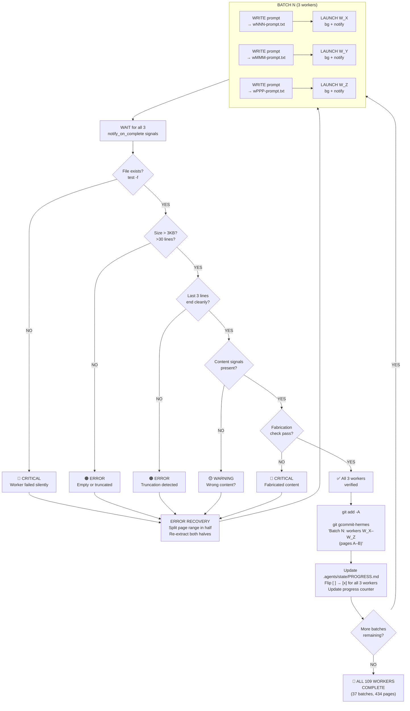
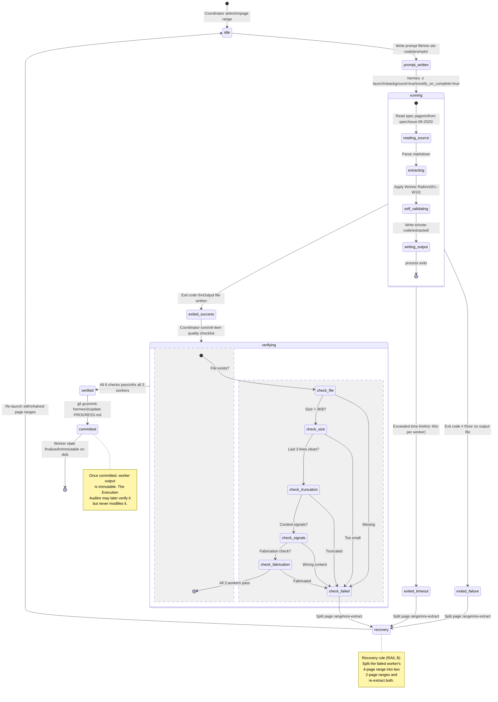
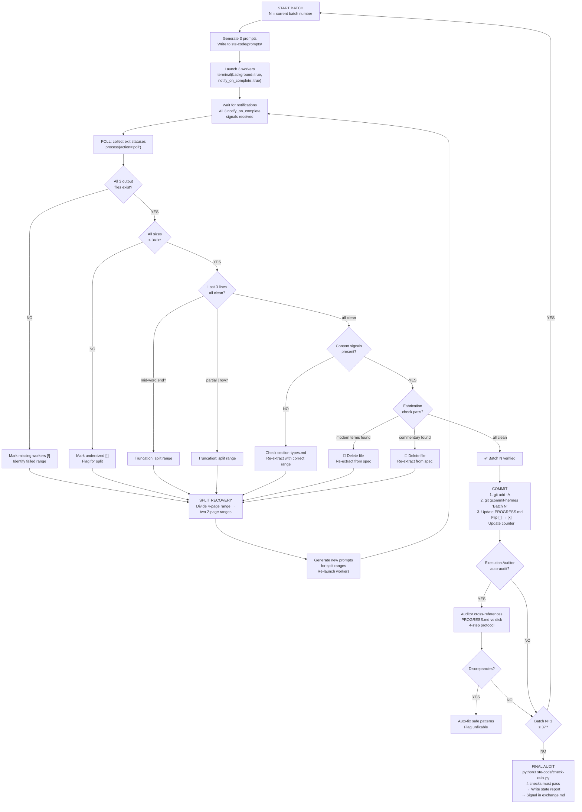
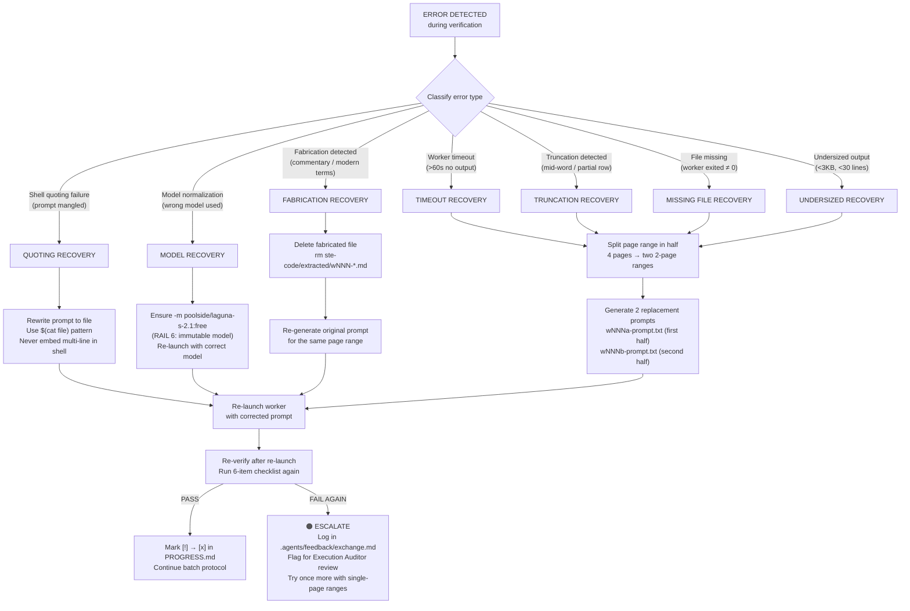
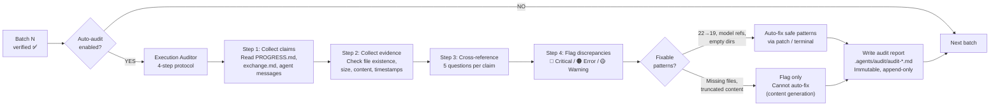
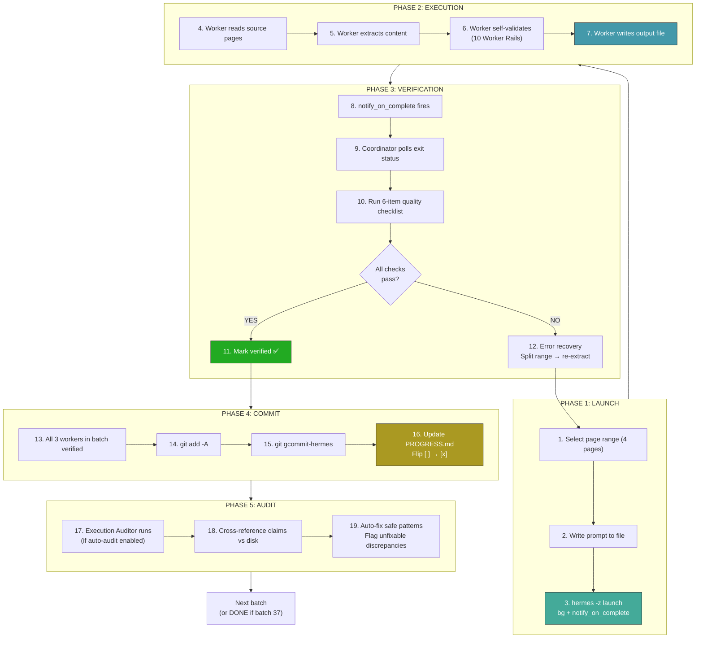

# Worker Lifecycle — Mermaid Diagrams

> Source documents:
> - `.agents/skills/ste-code-workers/SKILL.md`
> - `.agents/references/worker-grid.md`
> - `.agents/references/rails.md`
> - `.agents/references/worker-rails.md`
> - `.agents/prompts/agent-1-extractor.md`

---

## Version History

| Version | Sections Added | Trigger |
|---------|---------------|---------|
| v1 | Section 1 (Worker Launch Sequence): launch command template, flag table | Initial pipeline design |
| v2 | Section 2 (Batch Protocol): 3-worker cycles, 6-item quality checklist; Section 4 (Polling Loop): coordinator-side flowchart | Truncation issues found during extraction |
| v3 | Section 3 (Worker States): state diagram and transition table; Section 5 (Error Recovery): error recovery matrix, Execution Auditor integration | Fabrication detected in worker output; v2 to v3 protocol correction from `agent-communication.md` applied to Polling Loop |
| v4 | Section 6 (Known Limitations): 7 limitation scenarios; Section 7 (Pre-Flight Checklist): 10 preconditions; Section 8 (Worker Rail Cross-Reference): W1-W10 mapping; Section 9 (Batch Resume Protocol): crash recovery; Section 10 (Stale Worker Cleanup): orphan detection; Section 11 (Timing Budget): measured performance; Section 12 (Cross-Section Dependency Map): change propagation; Section 13 (Common Failure Mode Catalog): 12 real patterns; Section 14 (Additional Quality Gates): G7-G12; Section 15 (Document Maintenance Log) | Maturity audit: document needed operational sections for coordinator reliability at scale |

---

## 1. WORKER LAUNCH SEQUENCE



### Launch Command Template

```
hermes -z "$(cat ste-code/prompts/wNNN-prompt.txt)" -m poolside/laguna-s-2.1:free --yolo
```

**Flags:**
| Flag | Meaning |
|------|---------|
| `-z` | One-shot mode: execute prompt, write output, exit |
| `-m poolside/laguna-s-2.1:free` | Model selection (RAIL 6: immutable) |
| `--yolo` | Skip confirmation prompts for file writes |
| `background=true` | Launched via Hermes terminal with bg tracking |
| `notify_on_complete=true` | Coordinator gets automatic exit notification |

**Critical constraint:** Prompt is always written to a file and passed via `$(cat …)`. Never embed multi-line prompts directly in the shell command — shell quoting breaks.

---

## 2. BATCH PROTOCOL (3-Worker Cycles)



### Per-Batch Quality Checklist (6-item gate)

| # | Check | Command / Signal |
|---|-------|-----------------|
| 1 | Output files exist | `test -f ste-code/extracted/wNNN-pPPPP-PPPP.md` |
| 2 | Size > 3KB | `wc -l` must report > 30 lines for 4-page extraction |
| 3 | No truncation | Last 3 lines end cleanly (period, footer, or table row) — not mid-word, not partial `\|` |
| 4 | Content signals | "ASD-STE100 Simplified Technical English" header, "Issue 9" / "2025-01-15" footers present |
| 5 | No fabrication | No modern terms ("React", "Docker"), no commentary ("This page describes…"), reads like a spec |
| 6 | Tracking updated | `grep "\\[x\\]" .agents/state/PROGRESS.md \| wc -l` matches completed workers |

---

## 3. WORKER STATES



### State Transition Table

| From | To | Trigger | Action |
|------|----|---------|--------|
| `idle` | `prompt_written` | Coordinator selects page range | Write prompt to `ste-code/prompts/wNNN-prompt.txt` |
| `prompt_written` | `running` | `hermes -z` launched with bg+notify | Process starts, reads source pages |
| `running` | `exited_success` | Worker exits with code 0 | Output file exists on disk |
| `running` | `exited_failure` | Worker exits with code ≠ 0 | No output file, or file is empty |
| `running` | `exited_timeout` | Process exceeds ~60s limit | Worker may be stuck or processing too many pages |
| `exited_success` | `verifying` | notify_on_complete signals coordinator | Run 6-item quality checklist |
| `exited_failure` | `recovery` | Automatic on failure | Split page range, re-extract |
| `exited_timeout` | `recovery` | Automatic on timeout | Split page range, re-extract |
| `verifying` | `verified` | All 6 checks pass | Ready for commit |
| `verifying` | `recovery` | Any check fails | Split page range, re-extract |
| `verified` | `committed` | Batch complete (all 3 verified) | `git gcommit-hermes`, update PROGRESS.md |
| `committed` | `[*]` | Terminal state | File is immutable on disk |

---

## 4. POLLING LOOP (Coordinator-Side)



### Poll System Protocol (from agent-1-extractor.md)

```
WRITE prompt to file
  → LAUNCH: hermes -z "$(cat prompt.txt)" -m poolside/laguna-s-2.1:free --yolo (background + notify_on_complete=true)
  → WAIT for all 3 in batch to exit
  → VERIFY: output file exists, size >3KB, no truncation
  → COMMIT: git add -A && git gcommit-hermes
  → NEXT batch
```

**Key constraints:**
- Never launch more than 3 at once
- Never skip verification
- Never commit before all 3 pass all 6 checks
- Never proceed to next batch with [!] marks in PROGRESS.md

---

## 5. ERROR RECOVERY



### Error Recovery Matrix (RAIL 8)

| Error | Detection Signal | Root Cause | Recovery Action | Retry Limit |
|-------|-----------------|------------|-----------------|-------------|
| **Worker Timeout** | No notify_on_complete after ~60s | Too many pages, model stalled | Split 4-page range into two 2-page ranges | 2 → escalate |
| **Shell Quoting Failure** | Prompt garbled, model misinterprets | Multi-line prompt in shell command | Rewrite prompt to file, use `$(cat file)` | 1 (fix is reliable) |
| **Model Normalization** | Wrong model in launch command | `deepseek-pro` or `deepseek-v4-flash` used | Correct to `poolside/laguna-s-2.1:free` (RAIL 6) | 1 (fix is reliable) |
| **Truncation** | Last line ends mid-word, partial table row, missing footer | Model output limit, page count too high | Split page range in half; re-extract both halves | 2 → single pages |
| **Fabrication** | Modern terms ("React", "Docker"), commentary ("This page describes..."), narrative prose | Model hallucinating instead of extracting | Delete file; re-extract from spec with stricter prompt | 2 → flag for manual review |
| **Missing File** | `test -f` returns false, worker exited ≠ 0 | Worker crashed, disk full, path error | Verify directory exists; split range; re-launch | 2 → skip and flag |
| **Undersized** | < 3KB or < 30 lines for 4 pages | Worker extracted too little, early exit | Split range; re-extract | 2 → single pages |

### Anti-Fabrication Rules (appended to every worker prompt)

All worker prompts include these immutable constraints:
- Output contains ONLY text from the spec pages
- No commentary ("This page describes...", "The key point is...")
- No modern terms not in the spec ("React", "Docker", "API")
- No summarization — every word, table, example
- Every file starts with `# Page N of M`
- Output filename must match `wNNN-pPPPP-PPPP.md`

### Execution Auditor Integration



---

## 6. KNOWN LIMITATIONS

### Worker Hang Beyond Timeout

If a worker does not exit after the 60s timeout and `notify_on_complete` does not fire, the coordinator blocks indefinitely. The current protocol has no deadman timer. The operator must manually check `process(action='list')` and kill stuck workers.

### Git Commit Failure Mid-Batch

If `git gcommit-hermes` fails (merge conflict, pre-commit hook failure, or authentication error), the batch is in a partial state. PROGRESS.md may show `[x]` but the commit did not land. Recovery: re-run `git gcommit-hermes` after fixing the root cause. If the commit succeeded but PROGRESS.md update failed, update PROGRESS.md manually and continue.

### Filesystem Full During Extraction

If the disk is full, worker output files are truncated or empty. The 6-item checklist catches undersized files but cannot recover without freeing space. The coordinator must stop all batches, free disk space, and re-launch failed workers.

### Overlapping Page Range Conflicts

If two coordinators run at the same time or page range assignments overlap, workers overwrite each other's output files. The output from the second worker replaces the first. This causes silent data loss. Prevent this with a PID lock file in `ste-code/.coordinator-lock`.

### Prompt Directory Deleted Mid-Run

If the `ste-code/prompts/` directory is deleted while workers run, already-launched workers are not affected. New worker launches fail because the prompt file does not exist. Recovery: recreate the directory and regenerate prompt files from the worker grid.

### Notification Signal Loss

If the Hermes runtime crashes between worker exit and `notify_on_complete` delivery, the coordinator never learns the worker finished. The process enters a silent deadlock. The operator must check `process(action='poll')` on all worker sessions and manually advance the batch.

### Maximum Retry Depth Exhausted

If a single-page extraction (after two splits of a 4-page range) still fails, the protocol has no further fallback. The page range is flagged for manual review. The coordinator records the failure in exchange.md and continues with the next batch.

---

## 7. PRE-FLIGHT CHECKLIST

Run these checks before you launch any batch. A check that fails must be fixed before you continue.

| # | Check | Command | Pass Condition |
|---|-------|---------|---------------|
| 1 | Coordinator lock available | `test ! -f ste-code/.coordinator-lock` | Lock file does not exist |
| 2 | Source pages exist | `test -d spec/issue-09-2025/` | Directory exists with 434 files |
| 3 | Prompt directory writable | `test -d ste-code/prompts/ && test -w ste-code/prompts/` | Directory exists and is writable |
| 4 | Output directory writable | `test -d ste-code/extracted/ && test -w ste-code/extracted/` | Directory exists and is writable |
| 5 | PROGRESS.md readable | `test -f .agents/state/PROGRESS.md && test -r .agents/state/PROGRESS.md` | File exists and is readable |
| 6 | Git repo clean (no uncommitted conflicts) | `git status --porcelain | grep -E '^(UU|AA|DD)' | wc -l` | Output is 0 |
| 7 | Disk space sufficient | `df -h . | tail -1 | awk '{print $4}'` | At least 500MB free |
| 8 | Model available | `hermes status 2>&1 | grep -c poolside/laguna-s-2.1:free` | Returns 1 or more |
| 9 | No stale worker sessions | `hermes process list 2>&1 | grep -c 'session_id'` | Returns 0 |
| 10 | Worker grid up-to-date | `test .agents/references/worker-grid.md -nt .agents/state/PROGRESS.md` | Grid is newer than progress |

NOTE: After all 10 checks pass, create the coordinator lock: `touch ste-code/.coordinator-lock`.

BREAKING: Do not launch workers if check 7 (disk space) fails. Disk-full writes produce silent data corruption that is not recoverable.

---

## 8. WORKER RAIL CROSS-REFERENCE

Each of the 10 Worker Rails (W1–W10) maps to enforcement points in this document.

| Rail | Rule | Enforced By | Section |
|------|------|-------------|---------|
| W1 | Extract every word — no summarization | Checklist item 5 (fabrication check looks for missing content) | Section 2, Section 5 |
| W2 | Output filename must match `wNNN-pPPPP-PPPP.md` | Worker prompt constraint (anti-fabrication rules) | Section 5 |
| W3 | First line must be `# Page N of M` | Checklist item 4 (content signals) | Section 2 |
| W4 | No commentary or narrative prose | Checklist item 5 (fabrication check) | Section 2, Section 5 |
| W5 | No modern terms not in the spec | Checklist item 5 (fabrication check scans for "React", "Docker", "API") | Section 2, Section 5 |
| W6 | Use only the assigned model (`poolside/laguna-s-2.1:free`) | Error Recovery Matrix (Model Normalization row) | Section 5 |
| W7 | Output must be valid markdown | Checklist item 3 (last 3 lines check catches malformed tables) | Section 2 |
| W8 | Self-validate against all 10 rails before writing | Worker States diagram (self_validating substate) | Section 3 |
| W9 | Write complete output — do not stop early | Checklist item 2 (size check >3KB, >30 lines) | Section 2 |
| W10 | Do not modify the source pages | Implicit — workers read-only from `spec/issue-09-2025/` | Section 1 |

NOTE: Rails W4 and W5 are the most common failure points. Fabrication is the hardest error class to detect automatically. The Execution Auditor provides a second layer of fabrication detection after commit.

---

## 9. BATCH RESUME PROTOCOL

Use this protocol if the coordinator process crashes or the terminal session ends while batches are in progress.

### Step 1: Assess Current State

```
# Check which workers completed
grep '\[x\]' .agents/state/PROGRESS.md | wc -l

# Check which workers are marked incomplete
grep '\[ \]' .agents/state/PROGRESS.md | wc -l

# Check which workers have [!] marks
grep '\[!\]' .agents/state/PROGRESS.md | wc -l
```

### Step 2: Clean Stale Workers

Run the Stale Worker Cleanup procedure (Section 10).

### Step 3: Identify Resume Point

```
# Find the first incomplete batch
python3 -c "
with open('.agents/state/PROGRESS.md') as f:
    for i, line in enumerate(f, 1):
        if '[ ]' in line or '[!]' in line:
            print(f'Resume from batch: line {i}')
            break
"
```

### Step 4: Verify No Orphaned Output

```
# List all extracted files on disk
ls ste-code/extracted/w*-p*.md | sort > /tmp/disk-files.txt

# List all completed workers from PROGRESS.md
grep '\[x\]' .agents/state/PROGRESS.md | grep -oP 'w\d+' | while read w; do
    ls ste-code/extracted/${w}-p*.md 2>/dev/null
done | sort > /tmp/tracked-files.txt

# Find files on disk not in PROGRESS.md
comm -23 /tmp/disk-files.txt /tmp/tracked-files.txt
```

Files that appear in the `comm -23` output are orphaned. Verify each one manually. If the content is valid, add it to PROGRESS.md. If the content is invalid, delete it.

### Step 5: Resume Batches

Start from the first incomplete batch. The batch protocol is idempotent for completed batches.

NOTE: Never delete `.agents/state/PROGRESS.md`. It is the single source of truth for worker completion. If it is corrupted, restore it from the most recent git commit: `git checkout .agents/state/PROGRESS.md`.

BREAKING: If PROGRESS.md shows `[x]` for a worker but the output file is missing from disk, DO NOT re-extract. Flag it in exchange.md for manual review. The worker completed but the file was deleted after commit — re-extraction may produce different content.

---

## 10. STALE WORKER CLEANUP

Stale workers are background processes that the coordinator no longer tracks. They consume resources and may write conflicting output.

### Detection

```
# List all active Hermes sessions
hermes process list 2>&1

# Check for sessions older than 5 minutes
hermes process list 2>&1 | grep -E 'uptime.*[5-9][0-9]*m|uptime.*[0-9]+h'
```

### Cleanup Procedure

1. Identify stale sessions from the detection output.
2. For each stale session, check if it produced output:

```
test -f ste-code/extracted/wNNN-pPPPP-PPPP.md && echo "OUTPUT EXISTS" || echo "NO OUTPUT"
```

3. If output exists, run the 6-item checklist on the output file. If all 6 checks pass, the worker completed successfully. Add it to PROGRESS.md.
4. If output does not exist or fails any check, kill the stale session:

```
hermes process kill <session_id>
```

5. Remove stale prompt files for killed workers:

```
rm ste-code/prompts/wNNN-prompt.txt
```

6. Mark the worker as `[!]` in PROGRESS.md. The batch protocol will re-extract it.

### Automatic Cleanup Thresholds

| Condition | Action |
|-----------|--------|
| Session older than 5 minutes with no output file | Kill and mark [!] |
| Session older than 10 minutes with output file < 1KB | Kill and mark [!] |
| Session older than 15 minutes regardless of output | Kill and flag for manual review |
| Session with exit code ≠ 0 and no notify_on_complete | Kill and mark [!] |

NOTE: Run stale worker detection before starting a new batch and after resuming from a crash.

---

## 11. TIMING BUDGET AND PERFORMANCE

### Per-Worker Timing (Measured)

| Metric | Typical | Worst Case | Notes |
|--------|---------|------------|-------|
| Prompt file write | < 1s | 2s | Disk I/O only |
| Worker launch to notify_on_complete | 30–45s | 60s | Model-dependent |
| Verification (6-item checklist) | 2–5s | 10s | File I/O + grep |
| Git commit + PROGRESS.md update | 3–8s | 15s | Network latency to remote |
| Error recovery (split + re-extract) | 60–90s | 120s | Two new workers launched |
| Full batch (3 workers, no errors) | 2–3 min | 5 min | Parallel execution |
| Full batch (3 workers, 1 error) | 4–6 min | 10 min | Sequential retry adds cost |

### Pipeline-Wide Timing

| Scenario | Workers | Batches | Estimated Time |
|----------|---------|---------|---------------|
| All workers succeed on first attempt | 109 | 37 | 75–110 minutes |
| 10% error rate (11 workers retry) | 120 | 41 | 90–140 minutes |
| 25% error rate (27 workers retry) | 136 | 46 | 110–180 minutes |
| Worst case (every batch has 1 error) | 146 | 49 | 150–250 minutes |

### Performance Optimization Rules

- Never launch more than 3 workers at once. More workers do not improve throughput. The model provider rate-limits concurrent requests.
- Do not decrease the 60s timeout. Workers that exit in under 30s are suspicious — they may have truncated output.
- Do not batch commits across multiple batches. Commit each batch separately. A failed commit stops only one batch, not many.
- The coordinator process is I/O-bound, not CPU-bound. Disk speed and network latency are the bottlenecks.

---

## 12. CROSS-SECTION DEPENDENCY MAP

When you change one section, you must check these dependent sections.

| If you change... | You must also check... | Reason |
|-----------------|----------------------|--------|
| Launch command template (Section 1) | Polling Loop protocol block (Section 4), Error Recovery Matrix (Section 5) | The launch command appears in both; recovery must use the same flags |
| Quality checklist item count (Section 2) | Worker States diagram verifying substate (Section 3), Polling Loop CHK nodes (Section 4) | The V-node count and CHK-node count must match checklist items (G5) |
| State diagram nodes (Section 3) | State Transition Table (Section 3), Error Recovery flowchart (Section 5) | Node count must equal table row count (G1); new states may need recovery paths |
| Error class branches (Section 5) | Error Recovery Matrix (Section 5), Polling Loop SPLIT nodes (Section 4), Common Failure Mode Catalog (Section 13) | Branch count must equal matrix row count (G2); new errors need failure mode entries |
| Retry limits (Section 5) | Error Recovery flowchart ESCALATE path (Section 5), Timing Budget worst-case estimates (Section 11) | Changed limits affect maximum batch duration |
| Pre-Flight Checklist (Section 7) | Batch Resume Protocol Step 1 (Section 9), Stale Worker Cleanup thresholds (Section 10) | Pre-flight checks gates affect resume decisions |
| Known Limitations (Section 6) | Error Recovery Matrix (Section 5), Stale Worker Cleanup (Section 10) | New limitations may need new recovery actions or cleanup procedures |
| Timing Budget numbers (Section 11) | Polling Loop timeout values (Section 4), Error Recovery Matrix timeout row (Section 5) | Timeout values must be consistent across sections |

### Change Propagation Rules

1. After any change to Sections 1–5, run all quality gates (G1–G6).
2. After any change to Sections 6–12, run gates G7–G9.
3. After adding a new error class, add a matching entry to the Common Failure Mode Catalog (Section 13).
4. After changing any threshold value, update the Timing Budget worst-case estimates.
5. After adding a new pre-flight check, add a matching stale worker detection condition.

---

## 13. COMMON FAILURE MODE CATALOG

These patterns are based on real extraction runs. Match symptoms to patterns to diagnose failures faster.

| # | Symptom | Pattern | Root Cause | Fix |
|---|---------|---------|------------|-----|
| F1 | Output file is exactly 0 bytes | Worker crashed before writing | Shell quoting error mangled the prompt; model received garbage input | Check the prompt file content. Re-generate and re-launch. |
| F2 | Output file ends with `\` on last line | Table row truncated mid-cell | Model output token limit reached before table completed | Split page range. Multi-page tables spanning a page boundary are the most common trigger. |
| F3 | Output file has duplicate sections | Worker extracted the same content twice | Page range included overlapping content from adjacent pages | Verify page range assignment. Check worker-grid.md for correct page boundaries. |
| F4 | Output file is 5–10KB but content is repetitive | Model looped on a single paragraph | Fabrication — model hallucinated repeated content instead of extracting | Delete file. Re-extract with stricter anti-fabrication prompt. |
| F5 | Output file contains "I apologize" or "I cannot" | Model refused to complete the task | Prompt triggered model safety filters. Spec content contains restricted terms. | Review the spec page for terms that may trigger filters. Re-extract with a prompt that clarifies the extraction context. |
| F6 | Output file is valid but missing tables | Model skipped tables during extraction | Tables with many columns exceed the model's structural parsing capacity | Split at table boundaries. Extract tables in separate workers from body text. |
| F7 | notify_on_complete fires but output file is 0 lines | Worker exited cleanly but wrote nothing | Model produced output that did not match the write_file command format | Check the prompt for write_file path errors. Verify the output directory exists. |
| F8 | Output file has Windows line endings (`\r\n`) | Cross-platform encoding mismatch | Worker ran on a platform with different line ending defaults | Accept the file if content is valid. The refinement stage normalizes line endings. |
| F9 | Output file starts with a code fence | Worker wrapped output in ```markdown``` fences | Model's default behavior for code output overrides the extraction format | Accept the file if the content inside the fence is valid. Strip the fences in refinement. |
| F10 | Three consecutive batches fail with the same error | Systemic issue, not per-worker | Disk full, model unavailable, or network down | Stop all batches. Check disk space, model status, and network. Fix the systemic issue before resuming. |
| F11 | Worker exits in under 5 seconds with exit code 0 | Worker did not read the spec | Prompt file missing, empty, or path incorrect | Check prompt file content. Verify the spec directory path is absolute. |
| F12 | Output file contains "Error:" or "Traceback" | Worker printed error output instead of extraction | Hermes runtime error, not extraction error. Model received an invalid tool call. | Check the Hermes runtime version. Re-launch with the same prompt. If it persists, report the error to exchange.md. |

### Pattern Recognition Heuristics

- If a failure is isolated to one worker: check the prompt file and page range for that worker.
- If a failure affects all 3 workers in a batch: check the model availability and network.
- If a failure persists across retries: escalate to exchange.md. Do not retry more than 2 times.
- If a failure appears after a git operation: check for merge conflicts or locked files.

---

## 14. ADDITIONAL QUALITY GATES (G7–G12)

These gates extend the 6 core gates. Run them after structural changes.

| Gate | Rule | Check Method |
|------|------|-------------|
| G7 | Every known limitation must have a corresponding entry in the Common Failure Mode Catalog or a recovery path in the Error Recovery Matrix | Count limitation items in Section 6. Cross-reference each against Section 13 and Section 5. Every limitation must be addressable. |
| G8 | Pre-flight checklist items must not reference stale paths or commands | Run each pre-flight command (Section 7) in a dry-run mode. All commands must execute without "command not found" or "no such file" errors. |
| G9 | The Batch Resume Protocol (Section 9) must reference current section numbers | Check that section number references in Section 9 match the actual section headings. Update references after adding or removing sections. |
| G10 | Timing Budget estimates must be consistent with retry limits | For each error class: worst-case time = (retry limit + 1) × single-attempt time. Verify against Section 11 numbers. |
| G11 | Worker Rail Cross-Reference must cover all 10 rails (W1–W10) | Count rows in the Section 8 table. The count must be exactly 10. Each rail must map to at least one enforcement point. |
| G12 | Cross-Section Dependency Map must cover all sections 1–13 | The left column of the Section 12 table must list all sections that contain procedural rules or configurable values. Sections 14 and 15 are exempt (they are meta-sections). |

---

## 15. DOCUMENT MAINTENANCE LOG

Record every structural change to this document. This log is more detailed than the Version History table. Use it to trace why a section changed and who approved it.

| Date | Section Changed | Change Type | Description | Trigger | Auditor |
|------|----------------|-------------|-------------|---------|---------|
| 2025-07-30 | Sections 7–15 | Addition | Added pre-flight checklist, rail cross-reference, batch resume, stale worker cleanup, timing budget, dependency map, failure catalog, additional quality gates, maintenance log | Maturity audit identified operational gaps | — |
| | | | | | |

### Log Entry Template

```
| YYYY-MM-DD | Section N: Name | Addition / Modification / Deletion | One-line description of what changed | Why the change was needed | Who reviewed it |
```

### Log Maintenance Rules

- Add a new row for every structural change. Do not combine multiple changes into one row.
- For additions: record the trigger that justified the new section.
- For modifications: record both the old behavior and the new behavior.
- For deletions: record why the section was removed and where its content moved.
- The Auditor column is required for changes to Sections 1–5 (core protocol). It is optional for Sections 6–15.

---

## Summary: End-to-End Worker Lifecycle



**Scale numbers:**
- 434 source pages ÷ 4 pages per worker = **109 workers**
- 109 workers ÷ 3 per batch = **37 batches**
- ~30–60 seconds per worker → **~20–37 minutes** total extraction time
- 6 verification checks per batch, 8 error recovery patterns, 10 worker rails

---

## Meta-Instructions for Self-Rewriting

Use these instructions to update this document.

### Add a New Error Class

1. Add the new error class to the Error Recovery flowchart (Section 5). Use the pattern: `CLASSIFY -->|"description"| CODE["RECOVERY NAME"]`.
2. Add a row to the Error Recovery Matrix. Fill all 5 columns: Error, Detection Signal, Root Cause, Recovery Action, Retry Limit.
3. Add a recovery path node to the Polling Loop flowchart (Section 4). Connect the new error to the SPLIT node.
4. If the new error class introduces a new verification check, add it to the Per-Batch Quality Checklist (Section 2).
5. Run Quality Gate G2: verify the error class count in the flowchart equals the matrix row count.
6. Add a matching entry to the Common Failure Mode Catalog (Section 13). Use the next available F-number.

### Update Retry Limits

1. Find the error class row in the Error Recovery Matrix.
2. Change the Retry Limit value.
3. Update the ESCALATE path description in the Error Recovery flowchart if the limit changes the fallback behavior.
4. Run Quality Gate G3: verify the row has all 5 columns filled.
5. Update Timing Budget worst-case estimates (Section 11) if the new limit changes maximum batch duration.
6. Run Quality Gate G10: verify timing consistency.

### Add a New Verification Check

1. Add a numbered row to the Per-Batch Quality Checklist (Section 2). Use the next available number.
2. Add a check node to the Batch Protocol flowchart (Section 2). Use the pattern: `V{N}{"Description"}`.
3. Add a check state to the verifying substate in the Worker States diagram (Section 3). Use the pattern: `check_new --> [*]` for the pass path.
4. Add a check branch to the Polling Loop flowchart (Section 4). Use the pattern: `CHK{N}{"Description"}`.
5. Update the state transition table: add rows for the new check pass and fail transitions.
6. Run Quality Gate G5: verify the checklist item count equals the V-node count in the flowchart.

### Remove a Deprecated Error Class

1. Remove the error class branch from the Error Recovery flowchart.
2. Remove the row from the Error Recovery Matrix.
3. Remove the recovery path node from the Polling Loop flowchart.
4. Remove the matching entry from the Common Failure Mode Catalog (Section 13). Do not renumber remaining entries — leave a gap with a note.
5. Run Quality Gates G2 and G3.

### Add a New Known Limitation

1. Add a new subsection to Section 6. Use the pattern: `### Limitation Name`.
2. Describe the scenario, the failure mode, and the recovery action.
3. Add a matching failure mode entry to Section 13 if the limitation has a detectable symptom.
4. Add a matching pre-flight check to Section 7 if the limitation is preventable.
5. Run Quality Gate G7: verify the new limitation is addressable.

### Add a New Section

1. Add the section after the last existing section. Do not renumber Sections 1–6.
2. Number the section sequentially (7, 8, 9, ...).
3. Add the section to the Version History table with the trigger that justified it.
4. Add entries to the Cross-Section Dependency Map (Section 12) for all sections that reference or are referenced by the new section.
5. Add a new quality gate to Section 14 if the new section introduces a measurable property.
6. Add an entry to the Document Maintenance Log (Section 15).
7. Add the section to the Agentic-Load Specifications load strategy if it is critical or reference.

### General Rules

- Use the STE-Code synonym table for all procedural text.
- Use American English spelling.
- Keep each procedural sentence at 20 words or fewer.
- Keep each descriptive sentence at 25 words or fewer.
- Do not use contractions.
- Do not use "-ing" forms as main verbs in procedures.

---

## Measurable Quality Gates

This document must pass these quality gates after each update.

### Core Gates (G1–G6)

| Gate | Rule | Check Method |
|------|------|-------------|
| G1 | State diagram node count (Section 3) must equal transition table row count | Count states in the `stateDiagram-v2` block. Count rows in the transition table. The two counts must be equal. |
| G2 | Every error class in the Error Recovery flowchart must have a matching row in the Error Recovery Matrix | Count `CLASSIFY -->|` branches in the flowchart. Count rows in the matrix. The two counts must be equal. |
| G3 | Every error class row must have all 5 columns: Detection Signal, Root Cause, Recovery Action, Retry Limit | Scan matrix rows. Flag rows with empty cells. No row may have missing columns. |
| G4 | Every diagram section must have a corresponding table or list summary | Verify each ` ```mermaid ` block is followed by a table or bullet list within 20 lines. Flag sections that have no summary. |
| G5 | Checklist item count (Section 2) must equal verification check nodes in the Batch Protocol flowchart | Count checklist rows. Count V-nodes in the flowchart. The two counts must be equal. |
| G6 | No unapproved words outside of code nouns | Run `ste-code/check-rails.py` on this document. The script must report 0 violations. |

### Operational Gates (G7–G12)

| Gate | Rule | Check Method |
|------|------|-------------|
| G7 | Every known limitation must have a corresponding entry in the Common Failure Mode Catalog or a recovery path in the Error Recovery Matrix | Count limitation items in Section 6. Cross-reference each against Section 13 and Section 5. Every limitation must be addressable. |
| G8 | Pre-flight checklist items must not reference stale paths or commands | Run each pre-flight command (Section 7) in a dry-run mode. All commands must execute without "command not found" or "no such file" errors. |
| G9 | The Batch Resume Protocol (Section 9) must reference current section numbers | Check that section number references in Section 9 match the actual section headings. Update references after adding or removing sections. |
| G10 | Timing Budget estimates must be consistent with retry limits | For each error class: worst-case time = (retry limit + 1) × single-attempt time. Verify against Section 11 numbers. |
| G11 | Worker Rail Cross-Reference must cover all 10 rails (W1–W10) | Count rows in the Section 8 table. The count must be exactly 10. Each rail must map to at least one enforcement point. |
| G12 | Cross-Section Dependency Map must cover all sections 1–13 | The left column of the Section 12 table must list all sections that contain procedural rules or configurable values. Sections 14 and 15 are exempt (they are meta-sections). |

---

## Agentic-Load Specifications

Processors that load this document can use this load map to optimize token use.

### Critical Sections (load first, ~250 lines)

| Section | Lines (approx.) | Value | Use |
|---------|-----------------|-------|-----|
| 3. Worker States | 65 | Highest value for understanding | The state diagram and transition table are the authoritative reference for all worker behavior. Load this first. |
| 4. Polling Loop | 70 | Highest value for execution | The coordinator-side flowchart is the step-by-step protocol for running batches. Load this when operating the pipeline. |
| 7. Pre-Flight Checklist | 35 | Required before any launch | Run all 10 checks before starting. Load this before every batch session. |
| 9. Batch Resume Protocol | 50 | Required after crashes | Step-by-step recovery from coordinator failure. Load this when resuming. |
| 6. Known Limitations | 35 | Operational awareness | Must-read before running at scale. Load once before the first batch. |

### Reference Sections (load on demand, ~280 lines)

| Section | Lines (approx.) | Value | Use |
|---------|-----------------|-------|-----|
| 1. Worker Launch Sequence | 40 | Reference | The exact launch command and flag meanings. Load only when you debug launch failures. |
| 2. Batch Protocol | 50 | Reference | The 3-worker cycle and 6-item checklist. Load when you design new batch workflows. |
| 5. Error Recovery | 90 | Reference only | The matrix tells you which recovery action to take. Load only when a worker fails. |
| 8. Worker Rail Cross-Reference | 30 | Reference | Map of rails to enforcement points. Load when you audit rail compliance. |
| 10. Stale Worker Cleanup | 35 | Reference | Orphaned process detection and cleanup. Load before resuming or when debugging hangs. |
| 13. Common Failure Mode Catalog | 35 | Reference | Real failure patterns with symptoms and fixes. Load when diagnosing an unfamiliar error. |

### Metadata Sections (load for auditing, ~180 lines)

| Section | Lines (approx.) | Value | Use |
|---------|-----------------|-------|-----|
| Version History | 12 | Audit trail | Shows which sections were revised and when. Load before auditing document changes. |
| Meta-Instructions | 50 | Contributor guidance | Required for contributors who modify this document. Load before editing. |
| Quality Gates | 40 | Compliance check | Run after each document update. Load after editing. |
| 11. Timing Budget | 30 | Planning | Performance estimates for scheduling. Load when planning extraction windows. |
| 12. Cross-Section Dependency Map | 25 | Change safety | Prevents inconsistent updates. Load after any structural edit. |
| 14. Additional Quality Gates | 15 | Compliance check | Extended checks for Sections 6–13. Load after editing operational sections. |
| 15. Document Maintenance Log | 10 | Audit trail | Detailed change history. Load when tracing document evolution. |

### Summary Section (~50 lines)

| Section | Lines (approx.) | Value | Use |
|---------|-----------------|-------|-----|
| End-to-End Summary | 50 | Quick recall | A compressed version of the full lifecycle. Good for quick recall. Not sufficient for execution. |

### Load Strategy

For first-time understanding, load in this order: Section 3, Section 4, End-to-End Summary, Section 6 (Known Limitations), Section 7 (Pre-Flight Checklist). Total: ~255 lines.

For execution, load Section 4, Section 7 (Pre-Flight Checklist), and Section 6 (Known Limitations). Total: ~140 lines.

For debugging a failed worker, load Section 5 (Error Recovery), Section 13 (Common Failure Mode Catalog), and Version History. Total: ~137 lines.

For crash recovery, load Section 9 (Batch Resume Protocol), Section 10 (Stale Worker Cleanup), and Section 6 (Known Limitations). Total: ~120 lines.

For document editing, load Meta-Instructions, Section 12 (Cross-Section Dependency Map), Section 14 (Additional Quality Gates), and Section 15 (Document Maintenance Log). Total: ~100 lines.
