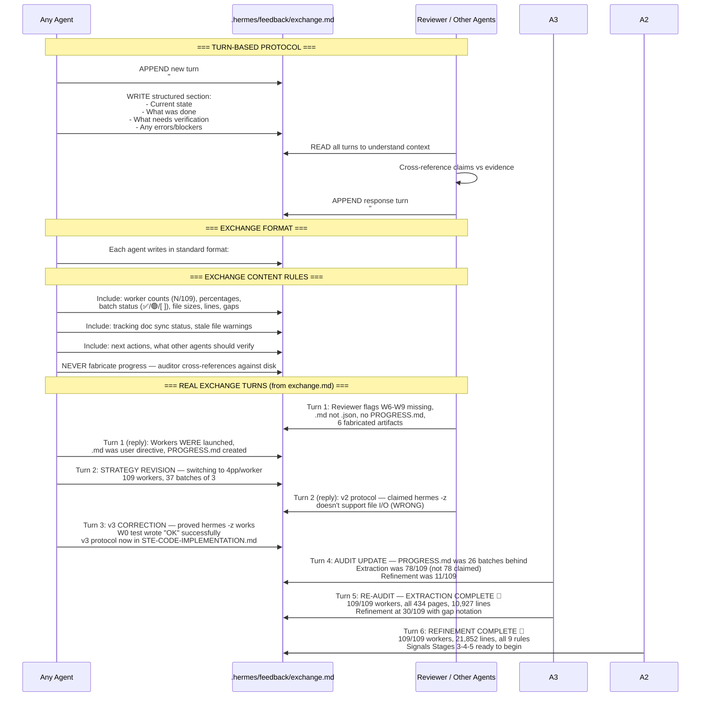
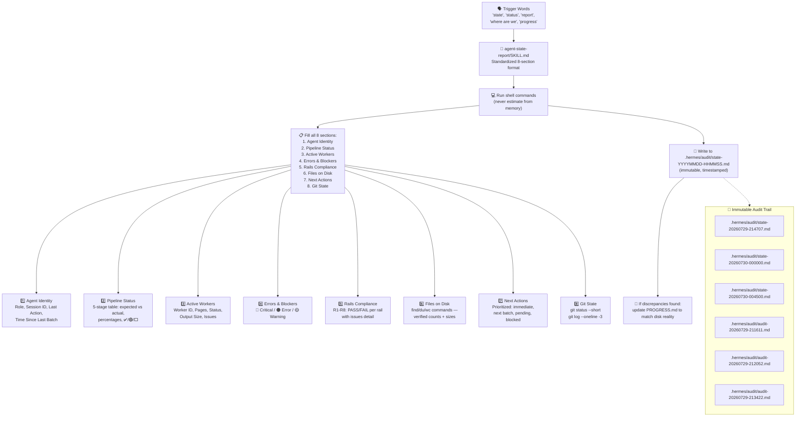
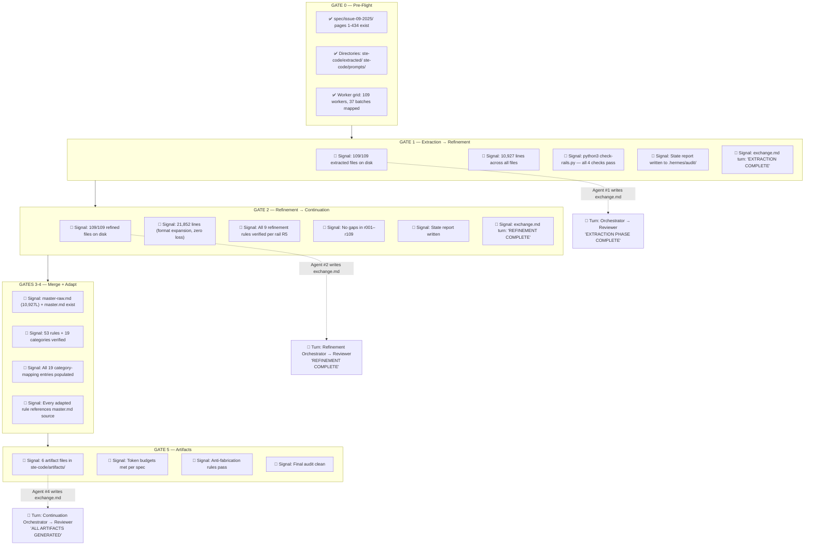
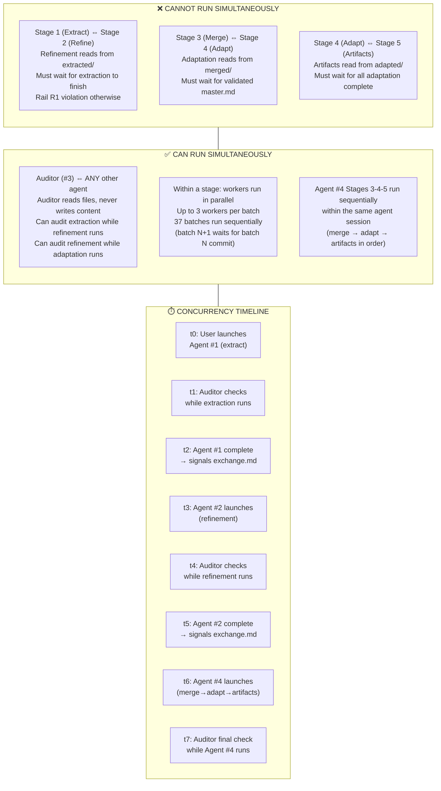
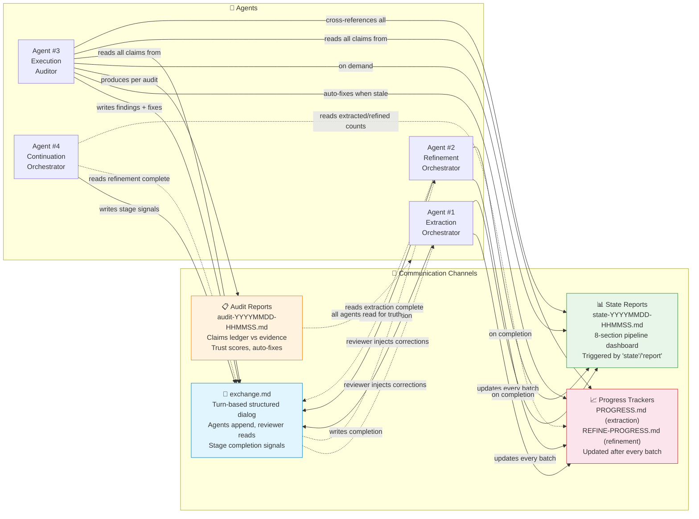

# Agent Communication Architecture — STE-Code Pipeline

> Mermaid diagrams documenting coordination across the 4-agent pipeline.
> All communication flows through `.hermes/feedback/exchange.md` (structured turns)
> and `.hermes/audit/state-*.md` (immutable state snapshots).
> Audit reports live at `.hermes/audit/audit-*.md` (append-only evidence log).

---

## 1. AGENT ROLES — Handoff Chain

```mermaid
sequenceDiagram
    participant U as 👤 User / Reviewer
    participant A1 as 🤖 Agent #1<br/>Extraction Orchestrator
    participant A2 as 🤖 Agent #2<br/>Refinement Orchestrator
    participant A3 as 🔍 Agent #3<br/>Execution Auditor
    participant A4 as 🤖 Agent #4<br/>Continuation Orchestrator
    participant FS as 📁 Filesystem<br/>(ste-code/)
    participant EX as 💬 Exchange<br/>(.hermes/feedback/exchange.md)

    Note over A1,A4: === STAGE 1: EXTRACTION (434 pages, 109 workers) ===

    U->>A1: Launch extraction swarm<br/>"Extract all 434 pages via hermes -z workers"
    A1->>FS: mkdir ste-code/extracted/ ste-code/prompts/
    loop 37 batches × 3 workers
        A1->>A1: Write prompt → ste-code/prompts/wNNN-prompt.txt
        A1->>FS: hermes -z "$(cat prompt.txt)" --yolo (bg+notify)
        A1->>FS: Wait for all 3 workers → verify output >3KB
        A1->>FS: git gcommit-hermes
        A1->>FS: Update PROGRESS.md [x] WNNN
    end
    A1->>FS: python3 check-rails.py (R1-R8, all 4 checks)
    A1->>EX: Signal: "EXTRACTION PHASE COMPLETE. 109/109 ✅"
    A1->>FS: Write state report → .hermes/audit/state-*.md

    Note over A1,A4: === GATE 1: Extraction verified → handoff to Refinement ===

    A3->>FS: Audit: find extracted/*.md | wc -l → 109
    A3->>FS: Audit: grep fabrication patterns, zero-byte check
    A3->>EX: Flag: PROGRESS.md was 31 batches behind (🔴 CRITICAL)
    A3->>FS: Auto-fix: sync PROGRESS.md with disk reality
    EX-->>A2: Read exchange: Stage 1 done, 109 files ready

    Note over A1,A4: === STAGE 2: REFINEMENT (9 rules, zero content loss) ===

    A2->>FS: mkdir ste-code/refined/ .hermes/prompts/refine/
    A2->>FS: Verify 109 extracted files exist
    loop 37 batches × 3 workers
        A2->>A2: Generate prompt with ALL 9 refinement rules (no abbreviations)
        A2->>FS: hermes -z "$(cat .hermes/prompts/refine/rNNN-prompt.txt)" --yolo
        A2->>FS: Wait → verify >3KB, no truncation, 9 rules applied
        A2->>FS: git commit; Update REFINE-PROGRESS.md
    end

    A2->>FS: Verify: 109 refined files, zero content loss (21,852 lines)
    A2->>FS: Write state report → .hermes/audit/state-*.md
    A2->>EX: Signal: "REFINEMENT COMPLETE. 109/109 ✅"

    Note over A1,A4: === GATE 2: Refinement verified → handoff to Continuation ===

    A3->>FS: Audit: find refined/*.md | wc -l → 109
    A3->>FS: Audit: verify r029, r031 gaps recovered
    A3->>EX: Flag: 6 artifact files in root are FABRICATED (🔴)
    EX-->>A4: Read exchange: Stage 2 done, Stages 3-5 ready

    Note over A1,A4: === STAGES 3-5: MERGE → ADAPT → ARTIFACTS ===

    A4->>FS: Stage 3: concat 109 refined → master-raw.md
    A4->>FS: Deduplicate, organize by section → master.md
    A4->>FS: Validate: 53 rules, 19 categories, dict entries
    A4->>EX: Signal: "Stage 3 MERGE complete"

    A4->>FS: Stage 4: Adapt STE rules → code domain
    A4->>FS: 19-category mapping applied; examples replaced
    A4->>FS: Verify: every rule references master.md source
    A4->>EX: Signal: "Stage 4 ADAPTATION complete"

    A4->>FS: Stage 5: Generate 6 artifact files
    A4->>FS: Quality gates: token budgets, cross-references, anti-fabrication
    A4->>EX: Signal: "Stage 5 ARTIFACTS complete. Pipeline done."

    A3->>FS: Final audit: verify all 6 artifacts from refined data
    A3->>EX: Final report: pipeline dashboard 100% ✅
```

---

## 2. FEEDBACK PROTOCOL — Exchange File Turns



---

## 3. STATE REPORTING — agent-state-report Skill



### State Report Format (filled example)

```
# Agent State Report — 2026-07-30 00:45:00

## Agent Identity
- Role: refinement-orchestrator
- Session: Hermes TUI, deepseek-v4-pro
- Last action: Completed all 109 refinement workers
- Time since last batch: <1 minute (pipeline complete)

## Pipeline Status
| Stage | Directory    | Expected | Actual | %    | Status |
|-------|-------------|----------|--------|------|--------|
| 1     | extracted/   | 109      | 109    | 100% | ✅     |
| 2     | refined/     | 109      | 109    | 100% | ✅     |
| 3     | merged/      | 2 files  | 2      | —    | ✅     |
| 4     | adapted/     | TBD      | 0      | —    | ⬜     |
| 5     | artifacts/   | 6        | 0      | —    | ⬜     |

## Errors & Blockers
| Sev | Description                                  | Action Needed            |
|-----|----------------------------------------------|--------------------------|
| 🔴  | 6 artifact files fabricated (pre-extraction) | Regenerate Stages 3→4→5  |
| 🟡  | PROGRESS.md was 31 batches behind            | Fixed; monitor going fwd |

## Rails Compliance
| Rail | Status | Issues Found |
|------|--------|-------------|
| R1   | PASS   | No cross-contamination |
| R2   | PASS   | rNNN-pPPPP-PPPP.md matches wNNN |
| R3   | PASS   | 109/109 verified on disk |
| R4   | PASS   | Zero content loss (10,927→21,852 lines) |
| R5   | PASS   | All 9 rules verified |
| R6   | PASS   | No fabrication detected |
| R7   | PASS   | REFINE-PROGRESS.md tracks all batches |
| R8   | PASS   | Slow workers completed without intervention |

## Files on Disk (verified, not claimed)
extracted/:  109 files, 912K  (10,927 lines)
refined/:    109 files, 916K  (21,852 lines)
merged/:       2 files, 708K  (master-raw.md, master.md)
adapted/:      0 files, 0B    (not started)
artifacts/:    0 files, 0B    (6 fabricated in root)
audit/:        4 files, 32K
prompts-refine/: 109 files, 436K
```

---

## 4. HANDOFF TRIGGERS — Stage Transition Signals



### Handoff Trigger Summary

| Transition | Who Finishes | Signal | Who Picks Up | Verification |
|-----------|-------------|--------|-------------|-------------|
| Gate 0 → 1 | User/Setup | Spec files exist | Agent #1 | `ls spec/issue-09-2025/page-*.md \| wc -l` = 434 |
| Gate 1 → 2 | Agent #1 | exchange.md: "EXTRACTION COMPLETE" | Agent #2 | 109 extracted files, 10,927 lines, check-rails.py passes |
| Gate 2 → 3 | Agent #2 | exchange.md: "REFINEMENT COMPLETE" | Agent #4 | 109 refined files, 21,852 lines, zero gaps, 9 rules verified |
| Gate 3 → 4 | Agent #4 | master.md validated | Agent #4 (same) | 53 rules, 19 categories, ~875 approved dict entries |
| Gate 4 → 5 | Agent #4 | All adapted files written | Agent #4 (same) | Every rule cross-references master.md source |
| Gate 5 → done | Agent #4 | exchange.md: artifacts complete | Reviewer | 6 files, token budgets met, anti-fab pass |

---

## 5. ERROR ESCALATION — Auditor Detection & Agent Response

```mermaid
flowchart TD
    AUDITOR["🔍 Agent #3 — Execution Auditor<br/>Runs continuously or on-demand<br/>'audit now', 'audit and fix'"]

    AUDITOR --> COLLECT["Step 1: Collect Claims<br/>Read PROGRESS.md, exchange.md,<br/>all SKILL.md progress logs"]
    COLLECT --> EVIDENCE["Step 2: Collect Evidence<br/>find/wc/stat on disk files<br/>(evidence-commands.md)")
    EVIDENCE --> XREF["Step 3: Cross-Reference<br/>For each claim:<br/>∃ file? >30 lines? timestamp? content?"]
    XREF --> FLAG["Step 4: Flag Discrepancies"]

    FLAG --> CRIT["🔴 CRITICAL<br/>- File claimed but missing<br/>- File empty/truncated<br/>- PROGRESS.md [x] but no file<br/>- Fabrication patterns detected"]
    FLAG --> ERR["🟠 ERROR<br/>- Wrong page range in file<br/>- Claimed count ≠ disk count<br/>- Stale tracking docs"]
    FLAG --> WARN["🟡 WARNING<br/>- File exists but not tracked<br/>- Retroactive claim timestamp<br/>- Multiple agents disagree"]

    CRIT --> FIXABLE{"Auto-fix<br/>safe?"}
    ERR --> FIXABLE
    WARN --> FIXABLE

    FIXABLE -->|"Yes (safe patterns)"| AUTOFIX["🛠️ Auto-Fix Applied<br/>- 22→19 category correction<br/>- deepseek-pro→v4-pro<br/>- Remove empty dirs<br/>- Delete fabricated artifacts<br/>- Sync PROGRESS.md with disk<br/>- Update stale README counts"]
    FIXABLE -->|"No (content issues)"| ESCALATE["🚨 Escalate to Agents<br/>Write to exchange.md<br/>Flag in audit report"]

    AUTOFIX --> RECHECK["♻️ Re-run audit to verify fix"]
    RECHECK --> REPORT["📋 Produce Audit Report<br/>.hermes/audit/audit-YYYYMMDD-HHMMSS.md<br/>Includes: claims ledger, evidence,<br/>discrepancies, auto-fixes, trust scores"]

    ESCALATE --> REPORT

    REPORT --> AGENTS["📢 All agents read audit report"]

    AGENTS --> A1RESP["Agent #1 Response<br/>- Re-launch failed workers<br/>- Split page range for truncated<br/>- Update PROGRESS.md"]
    AGENTS --> A2RESP["Agent #2 Response<br/>- Re-launch missing rNNN<br/>- Fix formatting violations<br/>- Update REFINE-PROGRESS.md"]
    AGENTS --> A3RESP["Agent #3 Response<br/>- Re-audit after fixes<br/>- Update trust scores<br/>- Verify no regression"]
    AGENTS --> A4RESP["Agent #4 Response<br/>- Replace fabricated artifacts<br/>- Cross-reference every claim<br/>- Re-verify anti-fab rules"]

    subgraph TRUST["📊 Agent Trust Scores (per audit)"]
        direction LR
        TS1["Extraction (execution): 100%<br/>Extraction (tracking): 0%"]
        TS2["Refinement (execution): 100%<br/>Refinement (tracking): 37%"]
        TS3["Auditor: 100%<br/>(3 audits, all verifiable)"]
    end

    REPORT -.-> TRUST

    subgraph FIXABLE_PATTERNS["🛠️ Safe Auto-Fix Patterns"]
        FP1["22→19 category count"]
        FP2["deepseek-pro→v4-pro model"]
        FP3["Empty stage directories"]
        FP4["Fabricated artifact files"]
        FP5["Stale PROGRESS.md counters"]
        FP6["README.md stale counts"]
    end

    subgraph UNFIXABLE["🚨 Escalate (Cannot Auto-Fix)"]
        UF1["Missing worker output → re-launch worker"]
        UF2["Truncated files → split page range, re-extract"]
        UF3["Fabricated content → delete, re-extract from spec"]
        UF4["Tracking lies → agent corrects own tracking"]
    end
```

### Error Escalation Protocol

| Severity | Detection Method | Who Flags | Fix Responsibility | Communication |
|----------|-----------------|-----------|-------------------|---------------|
| 🔴 CRITICAL | File missing, empty, or fabricated | Auditor | Originating agent re-launches worker | exchange.md + audit report |
| 🟠 ERROR | Wrong pages, stale tracking | Auditor | Auditor auto-fixes tracking; agent fixes content | exchange.md + audit report |
| 🟡 WARNING | Untracked work, timestamp issues | Auditor | Auditor auto-fixes safe patterns | Audit report only |
| 🟢 VERIFIED | All claims match disk evidence | Auditor | None needed | Trust score updated |

---

## 6. PARALLEL OPERATION — Concurrency Rules



### Concurrency Matrix

|               | Agent #1<br/>(Extract) | Agent #2<br/>(Refine) | Agent #3<br/>(Auditor) | Agent #4<br/>(Continue) |
|---------------|:---:|:---:|:---:|:---:|
| **Agent #1**  | 3/batch | ❌ | ✅ | ❌ |
| **Agent #2**  | ❌ | 3/batch | ✅ | ❌ |
| **Agent #3**  | ✅ | ✅ | solo | ✅ |
| **Agent #4**  | ❌ | ❌ | ✅ | sequential |

Key:
- ❌ = Cannot overlap — must complete before other starts
- ✅ = Can overlap — safe to run simultaneously
- 3/batch = Stage-internal parallelism (3 workers, sequential batches)
- solo = One auditor instance at a time
- sequential = Stages 3→4→5 run in order within one agent

### Parallelism Rules

1. **Extraction + Refinement: MUTUALLY EXCLUSIVE.** Agent #2 reads `extracted/` output. If Agent #1 is still writing, Agent #2 would read incomplete data. Rail R1 (Stage Isolation) enforced.

2. **Auditor: ALWAYS PARALLEL-SAFE.** Agent #3 only reads files and writes immutable reports to `.hermes/audit/`. It never modifies content files. Auto-fixes only touch tracking docs and safe factual corrections. The auditor can run at any time without affecting active orchestrators.

3. **Within a stage: BATCHED PARALLELISM.** Each orchestrator launches 3 workers simultaneously, waits for all 3 to exit, verifies output, commits, then proceeds to next batch. Never more than 3 concurrent workers.

4. **Agent #4: SEQUENTIAL STAGES.** Merge → Adapt → Artifacts in strict order. Each stage gates on the previous stage's output being fully written and validated.

5. **Reviewer: ASYNCHRONOUS.** The user/reviewer can inspect `exchange.md` and audit reports at any time. The reviewer doesn't block agent progress but can inject corrections via `exchange.md` turns.

---

## Complete Communication Map


