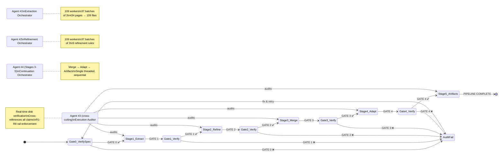
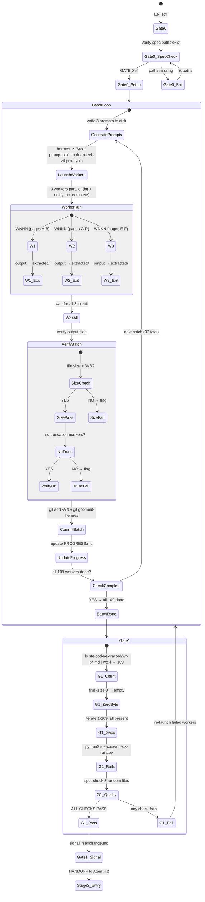
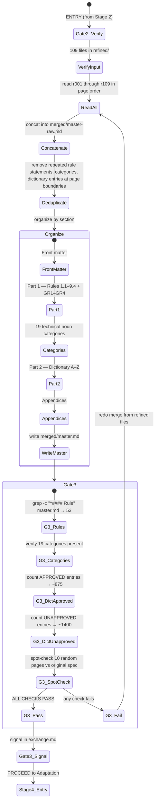
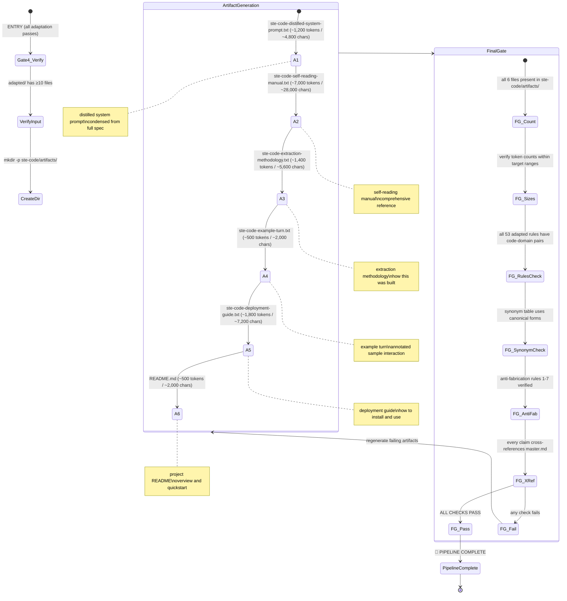
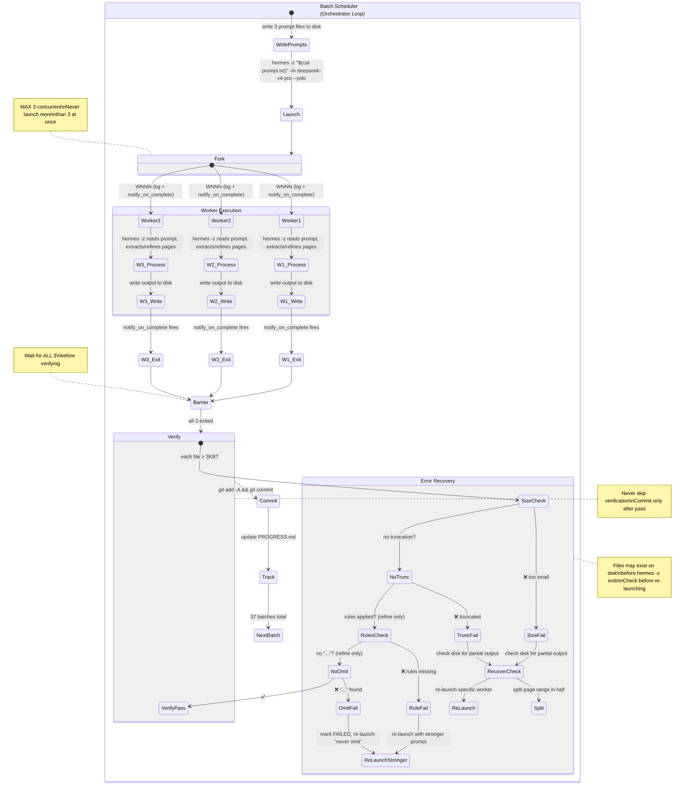
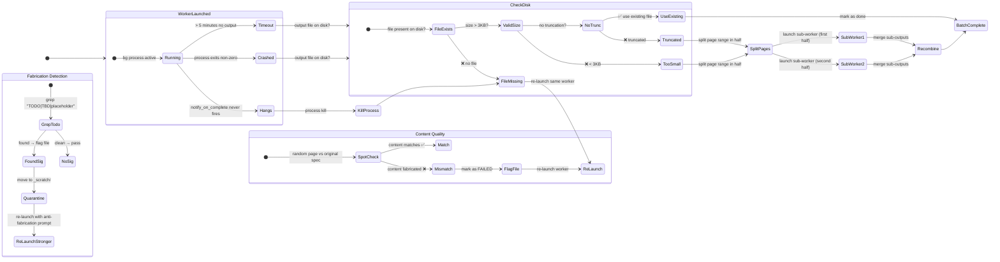

# STE-Code Pipeline — Master State Machine Blueprint

> **Source:** ASD-STE100 Issue 9, January 2025 (434 pages)
> **Agents:** Extraction (#1), Refinement (#2), Auditor (#3), Continuation (#4)
> **Model:** deepseek-v4-pro exclusively
> **Key Facts:** 53 writing rules + 4 GR rules, 19 technical noun categories, ~875 approved + ~1400 unapproved dictionary entries

---

## 1. High-Level Pipeline Flow



---

## 2. Stage 1 — Extraction (Agent #1)



---

## 3. Stage 2 — Refinement (Agent #2)

```mermaid
stateDiagram-v2
    [*] --> Gate1_Verify : ENTRY (from Stage 1)
    Gate1_Verify --> VerifyInput : 109 files in extracted/
    VerifyInput --> Gate1_Precheck : all > 3KB, no gaps

    Gate1_Precheck --> Setup : mkdir -p ste-code/refined .hermes/prompts/refine
    Setup --> BatchLoop

    state BatchLoop {
        [*] --> GeneratePrompts : write 3 full prompts (no abbreviation)
        GeneratePrompts --> LaunchWorkers : hermes -z "$(cat .hermes/prompts/refine/rNNN-prompt.txt)" -m deepseek-v4-pro --yolo
        LaunchWorkers --> WorkerRun : 3 workers parallel (bg + notify_on_complete)
        WorkerRun --> WaitAll : wait for all 3 to exit
        WaitAll --> VerifyBatch : verify output files
        VerifyBatch --> CommitBatch : git add && git commit "Batch N"
        CommitBatch --> UpdateProgress : update REFINE-PROGRESS.md + exchange.md every 10
        UpdateProgress --> CheckComplete : all 109 workers done?
        CheckComplete --> GeneratePrompts : next batch (37 total)
        CheckComplete --> BatchDone : YES → all 109 done

        state WorkerRun {
            [*] --> R1 : rNNN (pages A-B)
            [*] --> R2 : rNNN (pages C-D)
            [*] --> R3 : rNNN (pages E-F)

            R1 --> R1_Exit : output → refined/
            R2 --> R2_Exit : output → refined/
            R3 --> R3_Exit : output → refined/
        }

        state VerifyBatch {
            [*] --> SizeCheck : file size > 3KB?
            SizeCheck --> SizePass : YES
            SizeCheck --> RecoverMissing : NO → check disk (may have written before hang)
            RecoverMissing --> SplitAndRetry : still missing → split page range in half
            SizePass --> RuleCheck : 9 refinement rules applied?
            RuleCheck --> OmissionCheck : grep for "..." omissions?
            OmissionCheck --> OmissionFound : YES → mark FAILED, re-launch stronger
            OmissionCheck --> VerifyOK : NO → passes
        }
    }

    BatchDone --> Gate2

    state Gate2 {
        [*] --> G2_Count : ls ste-code/refined/r*-p*.md | wc -l → 109
        G2_Count --> G2_ZeroByte : find ste-code/refined -size 0 → empty
        G2_ZeroByte --> G2_Gaps : iterate r001-r109, all present
        G2_Gaps --> G2_Rails : python3 .hermes/scripts/check-rails.py
        G2_Rails --> G2_SpotCheck : spot-check 3 random files (formatting, no "...")
        G2_SpotCheck --> G2_Pass : ALL CHECKS PASS
        G2_SpotCheck --> G2_Fail : any check fails
    }

    G2_Pass --> Gate2_Signal : signal in exchange.md + state report
    Gate2_Signal --> Stage3_Entry : HANDOFF to Agent #4
    G2_Fail --> BatchLoop : re-launch failed workers
```



---

## 4. Stage 3 — Merge (Agent #4, first phase)



---

## 5. Stage 4 — Adaptation (Agent #4, second phase)

```mermaid
stateDiagram-v2
    [*] --> Gate3_Verify : ENTRY (from Stage 3)
    Gate3_Verify --> VerifyInput : merged/master.md validated

    VerifyInput --> PrepareAdapt : create ste-code/adapted/ directory

    state AdaptProcess {
        [*] --> Preserve : preserve unchanged elements
        Preserve --> Replace : replace with code-domain equivalents

        state Preserve {
            [*] --> P_Rules : all 53 rule numbers + 9-section org
            P_Rules --> P_Pipeline : 6-pass transformation pipeline
            P_Pipeline --> P_DictArch : APPROVED vs UNAPPROVED architecture
            P_DictArch --> P_TCCats : 19 Technical Code Noun categories
            P_TCCats --> P_VerbCats : 4 Technical Code Verb categories
        }

        state Replace {
            [*] --> R_Examples : STE/non-STE → code doc examples
            R_Examples --> R_Categories : aerospace categories → code-domain categories
            R_Categories --> R_Vocab : STE vocabulary → code-domain words
            R_Vocab --> R_Severity : WARNING/CAUTION → BREAKING/DEPRECATED/NOTE
            R_Severity --> R_CatMapping : apply 19-category mapping table
        }
    }

    AdaptProcess --> WriteAdapted : write adapted files to ste-code/adapted/
    WriteAdapted --> Gate4_Precheck

    state Gate4_Precheck {
        [*] --> G4_AdaptCount : ls ste-code/adapted/*.md | wc -l → ≥10
        G4_AdaptCount --> G4_RulesAdapted : all 53 rules have code-domain example pairs
        G4_RulesAdapted --> G4_SynonymTable : synonym table uses canonical forms from master.md
        G4_SynonymTable --> G4_AntiPatterns : anti-patterns are code-specific (not aerospace)
        G4_AntiPatterns --> G4_XRefs : every claim cross-references master.md entry
        G4_XRefs --> G4_NoFabrication : anti-fabrication rules 1-7 verified
        G4_NoFabrication --> G4_Pass : ALL CHECKS PASS
        G4_NoFabrication --> G4_Fail : any check fails
    }

    G4_Pass --> Stage5_Entry : PROCEED to Artifacts
    G4_Fail --> AdaptProcess : redo adaptation
```



---

## 6. Stage 5 — Artifacts (Agent #4, third phase)



---

## 7. State Transition Map — Data Flow Between Stages

```mermaid
stateDiagram-v2
    direction LR

    state extracted_dir <<directory>>
    state refined_dir <<directory>>
    state merged_dir <<directory>>
    state adapted_dir <<directory>>
    state artifacts_dir <<directory>>

    state "434 pages\nASD-STE100 Issue 9\n(January 2025)" as SpecSource

    state extracted_dir {
        w001 : w001-p1-4.md
        w002 : w002-p5-8.md
        more_w : ... 107 more files
        w109 : w109-p433-434.md
    }

    state refined_dir {
        r001 : r001-p1-4.md
        r002 : r002-p5-8.md
        more_r : ... 107 more files
        r109 : r109-p433-434.md
    }

    state merged_dir {
        master_raw : master-raw.md (concat)
        master : master.md (deduplicated, organized)
    }

    state adapted_dir {
        rules : coding-rules-*.md (≥10 files)
        dict : dictionary entries adapted
        categories : 19 categories mapped
    }

    state artifacts_dir {
        art1 : ste-code-distilled-system-prompt.txt
        art2 : ste-code-self-reading-manual.txt
        art3 : ste-code-extraction-methodology.txt
        art4 : ste-code-example-turn.txt
        art5 : ste-code-deployment-guide.txt
        art6 : README.md
    }

    SpecSource --> extracted_dir : Stage 1 — Extract\n109 workers, 4pp each
    extracted_dir --> refined_dir : Stage 2 — Refine\n109 workers, 9 rules
    refined_dir --> merged_dir : Stage 3 — Merge\nconcat + dedup + organize
    merged_dir --> adapted_dir : Stage 4 — Adapt\n19-category code mapping
    adapted_dir --> artifacts_dir : Stage 5 — Artifacts\n6 final output files

    note left of extracted_dir : 912 KB, 10,927 lines\ntotal across 109 files
    note left of refined_dir : 916 KB, 21,852 lines\ntotal across 109 files
    note left of merged_dir : 2 files:\nmaster-raw.md + master.md
    note left of adapted_dir : ≥10 files covering\nall 53 rules + 19 categories
    note left of artifacts_dir : 6 files:\n~12,400 total tokens\n~49,600 total chars
```

---

## 8. Gate Checkpoints — Full Verification Criteria

```mermaid
stateDiagram-v2
    direction TB

    state "GATE 0: Pre-Extraction" as G0 {
        [*] --> G0_1 : spec source pages exist on disk
        G0_1 --> G0_2 : ste-code/ directory structure created
        G0_2 --> G0_3 : worker-grid.md populated (109 workers, 4pp each)
        G0_3 --> G0_4 : prompt generation infrastructure ready
        G0_4 --> G0_PASS : GATE 0 ✅
    }

    state "GATE 1: Post-Extraction" as G1 {
        [*] --> G1_1 : 109 files in ste-code/extracted/
        G1_1 --> G1_2 : all files > 3KB (no truncation)
        G1_2 --> G1_3 : no zero-byte files
        G1_3 --> G1_4 : no gaps in w001-w109
        G1_4 --> G1_5 : check-rails.py passes all 4 checks
        G1_5 --> G1_6 : spot-check 3 files for real content
        G1_6 --> G1_7 : no fabrication ("TODO", "TBD", "placeholder")
        G1_7 --> G1_8 : PROGRESS.md matches disk state
        G1_8 --> G1_PASS : GATE 1 ✅
    }

    state "GATE 2: Post-Refinement" as G2 {
        [*] --> G2_1 : 109 files in ste-code/refined/
        G2_1 --> G2_2 : all files > 3KB
        G2_2 --> G2_3 : no zero-byte files
        G2_3 --> G2_4 : no gaps in r001-r109
        G2_4 --> G2_5 : all 9 refinement rules applied
        G2_5 --> G2_6 : no "..." omissions in any file
        G2_6 --> G2_7 : heading hierarchy correct (# → ## → ### → ####)
        G2_7 --> G2_8 : STE/Non-STE blockquote format correct
        G2_8 --> G2_9 : dictionary entries structured properly
        G2_9 --> G2_10 : REFINE-PROGRESS.md matches disk
        G2_10 --> G2_PASS : GATE 2 ✅
    }

    state "GATE 3: Post-Merge" as G3 {
        [*] --> G3_1 : master-raw.md exists (concatenation)
        G3_1 --> G3_2 : master.md exists (deduplicated + organized)
        G3_2 --> G3_3 : grep -c "^#### Rule" master.md = 53
        G3_3 --> G3_4 : 19 categories present and accounted for
        G3_4 --> G3_5 : ~875 APPROVED dictionary entries
        G3_5 --> G3_6 : ~1400 UNAPPROVED dictionary entries
        G3_6 --> G3_7 : section organization correct (front → Part 1 → categories → Part 2 → appendices)
        G3_7 --> G3_8 : spot-check 10 random pages against original spec
        G3_8 --> G3_PASS : GATE 3 ✅
    }

    state "GATE 4: Post-Adaptation" as G4 {
        [*] --> G4_1 : ≥10 files in ste-code/adapted/
        G4_1 --> G4_2 : all 53 rules have code-domain example pairs
        G4_2 --> G4_3 : synonym table uses canonical forms from master.md
        G4_3 --> G4_4 : anti-patterns are code-specific (not aerospace)
        G4_4 --> G4_5 : every claim cross-references master.md entry
        G4_5 --> G4_6 : anti-fabrication rules 1-7 verified
        G4_6 --> G4_7 : 19 categories (NOT 22), deepseek-v4-pro (NOT deepseek-pro)
        G4_7 --> G4_PASS : GATE 4 ✅
    }

    G0_PASS --> G1 : proceed to Extraction
    G1_PASS --> G2 : proceed to Refinement
    G2_PASS --> G3 : proceed to Merge
    G3_PASS --> G4 : proceed to Adaptation
    G4_PASS --> FINAL : proceed to Artifacts

    G0_1 --> G0_FAIL : ❌ → fix and retry
    G1_1 --> G1_FAIL : ❌ → re-launch failed workers
    G2_1 --> G2_FAIL : ❌ → re-launch + split page ranges
    G3_1 --> G3_FAIL : ❌ → redo merge from refined files
    G4_1 --> G4_FAIL : ❌ → redo adaptation
```



---

## 9. Parallelism Architecture — 3-Worker Batch Concurrency



---

## 10. Error State Machine — Failure Modes and Recovery



---

## 11. Rails Compliance — Cross-Cutting Constraints

```mermaid
stateDiagram-v2
    direction TB

    state "R1 — Stage Isolation" as R1 {
        note: Never cross-contaminate stage directories\nExtract writes only to extracted/\nRefine writes only to refined/\netc.
    }

    state "R2 — Naming Convention" as R2 {
        note: wNNN-pPPPP-PPPP.md for extracted\nrNNN-pPPPP-PPPP.md for refined\nStrict format, no deviations
    }

    state "R3 — Completion Integrity" as R3 {
        note: Never claim completion without disk proof\nAuditor verifies all claims against filesystem
    }

    state "R4 — Content Fidelity" as R4 {
        note: Zero fabrication — every word from spec\nNo "TODO", "TBD", "placeholder", or invented content
    }

    state "R5 — Formatting Standards" as R5 {
        note: All 9 refinement rules applied\nHeadings, tables, blockquotes, spacing, lists, code blocks
    }

    state "R6 — Factual Correctness" as R6 {
        note: 19 categories (NOT 22)\n53+4 rules (NOT 65)\ndeepseek-v4-pro (NOT deepseek-pro)\n434 pages (Issue 9, Jan 2025)
    }

    state "R7 — Progress Tracking" as R7 {
        note: PROGRESS.md matches disk reality\nUpdated after EVERY batch\nAuditor re-syncs if stale
    }

    state "R8 — Error Recovery" as R8 {
        note: All fixes documented\nStale files moved to _scratch/\nNo silent overwrites without audit trail
    }

    R1 --> R2 --> R3 --> R4 --> R5 --> R6 --> R7 --> R8

    state "Auditor Verifies All Rails" as AuditCheck {
        note: Agent #3 runs disk-verified audits\nNever trusts claims alone\nCompares PROGRESS.md against filesystem\nProduces state report with PASS/FAIL per rail
    }

    AuditCheck --> R1 : verify
    AuditCheck --> R2 : verify
    AuditCheck --> R3 : verify
    AuditCheck --> R4 : verify
    AuditCheck --> R5 : verify
    AuditCheck --> R6 : verify
    AuditCheck --> R7 : verify
    AuditCheck --> R8 : verify
```

---

## 12. Complete Pipeline — All States Unified

```mermaid
stateDiagram-v2
    direction TB

    state "STE-Code Pipeline End-to-End" as Pipeline {

        state "Agent #3 — Auditor (cross-cutting)" as Auditor {
            [*] --> AuditIdle : waiting for triggers
            AuditIdle --> AuditActive : "state", "status", "report", "audit"
            AuditActive --> RunChecks : file counts, zero-byte, gaps, rails
            RunChecks --> ProduceReport : state-YYYYMMDD-HHMMSS.md
            ProduceReport --> AutoFix : move stale files, sync PROGRESS.md
            AutoFix --> FlagExchange : update exchange.md
            FlagExchange --> AuditIdle : done
        }

        state "Stage 1 — Extract (Agent #1)" as S1 {
            [*] --> S1_G0 : GATE 0
            S1_G0 --> S1_Batches : 37 batches × 3 workers
            S1_Batches --> S1_G1 : GATE 1
            S1_G1 --> S1_Done : ✅ 109/109 (912KB, 10,927 lines)
        }

        state "Stage 2 — Refine (Agent #2)" as S2 {
            [*] --> S2_G1 : GATE 1 (109 extracted)
            S2_G1 --> S2_Batches : 37 batches × 3 workers
            S2_Batches --> S2_G2 : GATE 2
            S2_G2 --> S2_Done : ✅ 109/109 (916KB, 21,852 lines)
        }

        state "Stage 3 — Merge (Agent #4)" as S3 {
            [*] --> S3_G2 : GATE 2 (109 refined)
            S3_G2 --> S3_Concat : read all 109 → master-raw.md
            S3_Concat --> S3_Dedup : deduplicate + organize
            S3_Dedup --> S3_G3 : GATE 3
            S3_G3 --> S3_Done : ✅ master.md validated
        }

        state "Stage 4 — Adapt (Agent #4)" as S4 {
            [*] --> S4_G3 : GATE 3 (master.md)
            S4_G3 --> S4_Preserve : preserve 5 immutable elements
            S4_Preserve --> S4_Replace : replace with code-domain equivalents
            S4_Replace --> S4_G4 : GATE 4 precheck
            S4_G4 --> S4_Done : ✅ ≥10 adapted files
        }

        state "Stage 5 — Artifacts (Agent #4)" as S5 {
            [*] --> S5_G4 : GATE 4 (adapted)
            S5_G4 --> S5_Gen1 : distilled-system-prompt.txt
            S5_Gen1 --> S5_Gen2 : self-reading-manual.txt
            S5_Gen2 --> S5_Gen3 : extraction-methodology.txt
            S5_Gen3 --> S5_Gen4 : example-turn.txt
            S5_Gen4 --> S5_Gen5 : deployment-guide.txt
            S5_Gen5 --> S5_Gen6 : README.md
            S5_Gen6 --> S5_Final : FINAL GATE
            S5_Final --> S5_Done : 🎉 PIPELINE COMPLETE
        }

        S1_Done --> S2 : handoff (exchange.md)
        S2_Done --> S3 : handoff (exchange.md + state report)
        S3_Done --> S4 : proceed (same agent)
        S4_Done --> S5 : proceed (same agent)

        Auditor --> S1 : audits
        Auditor --> S2 : audits
        Auditor --> S3 : audits
        Auditor --> S4 : audits
        Auditor --> S5 : audits
    }

    Pipeline --> [*] : all 5 stages complete\n6 artifacts delivered
```



---

## Pipeline Summary

| Stage | Agent | Input | Output | Workers | Files | Gate |
|-------|-------|-------|--------|---------|-------|------|
| 1 — Extract | #1 | 434 spec pages | `ste-code/extracted/` | 109 (37×3) | 109 | GATE 0 → GATE 1 |
| 2 — Refine | #2 | `extracted/` | `ste-code/refined/` | 109 (37×3) | 109 | GATE 1 → GATE 2 |
| 3 — Merge | #4 | `refined/` | `ste-code/merged/` | 1 (sequential) | 2 | GATE 2 → GATE 3 |
| 4 — Adapt | #4 | `merged/` | `ste-code/adapted/` | 1 (sequential) | ≥10 | GATE 3 → GATE 4 |
| 5 — Artifacts | #4 | `adapted/` | `ste-code/artifacts/` | 1 (sequential) | 6 | GATE 4 → FINAL |

**Agent #3 (Auditor)** operates across all stages — disk-verified, never trusts claims, enforces R1-R8 rails.

**Model:** deepseek-v4-pro exclusively. **Key facts:** 53 writing rules + 4 GR rules, 19 categories (NOT 22), 434 pages.
